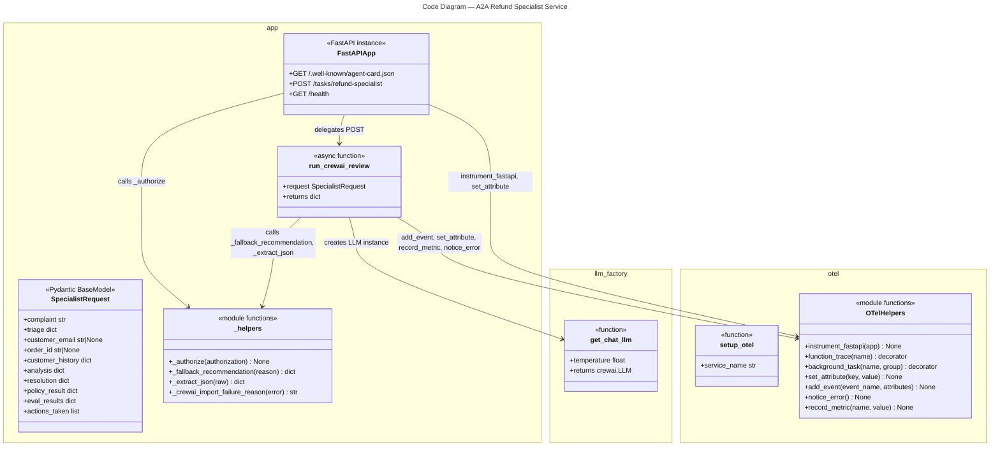
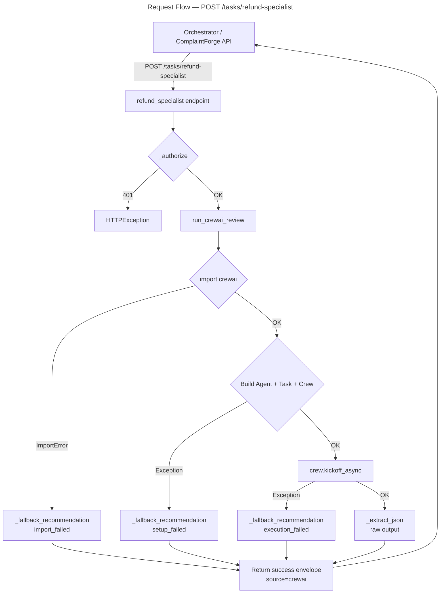

# C4 Code Level: A2A Refund Specialist Service

## Overview

- **Name**: A2A Refund Specialist Service
- **Description**: A standalone FastAPI microservice that accepts escalated complaint packages from the main ComplaintForge pipeline, runs a CrewAI agent to produce a policy-aware refund/credit recommendation, and returns structured JSON for human approval. Exposes an A2A (Agent-to-Agent) interface following the `/.well-known/agent-card.json` discovery convention.
- **Location**: `a2a_refund_specialist_service/`
- **Language**: Python 3.12
- **Purpose**: Provides an autonomous specialist review step within ComplaintForge. When a complaint is escalated beyond automated thresholds, this service uses a CrewAI crew (one Agent, one Task) backed by Azure OpenAI or a LiteLLM proxy to prepare a recommendation packet — decision, risk level, refund/credit amounts, and a draft customer response — that a human approver acts on. The service is hardened with three-layer fallback logic so that CrewAI failures never block the pipeline.

---

## Code Elements

### `app.py` — FastAPI application entry point

#### Classes

- **`SpecialistRequest(BaseModel)`**
  - Description: Pydantic v2 request schema that carries the full complaint context forwarded by the orchestrator. Aggregates all upstream pipeline outputs into a single payload for the CrewAI agent.
  - Location: `a2a_refund_specialist_service/app.py` lines 39–49
  - Fields: `complaint: str`, `triage: dict[str, Any]`, `customer_email: str | None`, `order_id: str | None`, `customer_history: dict[str, Any]`, `analysis: dict[str, Any]`, `resolution: dict[str, Any]`, `policy_result: dict[str, Any]`, `eval_results: dict[str, Any]`, `actions_taken: list[dict[str, Any]]`
  - Dependencies: `pydantic.BaseModel`, `pydantic.Field`

#### Functions

- **`_authorize(authorization: str | None) -> None`**
  - Description: Validates the incoming `Authorization` header against the `A2A_SPECIALIST_AUTH_TOKEN` environment variable. Raises HTTP 401 if the token is present but does not match; silently passes when no token is configured (open mode).
  - Location: `a2a_refund_specialist_service/app.py` lines 52–56
  - Dependencies: `fastapi.HTTPException`, `os.getenv`

- **`_fallback_recommendation(reason: str) -> dict[str, Any]`**
  - Description: Constructs a safe, human-review-required response envelope used whenever CrewAI cannot run. Preserves pipeline structure so callers receive a well-formed response regardless of AI availability.
  - Location: `a2a_refund_specialist_service/app.py` lines 59–79
  - Dependencies: none (pure function)

- **`_extract_json(raw: str) -> dict[str, Any]`**
  - Description: Strips optional markdown code fences (triple backticks, optional `json` label) from the CrewAI output string and parses the remaining text as JSON.
  - Location: `a2a_refund_specialist_service/app.py` lines 82–88
  - Dependencies: `json.loads`

- **`_crewai_import_failure_reason(error: Exception) -> str`**
  - Description: Formats a diagnostic string for CrewAI import failures. Appends a Python version compatibility hint when the runtime is Python 3.14 or later, where CrewAI is not yet supported.
  - Location: `a2a_refund_specialist_service/app.py` lines 91–99
  - Dependencies: `sys.version_info`

- **`run_crewai_review(request: SpecialistRequest) -> dict[str, Any]`** *(async, `@function_trace()` decorated)*
  - Description: Core orchestration function. Builds a single-agent CrewAI crew — one `Refund and Escalation Specialist` Agent plus one review Task — then calls `crew.kickoff_async()`. Implements three independent try/except layers: import failure (returns fallback), setup failure (returns fallback), and execution failure (returns fallback). On success, wraps the parsed recommendation in a `{"status": "success", "source": "crewai", "recommendation": ...}` envelope and records OTel metrics and events.
  - Location: `a2a_refund_specialist_service/app.py` lines 102–173
  - Dependencies: `crewai.Agent`, `crewai.Crew`, `crewai.Process`, `crewai.Task`, `llm_factory.get_chat_llm`, `otel.notice_error`, `otel.add_event`, `otel.set_attribute`, `otel.record_metric`, `otel.function_trace`

#### HTTP Endpoints

- **`agent_card() -> dict`** — `GET /.well-known/agent-card.json`
  - Description: Returns A2A agent discovery metadata (name, description, version, URL, capabilities). Allows orchestrators to dynamically discover this service's interface without hardcoded configuration.
  - Location: `a2a_refund_specialist_service/app.py` lines 176–189
  - Dependencies: none

- **`refund_specialist(request: SpecialistRequest, authorization: str | None) -> dict`** — `POST /tasks/refund-specialist`
  - Description: Main A2A endpoint. Authenticates the caller via `_authorize()`, logs contextual request metadata to OTel, then delegates to `run_crewai_review()` and returns its result.
  - Location: `a2a_refund_specialist_service/app.py` lines 192–201
  - Dependencies: `_authorize`, `run_crewai_review`, `otel.set_attribute`

- **`health() -> dict`** — `GET /health`
  - Description: Liveness probe used by Docker `HEALTHCHECK` and container orchestrators. Returns `{"status": "healthy", "service": "refund-specialist-a2a"}`.
  - Location: `a2a_refund_specialist_service/app.py` lines 204–206
  - Dependencies: none

---

### `llm_factory.py` — LLM provider abstraction

#### Module-Level Configuration

| Variable | Source env var | Description |
|---|---|---|
| `AZURE_OPENAI_API_KEY` | `AZURE_OPENAI_API_KEY` | Azure OpenAI authentication key |
| `AZURE_OPENAI_ENDPOINT` | `AZURE_OPENAI_ENDPOINT` | Azure OpenAI resource endpoint URL |
| `AZURE_OPENAI_DEPLOYMENT_NAME` | `AZURE_OPENAI_DEPLOYMENT_NAME` or `AZURE_OPENAI_DEPLOYMENT` | Deployment/model name |
| `AZURE_OPENAI_API_VERSION` | `AZURE_OPENAI_API_VERSION` | Optional API version string |
| `USE_LITELLM` | `USE_LITELLM` (default `"false"`) | Toggle to route calls through LiteLLM proxy |
| `LITELLM_BASE_URL` | `LITELLM_BASE_URL` (default `"http://localhost:4000"`) | LiteLLM proxy base URL |
| `LITELLM_API_KEY` | `LITELLM_API_KEY` (default `"sk-1234"`) | LiteLLM proxy API key |
| `LITELLM_MODEL` | `LITELLM_MODEL` (default `"gpt-4o"`) | Model identifier passed to LiteLLM |

#### Functions

- **`get_chat_llm(*, temperature: float = 0) -> Any`**
  - Description: Factory function returning a configured `crewai.LLM` instance. When `USE_LITELLM=true`, builds LiteLLM proxy kwargs (model, base URL, API key, custom header, optional API version). Otherwise validates that all three Azure OpenAI vars are present (raises `RuntimeError` listing missing names) and builds direct Azure kwargs using the `azure/<deployment>` model string convention. Both paths pass the `temperature` kwarg through.
  - Location: `a2a_refund_specialist_service/llm_factory.py` lines 24–60
  - Dependencies: `crewai.LLM`, `os.getenv`, `python-dotenv`

---

### `otel.py` — OpenTelemetry helper module

#### Module-Level State

- **`_histograms: dict[str, Any]`** (line 109): Process-scoped cache mapping metric names to lazily-created `Histogram` instruments, avoiding duplicate registration across repeated `record_metric` calls.

#### Functions

- **`setup_otel(service_name: str) -> None`**
  - Description: Bootstraps all three OTel signals for the process. Creates a `TracerProvider` with `BatchSpanProcessor` → `OTLPSpanExporter`, a `MeterProvider` with `PeriodicExportingMetricReader` → `OTLPMetricExporter`, and a `LoggerProvider` with `BatchLogRecordProcessor` → `OTLPLogExporter`. Attaches a `LoggingHandler` and a stdout `StreamHandler` to the root Python logger, sets log level to INFO, and auto-instruments the `requests` and `logging` libraries. Must be called before the FastAPI app is created.
  - Location: `a2a_refund_specialist_service/otel.py` lines 27–51
  - Dependencies: `opentelemetry-sdk`, `opentelemetry-exporter-otlp-proto-http`, `opentelemetry-instrumentation-requests`, `opentelemetry-instrumentation-logging`

- **`instrument_fastapi(app) -> None`**
  - Description: Applies `FastAPIInstrumentor` to an already-created FastAPI app instance, enabling automatic span creation for every HTTP request.
  - Location: `a2a_refund_specialist_service/otel.py` lines 54–57
  - Dependencies: `opentelemetry-instrumentation-fastapi`

- **`function_trace(name: str | None = None)`**
  - Description: Decorator factory that wraps both sync and async functions in a named OTel span. If `name` is omitted, uses `func.__qualname__`. Detects coroutines via `asyncio.iscoroutinefunction` and applies the appropriate wrapper, preserving the original function signature with `functools.wraps`.
  - Location: `a2a_refund_specialist_service/otel.py` lines 60–76
  - Dependencies: `opentelemetry.trace`, `asyncio`, `functools`

- **`background_task(name: str, group: str = "")`**
  - Description: Decorator factory for background async tasks that need a root (parentless) span. Prefixes the span name with `group/` when a group is provided. Unlike `function_trace`, intended for tasks not triggered by an incoming HTTP request.
  - Location: `a2a_refund_specialist_service/otel.py` lines 79–89
  - Dependencies: `opentelemetry.trace`, `functools`

- **`set_attribute(key: str, value: Any) -> None`**
  - Description: Convenience wrapper that calls `set_attribute` on the currently active OTel span. Used to enrich spans with business context (e.g., `specialist.has_order_id`).
  - Location: `a2a_refund_specialist_service/otel.py` lines 92–93
  - Dependencies: `opentelemetry.trace.get_current_span`

- **`add_event(event_name: str, attributes: dict[str, Any] | None = None) -> None`**
  - Description: Adds a named span event with optional key/value attributes to the current span. Used to record significant moments such as CrewAI review outcomes.
  - Location: `a2a_refund_specialist_service/otel.py` lines 96–97
  - Dependencies: `opentelemetry.trace.get_current_span`

- **`notice_error() -> None`**
  - Description: Captures the active exception from `sys.exc_info()`, calls `span.record_exception()`, and sets the span status to `ERROR`. Designed to be called from inside an `except` block without re-raising.
  - Location: `a2a_refund_specialist_service/otel.py` lines 100–106
  - Dependencies: `opentelemetry.trace`, `sys.exc_info`

- **`record_metric(name: str, value: float) -> None`**
  - Description: Records a histogram observation for the given metric name. Lazily creates the `Histogram` instrument on first call and caches it in `_histograms` for subsequent calls, avoiding duplicate meter registration.
  - Location: `a2a_refund_specialist_service/otel.py` lines 112–116
  - Dependencies: `opentelemetry.metrics.get_meter`

---

## Dependencies

### Internal Dependencies

- `otel` module (`otel.py`) — imported by `app.py`; provides all OTel instrumentation helpers
- `llm_factory` module (`llm_factory.py`) — imported by `app.py`; provides `get_chat_llm`

### External Dependencies

| Package | Version constraint | Role |
|---|---|---|
| `fastapi` | `>=0.115.0` | HTTP framework; defines app, routes, request/response handling |
| `uvicorn[standard]` | `>=0.30.0` | ASGI server; runs the FastAPI app on port 8001 |
| `pydantic` | `>=2.9.0` | Request schema validation (`SpecialistRequest`) |
| `python-dotenv` | `>=1.0.0` | Loads `.env` files into `os.environ` at startup |
| `crewai[azure-ai-inference]` | `>=1.14.0` | Multi-agent AI framework; provides `Agent`, `Crew`, `Process`, `Task`, `LLM` |
| `opentelemetry-api` | `>=1.20.0` | OTel API contracts (trace, metrics, logs) |
| `opentelemetry-sdk` | `>=1.20.0` | OTel SDK implementations (providers, processors, exporters) |
| `opentelemetry-exporter-otlp-proto-http` | `>=1.20.0` | OTLP/HTTP exporters for traces, metrics, and logs |
| `opentelemetry-instrumentation-fastapi` | `>=0.41b0` | Auto-instruments FastAPI request/response spans |
| `opentelemetry-instrumentation-requests` | `>=0.41b0` | Auto-instruments Python `requests` library calls |
| `opentelemetry-instrumentation-logging` | `>=0.41b0` | Injects trace/span IDs into Python log records |

---

## Relationships

---

## Notes

- **Startup order matters**: `setup_otel("complaintforge-a2a-specialist")` is called at module top-level in `app.py`, before FastAPI is constructed, so all OTel providers are registered before `instrument_fastapi(app)` is called.
- **LiteLLM toggle**: Setting `USE_LITELLM=true` in the environment routes all LLM traffic through a LiteLLM proxy (default `http://localhost:4000`), enabling model-agnostic testing and the ability to swap underlying models without code changes.
- **CrewAI Python compatibility**: `_crewai_import_failure_reason` encodes a runtime guard — CrewAI `>=1.14.0` requires Python `<3.14`. The Dockerfile pins Python 3.12-slim, which is within the supported range.
- **Fallback guarantees**: All three failure modes (import, setup, execution) return an identically-shaped dict with `source="fallback"` and `decision="human_review_required"`. Callers can detect the fallback path via `response["source"]` without inspecting error messages.
- **Port**: The service listens on port 8001 (distinct from the main ComplaintForge API on 8000).
- **Auth model**: Bearer token auth is optional — if `A2A_SPECIALIST_AUTH_TOKEN` is not set, the service accepts all requests, facilitating local development without secret management.
