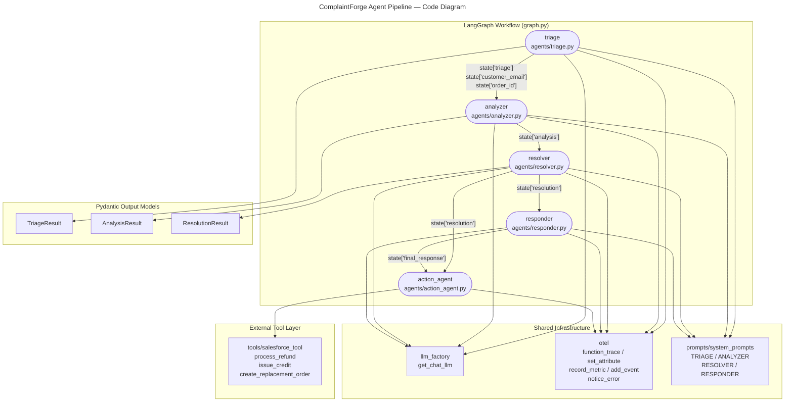

# C4 Code Level: Agents

## Overview

- **Name**: ComplaintForge Agent Pipeline
- **Description**: Five single-responsibility Python modules that form the sequential LLM-driven pipeline for autonomous complaint resolution — triage, analysis, resolution, response drafting, and action execution.
- **Location**: `agents/`
- **Language**: Python 3.11+
- **Purpose**: Process an incoming customer complaint end-to-end: classify it, enrich with CRM context, analyse sentiment and urgency, decide a policy-compliant resolution, draft a customer email, and execute real-world actions (refunds, credits, replacements, or escalations) through Salesforce.

---

## Code Elements

### Pydantic Output Models

These models define the structured JSON contracts between each LLM call and the wider LangGraph state. Each is passed to LangChain's `with_structured_output()` to enforce schema at inference time.

#### `TriageResult` — `agents/triage.py` lines 15–20

```python
class TriageResult(BaseModel):
    is_complaint: bool
    confidence: float           # 0.0–1.0
    reason: str
    customer_email: str | None
    order_id: str | None
```

Classification contract returned by the triage LLM. `is_complaint` gates whether the complaint workflow continues or terminates at the `ignored` node.

#### `AnalysisResult` — `agents/analyzer.py` lines 17–27

```python
class AnalysisResult(BaseModel):
    issue_type: Literal["shipping", "billing", "product", "service", "other"]
    sentiment: Literal["positive", "neutral", "negative", "very_negative"]
    urgency: Literal["low", "medium", "high"]
    repeat_complaint: bool
    key_details: str
```

Structured analysis of the complaint text and Salesforce history. The `sentiment` and `urgency` values are also mapped to numeric levels via `SENTIMENT_LEVELS` and `URGENCY_LEVELS` dictionaries for OTel metric recording.

#### `ResolutionResult` — `agents/resolver.py` lines 17–29

```python
class ResolutionResult(BaseModel):
    resolution_type: Literal[
        "full_refund", "partial_refund", "credit",
        "replacement", "apology", "escalate"
    ]
    refund_amount: float
    credit_amount: float
    action_needed: str
    confidence: float           # 0.0–1.0
```

Policy-compliant resolution decided by the resolver LLM. `resolution_type` drives downstream branching in `graph.py` (e.g. `"escalate"` routes to `specialist_review`).

---

### Agent Functions

#### `triage(state: dict) -> dict` — `agents/triage.py` lines 23–65

Classifies an incoming ticket as a complaint or non-complaint using an LLM chain. Extracts `customer_email` and `order_id` from the free-text input when present.

- **Parameters**: `state` dict must contain `"complaint"` (str).
- **Returns**: `{"triage": TriageResult.model_dump(), "customer_email": str | None, "order_id": str | None}`
- **Key behaviour**: Wraps the LLM call in a `try/except`; on failure it calls `notice_error()` and returns a safe fallback dict with `is_complaint=False` and `confidence=0.0` so the graph continues gracefully.
- **LLM chain**: `TRIAGE_PROMPT` → `llm.with_structured_output(TriageResult)` (uses `method="json_schema"` when `USE_LITELLM=True`).
- **OTel**: `set_attribute` for `triage.is_complaint` / `triage.confidence`; `record_metric` for both; `add_event("TriageResult")`.
- **LLM timeout**: Initialised with `request_timeout=20` — the only agent with an explicit timeout.
- **Dependencies**: `otel.{add_event, function_trace, notice_error, record_metric, set_attribute}`, `llm_factory.get_chat_llm`, `config.USE_LITELLM`, `prompts.system_prompts.TRIAGE_PROMPT`.

---

#### `analyzer(state: dict) -> dict` — `agents/analyzer.py` lines 33–67

Analyses the complaint text and Salesforce customer history to produce an `AnalysisResult`, logging extra warnings for high-urgency or very-negative-sentiment cases.

- **Parameters**: `state` dict must contain `"complaint"` (str) and optionally `"customer_history"` (dict).
- **Returns**: `{"analysis": AnalysisResult.model_dump()}`
- **LLM chain**: `ANALYZER_PROMPT` → `llm.with_structured_output(AnalysisResult)`. The `customer_history` dict is JSON-serialised before injection into the prompt.
- **Module-level constants**: `SENTIMENT_LEVELS = {"positive": 1, "neutral": 2, "negative": 3, "very_negative": 4}` and `URGENCY_LEVELS = {"low": 1, "medium": 2, "high": 3}` used to convert enum values to numeric histogram observations.
- **OTel**: `set_attribute` for `analysis.*` fields; `record_metric` for `analysis.sentiment_level` and `analysis.urgency_level`; `add_event("AnalysisResult")`.
- **Dependencies**: `otel`, `llm_factory.get_chat_llm`, `config.USE_LITELLM`, `prompts.system_prompts.ANALYZER_PROMPT`.

---

#### `resolver(state: dict) -> dict` — `agents/resolver.py` lines 32–79

Selects the single best resolution using the company policy rules embedded in `RESOLVER_PROMPT`. Logs a warning when `confidence < 0.85` or when the LLM recommends escalation.

- **Parameters**: `state` dict must contain `"customer_history"` (dict) and `"analysis"` (dict). Both are JSON-serialised before prompt injection.
- **Returns**: `{"resolution": ResolutionResult.model_dump()}`
- **LLM chain**: `RESOLVER_PROMPT` → `llm.with_structured_output(ResolutionResult)`.
- **OTel**: `set_attribute` for `resolution.*` fields; `record_metric` for `resolution.refund_amount`, `resolution.credit_amount`, `resolution.confidence`; `add_event("ResolutionResult")`.
- **Dependencies**: `otel`, `llm_factory.get_chat_llm`, `config.USE_LITELLM`, `prompts.system_prompts.RESOLVER_PROMPT`.

---

#### `responder(state: dict) -> dict` — `agents/responder.py` lines 13–37

Generates the empathetic customer-facing email body using the complaint text, history, analysis, and resolution as context. Unlike the other LLM agents it does **not** use structured output — the raw `.content` string from the model is used directly.

- **Parameters**: `state` dict must contain `"complaint"` (str); optionally `"customer_history"` (dict), `"resolution"` (dict), `"analysis"` (dict).
- **Returns**: `{"response_draft": str, "final_response": str}` — both keys hold the same value; `final_response` is the field read by the graph's terminal output.
- **LLM temperature**: Initialised at `temperature=1` (matches other agents) to allow slightly more creative tone.
- **OTel**: `set_attribute("responder.response_length", len(response_text))`; `record_metric("responder.response_length", ...)`.
- **Dependencies**: `otel.{function_trace, record_metric, set_attribute}`, `llm_factory.get_chat_llm`, `prompts.system_prompts.RESPONDER_PROMPT`.

---

#### `action_agent(state: dict) -> dict` — `agents/action_agent.py` lines 13–101

Executes zero or more real-world Salesforce actions based on `resolution_type` and the monetary amounts in the resolution dict. This agent does **not** call an LLM; it is purely imperative.

- **Parameters**: `state` dict must contain `"resolution"` (dict); optionally `"customer_history"` (dict).
- **Returns**: `{"actions_taken": list[dict]}` where each element records `"action"`, optional `"amount"`, and the raw `"result"` from the Salesforce tool.
- **Conditional logic** (evaluated independently, multiple actions can fire in one invocation):
  - `resolution_type in ["full_refund", "partial_refund"] AND refund_amount > 0` → calls `process_refund()`
  - `credit_amount > 0` → calls `issue_credit()`
  - `resolution_type == "replacement"` → calls `create_replacement_order()`
  - `resolution_type == "escalate"` → appends an `"escalate_to_human"` record (no Salesforce call)
- **OTel**: `set_attribute("action.resolution_type", ...)`, `set_attribute("action.actions_count", ...)`; `record_metric` for `action.refund_amount`, `action.credit_amount`, `action.actions_per_complaint`; `add_event("ActionTaken")` per action.
- **Dependencies**: `otel.{add_event, function_trace, record_metric, set_attribute}`, `tools.salesforce_tool.{create_replacement_order, issue_credit, process_refund}`.

---

## Dependencies

### Internal Dependencies

| Module | Used by | Purpose |
|---|---|---|
| `otel` | all five agents | OpenTelemetry helper: `@function_trace()`, `set_attribute()`, `record_metric()`, `add_event()`, `notice_error()` |
| `llm_factory.get_chat_llm` | `triage`, `analyzer`, `resolver`, `responder` | Provides a configured `ChatOpenAI` instance (Azure OpenAI or LiteLLM proxy) |
| `config.USE_LITELLM` | `triage`, `analyzer`, `resolver` | Feature flag selecting `method="json_schema"` for structured output |
| `prompts.system_prompts.TRIAGE_PROMPT` | `triage` | LLM system prompt for complaint classification |
| `prompts.system_prompts.ANALYZER_PROMPT` | `analyzer` | LLM system prompt for complaint analysis |
| `prompts.system_prompts.RESOLVER_PROMPT` | `resolver` | LLM system prompt with embedded policy rules |
| `prompts.system_prompts.RESPONDER_PROMPT` | `responder` | LLM system prompt for email drafting |
| `tools.salesforce_tool.process_refund` | `action_agent` | Creates a Salesforce Case for refund workflows |
| `tools.salesforce_tool.issue_credit` | `action_agent` | Creates a Salesforce Case for credit workflows |
| `tools.salesforce_tool.create_replacement_order` | `action_agent` | Creates a Salesforce Task for replacement orders |

### External Dependencies

| Package | Agents | Role |
|---|---|---|
| `langchain-core` (`ChatPromptTemplate`) | `triage`, `analyzer`, `resolver`, `responder` | Prompt templating and LLM chain composition |
| `langchain-openai` (`ChatOpenAI`) | via `llm_factory` | OpenAI-compatible LLM client |
| `pydantic` (`BaseModel`, `Field`) | `triage`, `analyzer`, `resolver` | Structured output schema definition and validation |
| `opentelemetry-sdk` / `opentelemetry-api` | via `otel` | Distributed tracing, metrics, and log export |
| `python-dotenv` | via `config` | Environment variable loading |
| `requests` | via `tools.salesforce_tool` | Salesforce REST API HTTP calls |

---

## Relationships



### State Flow Through the Pipeline

Each agent reads from and writes to the shared `ComplaintState` TypedDict defined in `graph.py`. The data dependencies are strictly sequential:

```
complaint (str)
    │
    ▼
triage ──────────────────────────────► { triage, customer_email, order_id }
                                              │
                          [customer_context node enriches customer_history]
                                              │
                                              ▼
                                       analyzer ──► { analysis }
                                              │
                                              ▼
                                       resolver ──► { resolution }
                                              │
                          ┌───────────────────┴────────────────────┐
                          ▼                                         ▼
                     responder ──► { response_draft,          action_agent ──► { actions_taken }
                                     final_response }
```

---

## Notes

- All five functions follow the **LangGraph node contract**: they accept a single `state: dict` and return a partial state `dict` with only the keys they produce.
- All are decorated with `@function_trace()` from `otel.py`, which wraps the function body in an OpenTelemetry span named after the function's `__qualname__`. Spans nest automatically when nodes call sub-functions that are also traced (e.g. `action_agent` → `process_refund`).
- The `USE_LITELLM` flag in `config.py` switches structured output between `method="json_schema"` (LiteLLM proxy) and the default method (Azure OpenAI native). Only `triage`, `analyzer`, and `resolver` are affected; `responder` does not use structured output.
- `triage` is the only agent with error handling for LLM unavailability. All other agents allow exceptions to propagate to the LangGraph runtime.
- `action_agent` is the only agent that does not call an LLM. It acts as an orchestrator for the `tools/salesforce_tool` layer, translating the `resolution` dict into zero or more Salesforce API calls.
- Escalation (`resolution_type == "escalate"`) is handled passively in `action_agent` (log + record only); the actual routing to a human reviewer is controlled by the conditional edges in `graph.py`.
