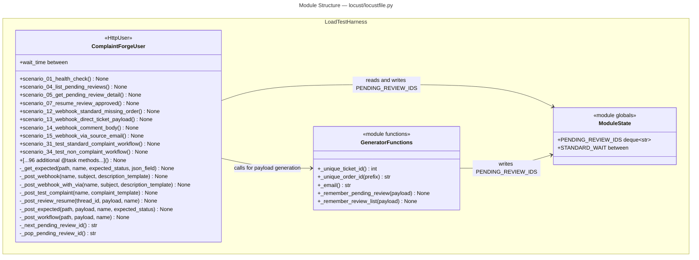
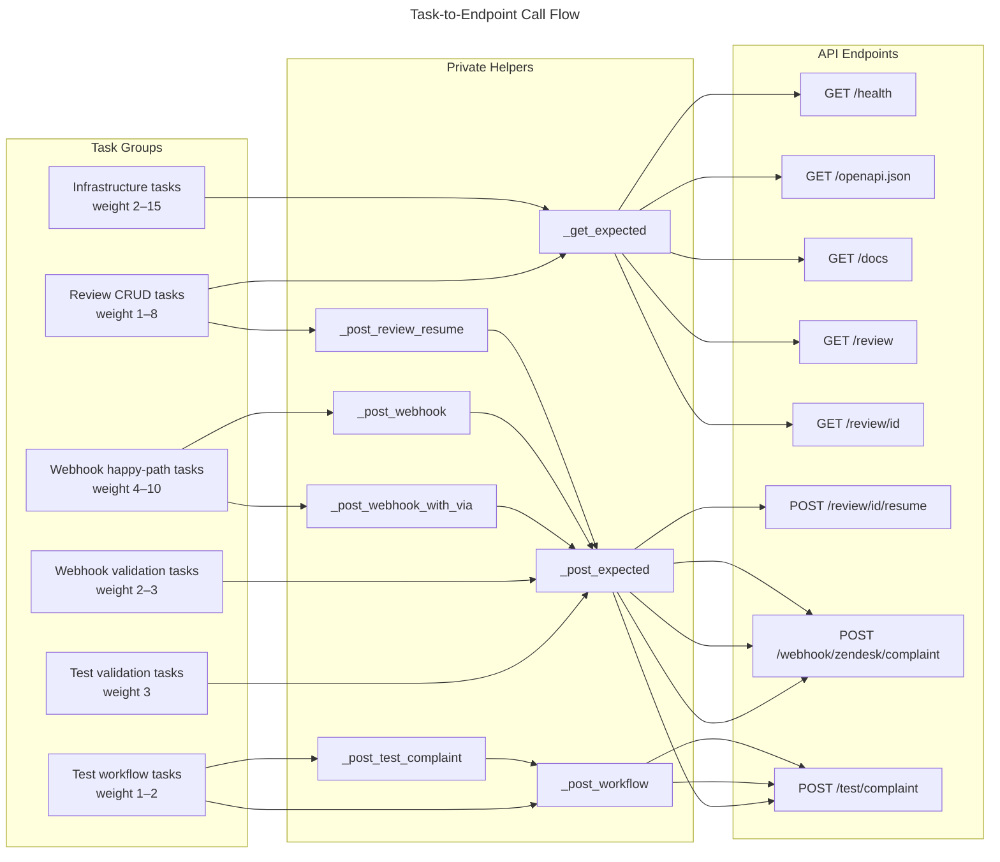

# C4 Code Level: Locust Load Test Suite

## Overview

- **Name**: ComplaintForge Locust Load Test Suite
- **Description**: A Locust-based HTTP load-testing harness that exercises every public endpoint of the ComplaintForge FastAPI application across 100 named scenarios covering health checks, pending-review CRUD, Zendesk webhook ingestion (all supported payload shapes), direct test-complaint workflow invocations, and negative/validation paths.
- **Location**: `locust/`
- **Language**: Python 3.11+
- **Purpose**: Generates realistic synthetic load against the ComplaintForge API to validate throughput, latency, and correctness under concurrent usage. Shares discovered `pending_review` thread IDs across task invocations via a bounded module-level deque so that review-resume scenarios have real thread IDs to act on, mimicking the natural read-after-write access pattern of a human reviewer.

---

## Module-Level State

### `PENDING_REVIEW_IDS`

- **Type**: `deque[str]` with `maxlen=500`
- **Location**: `locust/locustfile.py:11`
- **Purpose**: Shared ring-buffer of thread IDs discovered from API responses whose `status` equals `"pending_review"`. Populated by `_remember_pending_review` and `_remember_review_list`; consumed by `_next_pending_review_id` and `_pop_pending_review_id`. The fixed cap prevents unbounded growth across long runs.

### `STANDARD_WAIT`

- **Type**: `locust.between` callable
- **Location**: `locust/locustfile.py:14`
- **Purpose**: Configures a uniform random wait of 1–5 seconds between task executions for every `ComplaintForgeUser` instance.

---

## Code Elements

### Module-Level Helper Functions

- `_unique_ticket_id() -> int`
  - **Description**: Returns a random integer in the range `[100_000, 999_999]` to use as a synthetic Zendesk ticket ID.
  - **Location**: `locust/locustfile.py:17–18`
  - **Dependencies**: `random.randint`

- `_unique_order_id(prefix: str = "ORD") -> str`
  - **Description**: Returns a string of the form `"{prefix}-{5-digit number}"` (e.g., `"ORD-42317"`) to embed as a plausible order reference in complaint text.
  - **Location**: `locust/locustfile.py:21–22`
  - **Dependencies**: `random.randint`

- `_email() -> str`
  - **Description**: Returns a unique email address `"load-{10-hex-chars}@example.com"` derived from a UUID4, ensuring no two synthetic requesters share an address.
  - **Location**: `locust/locustfile.py:25–26`
  - **Dependencies**: `uuid.uuid4`

- `_remember_pending_review(payload: dict[str, Any]) -> None`
  - **Description**: Inspects a single API response body; if `payload["status"] == "pending_review"` and `"thread_id"` is present, appends the thread ID to `PENDING_REVIEW_IDS`.
  - **Location**: `locust/locustfile.py:29–32`
  - **Dependencies**: `PENDING_REVIEW_IDS`

- `_remember_review_list(payload: dict[str, Any]) -> None`
  - **Description**: Inspects a `GET /review` response body; iterates over `payload["reviews"]` and appends each item's `thread_id` to `PENDING_REVIEW_IDS`.
  - **Location**: `locust/locustfile.py:35–39`
  - **Dependencies**: `PENDING_REVIEW_IDS`

---

### Class: `ComplaintForgeUser`

- **Base class**: `locust.HttpUser`
- **Location**: `locust/locustfile.py:42–657`
- **Purpose**: Defines all load-test scenarios as `@task`-decorated methods. Locust instantiates one object per simulated user; each user picks tasks at random according to their integer weight, waits `STANDARD_WAIT`, then picks again.

#### Class Attribute

| Attribute | Type | Value | Purpose |
|-----------|------|-------|---------|
| `wait_time` | `locust.between` | `STANDARD_WAIT` | Controls inter-task pause duration |

---

#### Task Methods — Infrastructure & Read (weight range: 1–15)

| Method | Weight | Endpoint | Description |
|--------|--------|----------|-------------|
| `scenario_01_health_check(self) -> None` | 15 | `GET /health` | Asserts HTTP 200 and `status == "healthy"` in the JSON body. |
| `scenario_51_health_check_burst_read(self) -> None` | 3 | `GET /health` | Duplicate health-check at lower weight to simulate burst read traffic. |
| `scenario_02_openapi_schema(self) -> None` | 3 | `GET /openapi.json` | Asserts HTTP 200; exercises the FastAPI schema endpoint. |
| `scenario_03_docs_page(self) -> None` | 2 | `GET /docs` | Asserts HTTP 200; exercises the Swagger UI endpoint. |
| **Location** | `locust/locustfile.py:45–55, 313–315` | | |

---

#### Task Methods — Pending Review CRUD (weight range: 1–8)

| Method | Weight | Endpoint | Description |
|--------|--------|----------|-------------|
| `scenario_04_list_pending_reviews(self) -> None` | 8 | `GET /review` | Lists pending reviews; calls `_remember_review_list` to harvest thread IDs. |
| `scenario_52_review_list_after_ingestion(self) -> None` | 2 | `GET /review` | Same as 04 at lower weight; intended to follow webhook ingestion bursts. |
| `scenario_05_get_pending_review_detail(self) -> None` | 4 | `GET /review/{thread_id}` | Reads a specific thread from `PENDING_REVIEW_IDS`; accepts 200 or 404. |
| `scenario_06_get_unknown_review_detail(self) -> None` | 3 | `GET /review/{uuid}` | Uses a fresh UUID4; always expects 404. |
| `scenario_53_unknown_review_with_short_id(self) -> None` | 1 | `GET /review/not-a-thread` | Passes a literal short string; expects 404. |
| `scenario_07_resume_review_approved(self) -> None` | 2 | `POST /review/{thread_id}/resume` | Pops a thread ID and posts an approval payload with `approved: true`. |
| `scenario_08_resume_review_adjusted_resolution(self) -> None` | 2 | `POST /review/{thread_id}/resume` | Pops a thread ID and posts approval with a full `resolution` object (`partial_refund`, amount 75). |
| `scenario_09_resume_review_rejected(self) -> None` | 1 | `POST /review/{thread_id}/resume` | Pops a thread ID and posts a rejection payload with `approved: false`. |
| `scenario_10_resume_unknown_review(self) -> None` | 2 | `POST /review/{uuid}/resume` | Uses a fresh UUID4; always expects 404. |
| `scenario_11_resume_empty_payload_validation(self) -> None` | 2 | `POST /review/{thread_id}/resume` | Posts an empty body; expects 400 or 404. |
| `scenario_54_resume_unknown_with_resolution(self) -> None` | 1 | `POST /review/{uuid}/resume` | Fresh UUID4 with a resolution object; always expects 404. |
| **Location** | `locust/locustfile.py:58–140, 317–340` | | |

---

#### Task Methods — Zendesk Webhook Happy Path (weight: 4–10)

These methods call `_post_webhook` or `_post_webhook_with_via` with scenario-specific subject and complaint text. All expect HTTP 200.

| Method | Weight | Payload Shape | Complaint Theme |
|--------|--------|---------------|-----------------|
| `scenario_12_webhook_standard_missing_order` | 10 | nested ticket + description | Missing order |
| `scenario_13_webhook_direct_ticket_payload` | 8 | flat (no outer `ticket` key) | Missing order |
| `scenario_14_webhook_comment_body` | 7 | nested ticket + `comment.body` | Missing parts |
| `scenario_15_webhook_via_source_email` | 7 | `via.source.from.address` (no requester) | Damaged delivery |
| `scenario_16_webhook_missing_ticket_id` | 5 | nested ticket without `id` | Non-arrival |
| `scenario_20_webhook_late_delivery` | 5 | standard | Late delivery |
| `scenario_21_webhook_damaged_product` | 5 | standard | Damaged product |
| `scenario_22_webhook_wrong_item` | 5 | standard | Wrong item |
| `scenario_23_webhook_billing_dispute` | 5 | standard | Double charge |
| `scenario_24_webhook_repeat_contact` | 4 | standard | Third contact |
| `scenario_25_webhook_angry_customer` | 4 | standard | Escalation request |
| `scenario_26_webhook_replacement_request` | 4 | standard | Defective item |
| `scenario_27_webhook_cancellation_request` | 4 | standard | Cancel and refund |
| `scenario_28_webhook_delivery_address_issue` | 4 | standard | Wrong address |
| `scenario_29_webhook_missing_parts` | 4 | standard | Missing parts |
| `scenario_30_webhook_quality_complaint` | 4 | standard | Poor quality |
| `scenario_55_webhook_subscription_issue` | 4 | standard | Subscription |
| `scenario_56_webhook_premium_shipping_refund` | 4 | standard | Shipping refund |
| `scenario_57_webhook_return_label_missing` | 4 | standard | Return label |
| `scenario_58_webhook_warranty_claim` | 4 | standard | Warranty |
| `scenario_59_webhook_gift_order_problem` | 4 | standard | Gift order |
| `scenario_60_webhook_perishable_damage` | 4 | standard | Spoiled item |
| `scenario_61_webhook_partial_delivery` | 4 | standard | Partial delivery |
| `scenario_62_webhook_tracking_delivered_not_received` | 4 | standard | Lost package |
| `scenario_63_webhook_account_credit_missing` | 4 | standard | Missing credit |
| `scenario_64_webhook_refund_delay` | 4 | standard | Delayed refund |
| `scenario_65_webhook_exchange_request` | 4 | standard | Wrong size |
| `scenario_66_webhook_vip_customer_escalation` | 4 | standard | VIP escalation |
| `scenario_67_webhook_social_media_risk` | 4 | standard | Public complaint |
| `scenario_68_webhook_accessibility_issue` | 4 | standard | Accessibility |
| `scenario_69_webhook_installation_failure` | 4 | standard | Missing hardware |
| `scenario_70_webhook_multiple_orders_one_ticket` | 4 | nested ticket + two order IDs inline | Multi-order damage |
| `scenario_71_webhook_comment_body_billing` | 4 | nested ticket + `comment.body` | Billing via comment |
| `scenario_72_webhook_via_email_refund_delay` | 4 | `via.source.from.address` | Delayed refund |
| `scenario_73_webhook_direct_payload_wrong_address` | 4 | flat | Wrong address |
| `scenario_74_webhook_direct_payload_return_issue` | 4 | flat | Return not reflected |

**Location**: `locust/locustfile.py:131–453`

---

#### Task Methods — Zendesk Webhook Validation Failures (weight: 2–3)

All post to `POST /webhook/zendesk/complaint` and expect HTTP 400.

| Method | Weight | Invalid Condition |
|--------|--------|-------------------|
| `scenario_17_webhook_missing_description_validation` | 3 | No `description` or `comment.body` |
| `scenario_18_webhook_missing_email_validation` | 3 | No `requester.email` |
| `scenario_19_webhook_empty_payload_validation` | 3 | Empty dict `{}` |
| `scenario_75_webhook_invalid_blank_description` | 2 | `description: ""` |
| `scenario_76_webhook_invalid_empty_comment_body` | 2 | `comment.body: ""` |
| `scenario_77_webhook_invalid_requester_empty_object` | 2 | `requester: {}` |
| `scenario_78_webhook_invalid_via_empty_source` | 2 | `via.source: {}` |
| `scenario_79_webhook_invalid_nested_ticket_empty` | 2 | `ticket: {}` |
| `scenario_80_webhook_invalid_subject_only` | 2 | Flat payload with `subject` only |

**Location**: `locust/locustfile.py:174–481`

---

#### Task Methods — Test Complaint Workflow (weight: 1–2)

These methods call `_post_test_complaint` or `_post_workflow` directly against `POST /test/complaint`, which runs the full LangGraph pipeline inline. All expect HTTP 200 with `status` in `{"completed", "pending_review"}`.

| Method | Weight | Complaint Theme |
|--------|--------|-----------------|
| `scenario_31_test_standard_complaint_workflow` | 2 | Standard non-arrival |
| `scenario_32_test_damaged_product_workflow` | 2 | Damaged product |
| `scenario_33_test_high_value_refund_escalation` | 1 | $950 item, two prior contacts |
| `scenario_34_test_non_complaint_workflow` | 2 | Non-complaint message |
| `scenario_37_test_late_delivery_workflow` | 1 | Late delivery |
| `scenario_38_test_wrong_item_workflow` | 1 | Wrong item |
| `scenario_39_test_billing_refund_workflow` | 1 | Double charge |
| `scenario_40_test_replacement_workflow` | 1 | Defective, no store credit |
| `scenario_41_test_repeat_complaint_workflow` | 1 | Fourth contact |
| `scenario_42_test_urgent_sentiment_workflow` | 1 | Urgent sentiment |
| `scenario_43_test_default_email_workflow` | 1 | No email supplied (default) |
| `scenario_44_test_excluded_product_language` | 1 | Final-sale damaged item |
| `scenario_45_test_low_confidence_language` | 1 | Ambiguous complaint |
| `scenario_46_test_apology_only_request` | 1 | Apology requested |
| `scenario_47_test_credit_request` | 1 | Store credit acceptable |
| `scenario_48_test_shipping_update_request` | 1 | No tracking update |
| `scenario_49_test_damaged_high_sentiment` | 1 | Furious customer |
| `scenario_50_test_bulk_order_complaint` | 1 | Business bulk order |
| `scenario_81`–`scenario_100` | 1 each | Extended coverage: subscription, premium shipping, return label, warranty, gift, perishable, partial delivery, delivered-not-received, missing credit, refund delay, exchange, VIP, social media risk, accessibility, installation failure, multiple orders, high-value lost package, low-value credit, duplicate case, formal complaint |

**Location**: `locust/locustfile.py:232–567`

---

#### Task Methods — Test Complaint Validation (weight: 3)

| Method | Weight | Endpoint | Expected Status |
|--------|--------|----------|-----------------|
| `scenario_35_test_missing_complaint_validation(self) -> None` | 3 | `POST /test/complaint` | 400 — no `complaint` field |
| `scenario_36_test_empty_complaint_validation(self) -> None` | 3 | `POST /test/complaint` | 400 — `complaint: ""` |

**Location**: `locust/locustfile.py:249–254`

---

#### Private Helper Methods

- `_get_expected(self, path: str, name: str, *, expected_status: int | set[int], json_field: tuple[str, Any] | None = None) -> None`
  - **Description**: Sends a `GET` request; marks the response as a Locust failure if the status code is not in the expected set. When `json_field` is provided and the response is a success, additionally asserts that `response.json()[key] == expected_value`.
  - **Location**: `locust/locustfile.py:568–585`
  - **Dependencies**: `self.client.get` (Locust HTTP session)

- `_post_webhook(self, name: str, subject: str, description_template: str) -> None`
  - **Description**: Builds a standard nested Zendesk ticket payload (`ticket.id`, `ticket.subject`, `ticket.description`, `ticket.requester.email`) by calling `_unique_ticket_id`, `_unique_order_id`, and `_email`, then delegates to `_post_expected` expecting HTTP 200.
  - **Location**: `locust/locustfile.py:587–597`
  - **Dependencies**: `_unique_ticket_id`, `_unique_order_id`, `_email`, `_post_expected`

- `_post_webhook_with_via(self, name: str, subject: str, description_template: str) -> None`
  - **Description**: Builds a Zendesk ticket payload that uses `via.source.from.address` instead of `requester.email`, then delegates to `_post_expected` expecting HTTP 200.
  - **Location**: `locust/locustfile.py:599–609`
  - **Dependencies**: `_unique_ticket_id`, `_unique_order_id`, `_email`, `_post_expected`

- `_post_test_complaint(self, name: str, complaint_template: str) -> None`
  - **Description**: Constructs a `{email, complaint}` payload by substituting a generated `order_id` into the template string, then delegates to `_post_workflow` at `POST /test/complaint`.
  - **Location**: `locust/locustfile.py:611–617`
  - **Dependencies**: `_unique_order_id`, `_email`, `_post_workflow`

- `_post_review_resume(self, thread_id: str, payload: dict[str, Any], name: str) -> None`
  - **Description**: Posts to `POST /review/{thread_id}/resume`; accepts either 200 (thread still pending) or 404 (thread already consumed or unknown) as success.
  - **Location**: `locust/locustfile.py:619–620`
  - **Dependencies**: `_post_expected`

- `_post_expected(self, path: str, payload: dict[str, Any], name: str, *, expected_status: int | set[int]) -> None`
  - **Description**: Sends a `POST` request with a JSON body; marks the response as a Locust failure if the status code is not in the expected set. On success, calls `_remember_pending_review` so that any `pending_review` thread ID is captured for later reuse.
  - **Location**: `locust/locustfile.py:622–636`
  - **Dependencies**: `self.client.post`, `_remember_pending_review`

- `_post_workflow(self, path: str, payload: dict[str, Any], name: str) -> None`
  - **Description**: Sends a `POST` request; expects HTTP 200 with `status` in `{"completed", "pending_review"}`. Any other status or missing field is reported as a Locust failure. Calls `_remember_pending_review` for state-sharing.
  - **Location**: `locust/locustfile.py:638–647`
  - **Dependencies**: `self.client.post`, `_remember_pending_review`

- `_next_pending_review_id(self) -> str | None`
  - **Description**: Returns a randomly-chosen thread ID from `PENDING_REVIEW_IDS` without removing it (non-destructive read). Returns `None` when the deque is empty.
  - **Location**: `locust/locustfile.py:649–652`
  - **Dependencies**: `PENDING_REVIEW_IDS`, `random.choice`

- `_pop_pending_review_id(self) -> str | None`
  - **Description**: Removes and returns the oldest thread ID from `PENDING_REVIEW_IDS` via `popleft`. Returns `None` when the deque is empty. Used by resume scenarios so each thread ID is consumed at most once.
  - **Location**: `locust/locustfile.py:654–657`
  - **Dependencies**: `PENDING_REVIEW_IDS`

---

## Dependencies

### Internal Dependencies

None. The `locust/` directory is fully self-contained and does not import from any other module within the ComplaintForge repository.

### External Dependencies

| Library | Import | Purpose |
|---------|--------|---------|
| `locust` | `HttpUser`, `between`, `task` | Load-test framework; provides user simulation, task scheduling, and the HTTP client |
| `random` | `randint`, `choice` | Generates synthetic ticket IDs and order numbers; random task selection by Locust |
| `uuid` | `uuid4` | Generates unique email addresses and synthetic unknown thread IDs |
| `collections` | `deque` | Bounded ring-buffer for shared `PENDING_REVIEW_IDS` state |
| `typing` | `Any` | Type annotation for JSON payloads |
| `__future__` | `annotations` | Deferred annotation evaluation for `int \| set[int]` union syntax |

### Runtime Container

The `Dockerfile` builds from `locustio/locust:latest`, exposes port `8089` (the Locust web UI), and sets the entrypoint to `locust -f /mnt/locust/locustfile.py`.

---

## Relationships

---

## Notes

- **Task weights** determine relative frequency: weight-15 health checks fire ~15x more often than weight-1 test workflow tasks. This models realistic production traffic where health probes and lightweight reads dominate over expensive LLM-backed workflows.
- **State sharing via `PENDING_REVIEW_IDS`**: Because Locust can run workers in separate processes, `PENDING_REVIEW_IDS` is only shared within a single process. Cross-process state sharing is out of scope; the deque is best-effort.
- **`_pop_pending_review_id` vs `_next_pending_review_id`**: Resume scenarios (07, 08, 09) use `popleft` to consume thread IDs destructively, preventing the same thread from being resumed twice. Read-only detail scenarios (05) use `random.choice` non-destructively.
- **Payload shape coverage**: The webhook scenarios collectively exercise all four payload shapes accepted by `POST /webhook/zendesk/complaint`: (1) nested `ticket.description`, (2) flat top-level `description`, (3) `ticket.comment.body`, and (4) `ticket.via.source.from.address`. This matches the parser logic in the FastAPI handler.
- **No authentication**: All requests are unauthenticated. The ComplaintForge API does not enforce auth tokens on the endpoints tested here.
- **Docker usage**: The `Dockerfile` enables the suite to run as an Azure Container Instance or Docker Compose service pointed at the API's Azure Container Apps endpoint for cloud-scale load tests.
