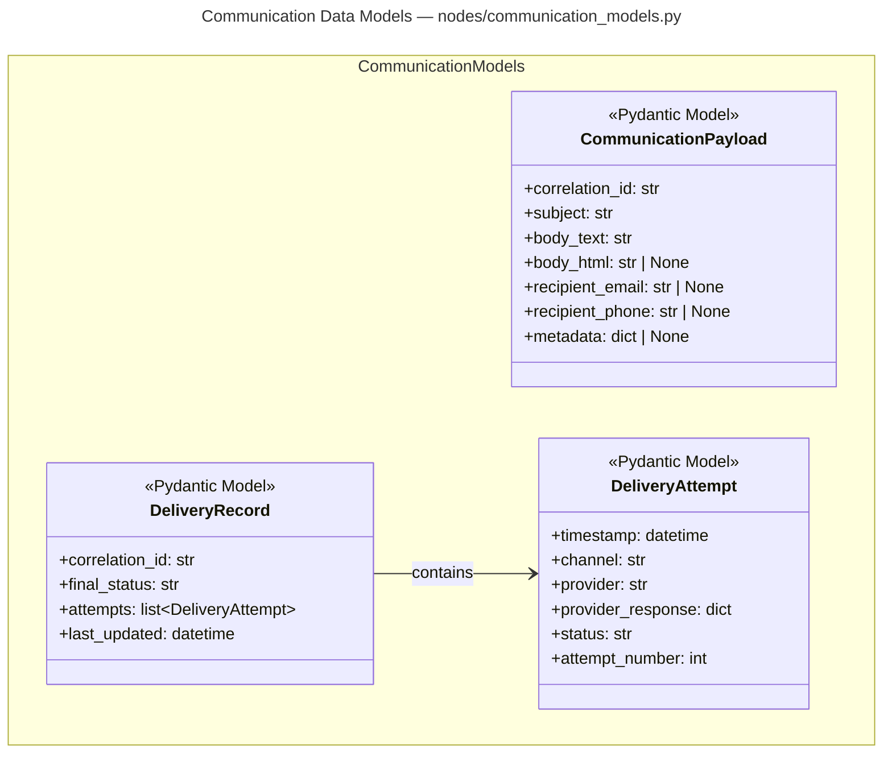
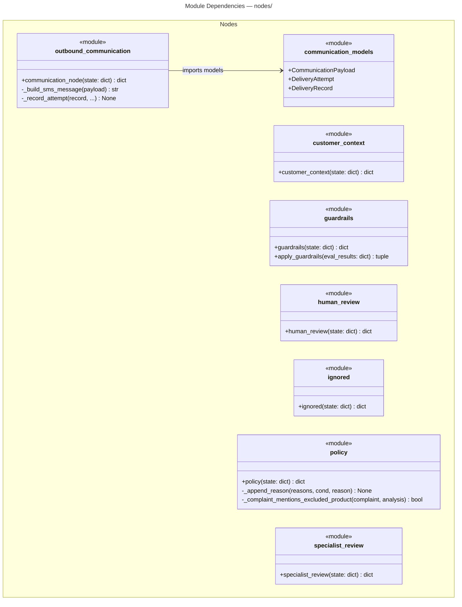
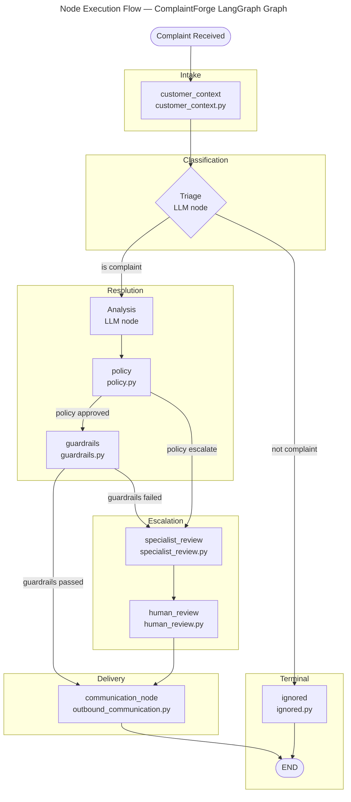

# C4 Code Level: nodes/

## Overview

- **Name**: LangGraph Workflow Nodes
- **Description**: A collection of discrete Python functions that serve as the processing nodes within the ComplaintForge LangGraph workflow. Each node receives the shared workflow state dict, performs its work, and returns a partial state update.
- **Location**: `nodes/`
- **Language**: Python
- **Purpose**: Implement every distinct processing step in the complaint-handling pipeline: customer data enrichment, business policy enforcement, quality guardrails, outbound communication dispatch, specialist escalation, and human-in-the-loop interruption. These nodes are wired together by the LangGraph graph definition and are instrumented end-to-end with OpenTelemetry spans, attributes, events, and metrics.

---

## Code Elements

### Classes

#### `CommunicationPayload`
- **Signature**: `class CommunicationPayload(BaseModel)`
- **Description**: Pydantic model that captures all data needed to send a single outbound communication. Holds both email and phone channels so the delivery node can attempt the appropriate channel.
- **Location**: `nodes/communication_models.py` lines 7–14
- **Fields**: `correlation_id: str`, `subject: str`, `body_text: str`, `body_html: str | None`, `recipient_email: str | None`, `recipient_phone: str | None`, `metadata: dict[str, Any] | None`
- **Dependencies**: `pydantic.BaseModel`, `pydantic.Field`

#### `DeliveryAttempt`
- **Signature**: `class DeliveryAttempt(BaseModel)`
- **Description**: Pydantic model that records metadata for a single delivery attempt on a specific channel and provider, including the raw provider response and attempt sequence number.
- **Location**: `nodes/communication_models.py` lines 17–23
- **Fields**: `timestamp: datetime` (default `datetime.utcnow`), `channel: str`, `provider: str`, `provider_response: dict[str, Any]`, `status: str`, `attempt_number: int`
- **Dependencies**: `pydantic.BaseModel`, `pydantic.Field`, `datetime.datetime`

#### `DeliveryRecord`
- **Signature**: `class DeliveryRecord(BaseModel)`
- **Description**: Pydantic model that aggregates all delivery attempts for a single correlation ID and carries the final delivery status written back to the workflow state.
- **Location**: `nodes/communication_models.py` lines 26–30
- **Fields**: `correlation_id: str`, `final_status: str`, `attempts: list[DeliveryAttempt]` (default `[]`), `last_updated: datetime` (default `datetime.utcnow`)
- **Dependencies**: `pydantic.BaseModel`, `pydantic.Field`, `nodes.communication_models.DeliveryAttempt`

---

### Node Functions

#### `customer_context`
- **Signature**: `def customer_context(state: dict) -> dict`
- **Description**: Enriches the workflow state with Salesforce customer history by calling `get_customer_history` with the customer email and order ID. Returns a partial state containing `customer_email`, `customer_phone`, `order_id`, `customer_history`, and `customer_context_result`. Records OTel span attributes and a `CustomerContextLookup` event.
- **Location**: `nodes/customer_context.py` lines 10–59
- **Decorator**: `@function_trace()` (wraps execution in an OTel span)
- **Dependencies**: `otel.function_trace`, `otel.add_event`, `otel.record_metric`, `otel.set_attribute`, `tools.salesforce_tool.get_customer_history`

#### `guardrails` (async)
- **Signature**: `async def guardrails(state: dict[str, Any]) -> dict[str, Any]`
- **Description**: Runs every evaluator in `RESPONSE_QUALITY_EVALUATORS` against the current state and calls `apply_guardrails` to decide pass or fail. On failure, overrides the resolution to `escalate` and injects a safe generic response. Emits a `GuardrailResult` event and individual score metrics per evaluator.
- **Location**: `nodes/guardrails.py` lines 30–92
- **Decorator**: `@function_trace()`
- **Dependencies**: `otel.function_trace`, `otel.add_event`, `otel.record_metric`, `otel.set_attribute`, `response_evaluators.RESPONSE_QUALITY_EVALUATORS`, `guardrails.apply_guardrails` (local)

#### `human_review`
- **Signature**: `def human_review(state: dict) -> dict`
- **Description**: Pauses the LangGraph workflow by calling `langgraph.types.interrupt` with a structured payload containing the full complaint context and current resolution. Resumes when a human operator submits a review dict. If the review contains a `final_response` key, it is used as the outbound message.
- **Location**: `nodes/human_review.py` lines 10–49
- **Decorator**: `@function_trace()`
- **Dependencies**: `langgraph.types.interrupt`, `otel.function_trace`, `otel.add_event`, `otel.record_metric`, `otel.set_attribute`

#### `ignored`
- **Signature**: `def ignored(state: dict) -> dict`
- **Description**: Terminal node for tickets that triage has classified as non-complaints. Sets `final_response` to an empty string and records an `ignored_non_complaint` action in `actions_taken`. Emits a `TicketIgnored` event and increments the `triage.non_complaint` metric.
- **Location**: `nodes/ignored.py` lines 9–23
- **Decorator**: `@function_trace()`
- **Dependencies**: `otel.function_trace`, `otel.add_event`, `otel.record_metric`

#### `communication_node`
- **Signature**: `def communication_node(state: dict[str, Any]) -> dict[str, Any]`
- **Description**: Dispatches the final response to the customer via email first; falls back to SMS if email results in a permanent failure and a phone number is available. If all delivery paths fail, triggers a `langgraph.types.interrupt` to escalate to human review. Respects the `OUTBOUND_COMMUNICATION_ENABLED` feature flag; if disabled, returns a `delivery_record` with status `skipped` without any I/O.
- **Location**: `nodes/outbound_communication.py` lines 42–174
- **Decorator**: `@function_trace()`
- **Dependencies**: `langgraph.types.interrupt`, `nodes.communication_models.CommunicationPayload`, `nodes.communication_models.DeliveryAttempt`, `nodes.communication_models.DeliveryRecord`, `otel.function_trace`, `otel.add_event`, `otel.record_metric`, `otel.set_attribute`, `tools.mailchimp_tool.send_email`, `tools.mailchimp_tool.send_sms`, `config.OUTBOUND_COMMUNICATION_ENABLED`

#### `policy`
- **Signature**: `def policy(state: dict[str, Any]) -> dict[str, Any]`
- **Description**: Applies deterministic business rules to the LLM-proposed resolution before any external actions are taken. Checks confidence threshold (< 0.85), refund ceiling (> $500), Salesforce order match requirement for refunds, digital/custom product exclusions, and Salesforce lookup errors. Escalates to human review when any rule fires; otherwise approves and returns a `policy_result`.
- **Location**: `nodes/policy.py` lines 24–102
- **Decorator**: `@function_trace()`
- **Dependencies**: `otel.function_trace`, `otel.add_event`, `otel.record_metric`, `otel.set_attribute`, `policy._append_reason` (local), `policy._complaint_mentions_excluded_product` (local)

#### `specialist_review`
- **Signature**: `def specialist_review(state: dict) -> dict`
- **Description**: Delegates to a remote A2A (Agent-to-Agent) specialist service via `request_specialist_review`, attaching the full state as context. Stores the specialist recommendation in `specialist_review` and records the result in `actions_taken`. Emits a `SpecialistReviewRequested` event and increments `specialist_review.requested`.
- **Location**: `nodes/specialist_review.py` lines 10–30
- **Decorator**: `@function_trace()`
- **Dependencies**: `otel.function_trace`, `otel.add_event`, `otel.record_metric`, `otel.set_attribute`, `tools.a2a_specialist_tool.request_specialist_review`

---

### Helper / Private Functions

#### `apply_guardrails`
- **Signature**: `def apply_guardrails(eval_results: dict[str, dict[str, Any]]) -> tuple[bool, str, dict[str, Any]]`
- **Description**: Pure function that inspects the scored evaluator output dictionary and returns a pass/fail verdict with a human-readable failure summary. Fails if either `empathy_score` or `resolution_appropriateness` score falls below 6.
- **Location**: `nodes/guardrails.py` lines 11–26
- **Dependencies**: none (pure)

#### `_build_sms_message`
- **Signature**: `def _build_sms_message(payload: CommunicationPayload) -> str`
- **Description**: Formats an SMS-appropriate message string from a `CommunicationPayload`, truncating body text to 300 characters and appending a continuation hint when the body was trimmed.
- **Location**: `nodes/outbound_communication.py` lines 15–19
- **Dependencies**: `nodes.communication_models.CommunicationPayload`

#### `_record_attempt`
- **Signature**: `def _record_attempt(record: DeliveryRecord, channel: str, provider: str, provider_response: dict[str, Any], status: str) -> None`
- **Description**: Appends a new `DeliveryAttempt` to the given `DeliveryRecord`, automatically computing the attempt sequence number and updating `last_updated` on the record.
- **Location**: `nodes/outbound_communication.py` lines 22–38
- **Dependencies**: `nodes.communication_models.DeliveryAttempt`, `nodes.communication_models.DeliveryRecord`

#### `_append_reason`
- **Signature**: `def _append_reason(reasons: list[str], condition: bool, reason: str) -> None`
- **Description**: Conditionally appends a reason string to a mutable list; used by `policy` to accumulate all policy violation strings before deciding to escalate.
- **Location**: `nodes/policy.py` lines 9–11
- **Dependencies**: none (pure)

#### `_complaint_mentions_excluded_product`
- **Signature**: `def _complaint_mentions_excluded_product(complaint: str, analysis: dict[str, Any]) -> bool`
- **Description**: Scans the complaint text and analysis fields for keywords indicating excluded product categories (digital, download, custom, personalized) that cannot receive automatic refunds.
- **Location**: `nodes/policy.py` lines 14–20
- **Dependencies**: none (pure)

---

## Dependencies

### Internal Dependencies

| Importing Module | Imported Symbol | Source |
|---|---|---|
| `nodes/customer_context.py` | `function_trace`, `add_event`, `record_metric`, `set_attribute` | `otel` (root) |
| `nodes/customer_context.py` | `get_customer_history` | `tools/salesforce_tool.py` |
| `nodes/guardrails.py` | `function_trace`, `add_event`, `record_metric`, `set_attribute` | `otel` (root) |
| `nodes/guardrails.py` | `RESPONSE_QUALITY_EVALUATORS` | `response_evaluators.py` (root) |
| `nodes/human_review.py` | `function_trace`, `add_event`, `record_metric`, `set_attribute` | `otel` (root) |
| `nodes/ignored.py` | `function_trace`, `add_event`, `record_metric` | `otel` (root) |
| `nodes/outbound_communication.py` | `CommunicationPayload`, `DeliveryAttempt`, `DeliveryRecord` | `nodes/communication_models.py` |
| `nodes/outbound_communication.py` | `function_trace`, `add_event`, `record_metric`, `set_attribute` | `otel` (root) |
| `nodes/outbound_communication.py` | `send_email`, `send_sms` | `tools/mailchimp_tool.py` |
| `nodes/outbound_communication.py` | `OUTBOUND_COMMUNICATION_ENABLED` | `config.py` (root) |
| `nodes/policy.py` | `function_trace`, `add_event`, `record_metric`, `set_attribute` | `otel` (root) |
| `nodes/specialist_review.py` | `function_trace`, `add_event`, `record_metric`, `set_attribute` | `otel` (root) |
| `nodes/specialist_review.py` | `request_specialist_review` | `tools/a2a_specialist_tool.py` |

### External Dependencies

| Library | Used In | Purpose |
|---|---|---|
| `pydantic` (`BaseModel`, `Field`) | `nodes/communication_models.py` | Data model validation and serialisation for delivery payloads |
| `langgraph.types.interrupt` | `nodes/human_review.py`, `nodes/outbound_communication.py` | Suspend workflow execution pending human input |
| `opentelemetry` (via `otel.py`) | All node files | Distributed tracing, custom metrics, structured log events |

---

## Relationships

### Data Models (communication_models.py)

### Module Structure and Intra-Package Dependencies

### Node Execution Flow Within the LangGraph Workflow

---

## Notes

- **All node functions share the same contract**: accept a `state: dict` (the LangGraph state object) and return a `dict` of partial state updates to merge back. No node mutates state in-place.
- **OTel instrumentation pattern**: every public node function is decorated with `@function_trace()` from the project's `otel.py` helper, which wraps the function body in an OpenTelemetry span. Within each node, `set_attribute`, `add_event`, and `record_metric` calls are made to enrich the span with structured observability data.
- **`guardrails` is the only async node** (`async def`). The `@function_trace()` decorator in `otel.py` handles both sync and async functions transparently.
- **`communication_models.py` has no node function** — it is a pure data-model module consumed exclusively by `outbound_communication.py` within the `nodes/` package.
- **LangGraph interrupt pattern**: both `human_review.py` and `outbound_communication.py` call `langgraph.types.interrupt(...)`, which suspends the graph run and returns control to the caller until a human operator resumes the thread with a response payload.
- **Feature flag**: `outbound_communication.py` checks `OUTBOUND_COMMUNICATION_ENABLED` (from `config.py`) at the top of `communication_node`. When `False`, delivery is skipped entirely and a `DeliveryRecord` with `final_status="skipped"` is returned, which is useful for staging and development environments.
