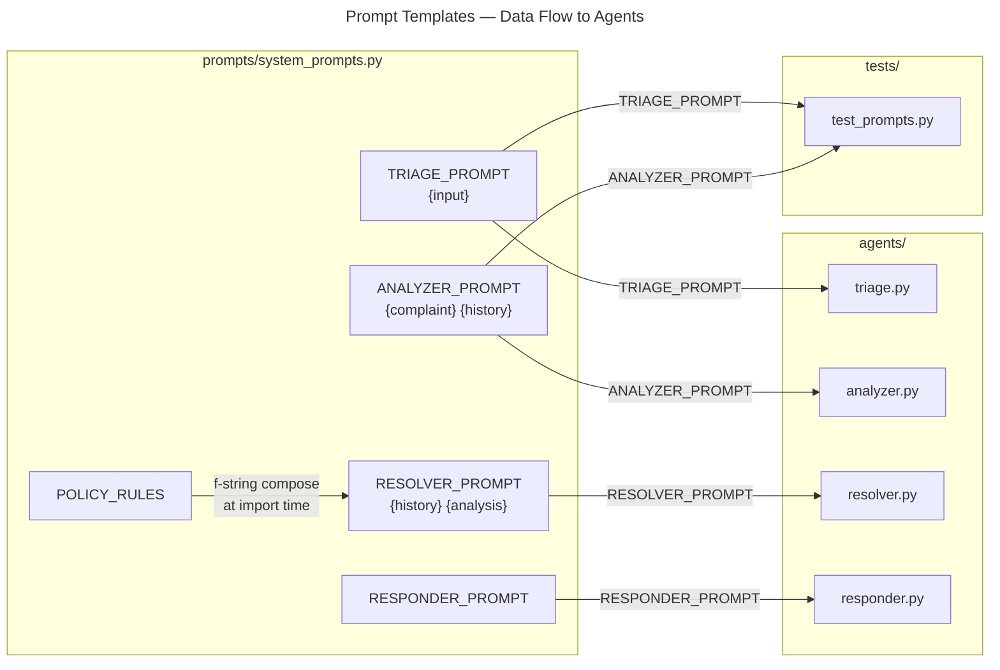

# C4 Code Level: prompts

## Overview

- **Name**: Prompt Templates Module
- **Description**: A pure data module that centralises all LLM prompt templates and business-policy rules used by the ComplaintForge autonomous agent pipeline.
- **Location**: `prompts/`
- **Language**: Python
- **Purpose**: Provides a single, versioned source of truth for every natural-language instruction sent to the LLM. Each constant is a LangChain-compatible template string consumed by exactly one agent; one shared constant (`POLICY_RULES`) is composed into the resolver template at module load time.

---

## Code Elements

The module contains no functions or classes. All exported symbols are module-level string constants.

### Constants

- **`POLICY_RULES`**
  - Type: `str` (plain multiline string)
  - Description: Encodes the five business-rule tiers that govern refund and credit decisions (first-time vs. repeat complaints, amount thresholds, digital/custom-order exclusions, and escalation triggers). Embedded verbatim into `RESOLVER_PROMPT` via an f-string at module import time.
  - Location: `prompts/system_prompts.py:1-8`
  - Dependencies: none

- **`TRIAGE_PROMPT`**
  - Type: `str` (LangChain template with one variable)
  - Template variables: `{input}`
  - Description: Instructs the LLM to act as a triage agent, classify whether an incoming ticket is a complaint, extract customer e-mail and order ID, and return a structured JSON object with fields `is_complaint`, `confidence`, `reason`, `customer_email`, and `order_id`.
  - Location: `prompts/system_prompts.py:10-27`
  - Consumed by: `agents/triage.py`

- **`ANALYZER_PROMPT`**
  - Type: `str` (LangChain template with two variables)
  - Template variables: `{complaint}`, `{history}`
  - Description: Instructs the LLM to analyse a complaint alongside Salesforce customer history and return a JSON object with fields `issue_type`, `sentiment`, `urgency`, `repeat_complaint`, and `key_details`.
  - Location: `prompts/system_prompts.py:29-43`
  - Consumed by: `agents/analyzer.py`

- **`RESOLVER_PROMPT`**
  - Type: `str` (Python f-string; LangChain template with two runtime variables)
  - Composed from: `POLICY_RULES` (inlined at import time)
  - Template variables: `{history}`, `{analysis}`
  - Description: Instructs the LLM to act as the Resolver Agent, apply the embedded policy rules to the customer history and analysis, and decide on a single resolution action returned as JSON.
  - Location: `prompts/system_prompts.py:45-51`
  - Consumed by: `agents/resolver.py`

- **`RESPONDER_PROMPT`**
  - Type: `str` (plain string; no LangChain template variables)
  - Description: Instructs the LLM to compose a warm, professional, empathetic e-mail body using the resolution decision and customer history already present in the conversation context.
  - Location: `prompts/system_prompts.py:53-57`
  - Consumed by: `agents/responder.py`

---

## Dependencies

### Internal Dependencies

None. `system_prompts.py` imports nothing. It is a leaf module; other modules import from it.

### External Dependencies

None declared inside this module. Consumers bind the template strings to `langchain_core.prompts.ChatPromptTemplate` — that dependency lives in the calling agents and in `tests/test_prompts.py`, not here.

---

## Relationships

---

## Notes

- **No `__init__.py`**: The `prompts/` directory does not contain an `__init__.py`. Python 3 treats it as an implicit namespace package; callers use the dotted import `from prompts.system_prompts import …`.
- **f-string composition**: `RESOLVER_PROMPT` is defined with an f-string that splices `POLICY_RULES` at module load time. The resulting string still contains double-braced `{{history}}` and `{{analysis}}` literals so that LangChain's template engine sees them as single-brace placeholders at render time.
- **Output contract**: Every prompt that accepts runtime variables instructs the LLM to return **only valid JSON** with a fixed schema. This tight contract is what allows downstream agents to parse the LLM response without additional prompt negotiation.
- **Test coverage**: `tests/test_prompts.py` uses `langchain_core.prompts.ChatPromptTemplate` to assert that `TRIAGE_PROMPT` exposes exactly the variable `input` and that `ANALYZER_PROMPT` exposes exactly `complaint` and `history`, providing a lightweight regression guard against accidental template variable changes.
