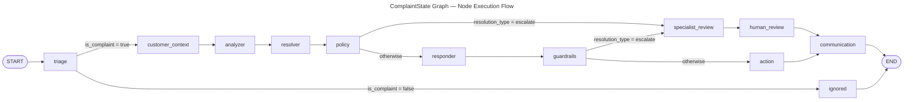

# C4 Code Level: Root Module — ComplaintForge

## Overview

- **Name**: ComplaintForge Root Module
- **Description**: Entry points, workflow orchestration, observability infrastructure, and shared utilities for the ComplaintForge autonomous complaint-handling system.
- **Location**: `./` (repository root)
- **Language**: Python 3.11+
- **Purpose**: Defines the LangGraph stateful workflow (`graph.py`), exposes it as both a CLI script (`main.py`) and a production FastAPI service (`main_fastapi.py`), provides a single OpenTelemetry helper module (`otel.py`), centralises configuration (`config.py`), abstracts LLM instantiation (`llm_factory.py`), and implements LangSmith evaluation functions (`response_evaluators.py`).

---

## Code Elements

### `config.py` — Environment Configuration Module

No classes or functions; the module executes on import and populates module-level constants read from environment variables via `python-dotenv`.

| Constant | Type | Source env-var(s) |
|---|---|---|
| `AZURE_OPENAI_API_KEY` | `str \| None` | `AZURE_OPENAI_API_KEY` |
| `AZURE_OPENAI_ENDPOINT` | `str \| None` | `AZURE_OPENAI_ENDPOINT` |
| `AZURE_OPENAI_DEPLOYMENT_NAME` | `str \| None` | `AZURE_OPENAI_DEPLOYMENT_NAME`, `AZURE_OPENAI_DEPLOYMENT` |
| `SALESFORCE_LOGIN_URL` | `str` | `SALESFORCE_LOGIN_URL` (default `https://login.salesforce.com`) |
| `SALESFORCE_CLIENT_ID` | `str \| None` | `SALESFORCE_CLIENT_ID` |
| `SALESFORCE_CLIENT_SECRET` | `str \| None` | `SALESFORCE_CLIENT_SECRET` |
| `SALESFORCE_API_VERSION` | `str` | `SALESFORCE_API_VERSION` (default `v61.0`) |
| `SALESFORCE_RETURN_ORDER_OBJECT` | `str` | `SALESFORCE_RETURN_ORDER_OBJECT` (default `ReturnOrder`) |
| `SALESFORCE_RETURN_ORDER_ACCOUNT_FIELD` | `str` | `SALESFORCE_RETURN_ORDER_ACCOUNT_FIELD` (default `AccountId`) |
| `SALESFORCE_RETURN_ORDER_ORDER_FIELD` | `str` | `SALESFORCE_RETURN_ORDER_ORDER_FIELD` (default `OrderId`) |
| `MAILCHIMP_API_KEY` | `str \| None` | `MAILCHIMP_API_KEY` |
| `MAILCHIMP_FROM_EMAIL` | `str \| None` | `MAILCHIMP_FROM_EMAIL` |
| `MAILCHIMP_TIMEOUT` | `float` | `MAILCHIMP_TIMEOUT` (default `30`) |
| `OUTBOUND_COMMUNICATION_ENABLED` | `bool` | `OUTBOUND_COMMUNICATION_ENABLED` (default `true`) |
| `USE_LITELLM` | `bool` | `USE_LITELLM` (default `false`) |
| `LITELLM_BASE_URL` | `str` | `LITELLM_BASE_URL` (default `http://localhost:4000`) |
| `LITELLM_API_KEY` | `str` | `LITELLM_API_KEY` (default `sk-1234`) |
| `LITELLM_MODEL` | `str` | `LITELLM_MODEL` (default `gpt-4o`) |

- **Location**: `config.py:1–30`
- **Dependencies**: `python-dotenv`

---

### `llm_factory.py` — LLM Instantiation Module

#### Functions

- `_azure_openai_base_url() -> str`
  - Normalises the `AZURE_OPENAI_ENDPOINT` value to always end with `/openai/v1/`, handling both endpoint styles found in Azure OpenAI resources.
  - **Location**: `llm_factory.py:14–18`
  - **Dependencies**: `config.AZURE_OPENAI_ENDPOINT`

- `get_chat_llm(*, temperature: float = 0, request_timeout: float | None = None) -> ChatOpenAI`
  - Factory function that returns a `ChatOpenAI` instance configured for either Azure OpenAI (default) or a LiteLLM proxy, depending on the `USE_LITELLM` flag. Raises `RuntimeError` if Azure credentials are missing and LiteLLM is not enabled.
  - **Location**: `llm_factory.py:21–57`
  - **Dependencies**: `config` (all Azure/LiteLLM constants), `langchain_openai.ChatOpenAI`

---

### `otel.py` — OpenTelemetry Helper Module

#### Classes

- `_ExtraFormatter(logging.Formatter)`
  - Private logging formatter that appends any non-standard `LogRecord` fields (i.e., `extra={}` kwargs passed to logger calls) to the formatted log line in `key=value` format, separated by ` | `.
  - **Location**: `otel.py:27–38`
  - **Methods**:
    - `format(self, record: logging.LogRecord) -> str` — Calls `super().format()`, then appends sorted extra fields.

#### Functions

- `setup_otel(service_name: str) -> None`
  - Configures the global `TracerProvider`, `MeterProvider`, and `LoggerProvider` for OTLP export over HTTP. Adds both the OTel `LoggingHandler` and a stdout `StreamHandler` (with `_ExtraFormatter`) to the root logger. Also auto-instruments `requests` and Python `logging`. Must be called once at application startup, before any logger is used.
  - **Location**: `otel.py:41–65`
  - **Dependencies**: All `opentelemetry-sdk` and `opentelemetry-exporter-otlp-proto-http` packages.

- `instrument_fastapi(app) -> None`
  - Instruments a FastAPI application instance with `FastAPIInstrumentor` to produce automatic span-per-request tracing. Import of `FastAPIInstrumentor` is deferred inside the function to avoid hard dependency.
  - **Location**: `otel.py:68–71`
  - **Dependencies**: `opentelemetry-instrumentation-fastapi`

- `function_trace(name: str | None = None)`
  - Decorator factory that wraps any sync or async function in an OTel span. The span name defaults to `func.__qualname__` if `name` is not provided. Returns a coroutine-aware wrapper for async functions and a regular wrapper for sync functions.
  - **Location**: `otel.py:74–90`
  - **Dependencies**: `opentelemetry.trace`, `asyncio`, `functools`

- `background_task(name: str, group: str = "")`
  - Decorator factory that creates a root-level span for background async tasks. The span name is formatted as `{group}/{name}` when `group` is provided.
  - **Location**: `otel.py:93–103`
  - **Dependencies**: `opentelemetry.trace`, `functools`

- `set_attribute(key: str, value: Any) -> None`
  - Sets a single attribute on the currently active OTel span. No-op if there is no active span.
  - **Location**: `otel.py:106–107`
  - **Dependencies**: `opentelemetry.trace`

- `add_event(event_name: str, attributes: dict[str, Any] | None = None) -> None`
  - Adds a named event with optional attributes to the currently active OTel span.
  - **Location**: `otel.py:110–111`
  - **Dependencies**: `opentelemetry.trace`

- `notice_error() -> None`
  - Records the currently active exception (via `sys.exc_info()`) on the active span, sets span status to `ERROR`. Should be called from an `except` block.
  - **Location**: `otel.py:114–120`
  - **Dependencies**: `opentelemetry.trace`, `sys`

- `record_metric(name: str, value: float) -> None`
  - Lazily creates an OTel histogram instrument on first use (stored in module-level `_histograms` dict), then records a histogram observation. Metric instruments are reused across calls with the same `name`.
  - **Location**: `otel.py:126–130`
  - **Dependencies**: `opentelemetry.metrics`

---

### `graph.py` — LangGraph Workflow Definition

#### TypedDict

- `ComplaintState(TypedDict)`
  - Defines the shared state schema passed between all graph nodes. Fields use `Annotated[list, operator.add]` for append-only list fields (`actions_taken`, `messages`).
  - **Location**: `graph.py:44–62`
  - **Fields**: `complaint: str`, `triage: dict`, `customer_email: str | None`, `customer_phone: str | None`, `order_id: str | None`, `customer_history: dict`, `customer_context_result: dict`, `analysis: dict`, `resolution: dict`, `policy_result: dict`, `response_draft: str`, `actions_taken: Annotated[list, operator.add]`, `eval_results: dict`, `specialist_review: dict`, `human_review: dict`, `final_response: str`, `messages: Annotated[list, operator.add]`

#### Node Wrapper Functions

All wrappers delegate immediately to the imported agent or node function. They exist to provide a uniform `(state: ComplaintState) -> dict` signature for LangGraph's node registry.

| Wrapper | Target | Location |
|---|---|---|
| `triage_node(state: ComplaintState)` | `agents.triage.triage` | `graph.py:64–65` |
| `customer_context_node(state: ComplaintState)` | `nodes.customer_context.customer_context` | `graph.py:67–68` |
| `analyzer_node(state: ComplaintState)` | `agents.analyzer.analyzer` | `graph.py:70–71` |
| `resolver_node(state: ComplaintState)` | `agents.resolver.resolver` | `graph.py:73–74` |
| `policy_node(state: ComplaintState)` | `nodes.policy.policy` | `graph.py:76–77` |
| `responder_node(state: ComplaintState)` | `agents.responder.responder` | `graph.py:79–80` |
| `guardrails_node(state: ComplaintState)` | `nodes.guardrails.guardrails` (async) | `graph.py:82–83` |
| `action_node(state: ComplaintState)` | `agents.action_agent.action_agent` | `graph.py:85–86` |
| `communication_node(state: ComplaintState)` | `nodes.outbound_communication.communication_node` | `graph.py:88–89` |
| `specialist_review_node(state: ComplaintState)` | `nodes.specialist_review.specialist_review` | `graph.py:91–92` |
| `human_review_node(state: ComplaintState)` | `nodes.human_review.human_review` | `graph.py:94–95` |
| `ignored_node(state: ComplaintState)` | `nodes.ignored.ignored` | `graph.py:121–122` |

#### Routing Functions

- `route_after_triage(state: ComplaintState) -> str`
  - Returns `"customer_context"` when `state["triage"]["is_complaint"]` is `True`, otherwise `"ignored"`.
  - **Location**: `graph.py:113–119`

- `route_after_resolver(state: ComplaintState) -> str`
  - Returns `"specialist_review"` when `state["resolution"]["resolution_type"] == "escalate"`, otherwise `"responder"`.
  - **Location**: `graph.py:97–103`

- `route_after_guardrails(state: ComplaintState) -> str`
  - Returns `"specialist_review"` when `state["resolution"]["resolution_type"] == "escalate"`, otherwise `"action"`.
  - **Location**: `graph.py:105–111`

#### Graph Assembly (module-level)

- `workflow = StateGraph(ComplaintState)` — LangGraph state machine instance.
- `checkpointer = MemorySaver()` — In-memory checkpoint backend enabling human-in-the-loop interrupts.
- `app = workflow.compile(checkpointer=checkpointer)` — Compiled, executable LangGraph application exported for use by `main.py` and `main_fastapi.py`.
- **Location**: `graph.py:125–180`
- **Dependencies**: `langgraph`, all agents and nodes packages

---

### `main.py` — CLI Entry Point

#### Functions

- `handle_complaint(complaint_text: str) -> dict`
  - Async function that invokes the compiled LangGraph workflow (`app.ainvoke`) with a bare initial state, then prints the final response, actions taken, and Salesforce history summary to stdout. Returns the raw result dict from the graph.
  - **Location**: `main.py:7–25`
  - **Dependencies**: `graph.app`

- Module `__main__` block (lines 28–33) — Hard-coded sample complaint to demonstrate CLI usage via `asyncio.run(handle_complaint(...))`.

---

### `main_fastapi.py` — FastAPI Application

#### Pydantic Models

- `HumanReviewResume(BaseModel)`
  - Request body for the `POST /review/{thread_id}/resume` endpoint.
  - **Location**: `main_fastapi.py:39–43`
  - **Fields**: `final_response: str | None`, `approved: bool | None`, `notes: str | None`, `resolution: dict | None`

#### Module-Level State

- `review_runs: dict[str, dict]` — In-process dictionary keying `thread_id` to run metadata (status, ticket_id, interrupts, result). Not persisted across restarts.

#### Helper Functions (private)

- `_graph_config(thread_id: str) -> dict`
  - Returns a LangGraph `configurable` dict `{"configurable": {"thread_id": thread_id}}` used to address a specific graph checkpoint.
  - **Location**: `main_fastapi.py:46–47`

- `_serialize_interrupt(interrupt_obj) -> dict`
  - Converts a LangGraph interrupt object to a JSON-serialisable dict with `id` and `value` keys using `getattr` with fallbacks.
  - **Location**: `main_fastapi.py:50–54`

- `_serialize_interrupts(result: dict) -> list[dict]`
  - Extracts and serialises all interrupt objects from a graph result's `__interrupt__` list.
  - **Location**: `main_fastapi.py:57–62`

- `_pending_review_state(thread_id: str) -> dict`
  - Queries the live graph checkpoint for a given `thread_id` and returns a status dict including any pending interrupts and the current node queue (`next`).
  - **Location**: `main_fastapi.py:64–76`
  - **Dependencies**: `complaint_graph.get_state`

- `_record_run(thread_id: str, **updates) -> None`
  - Upserts arbitrary key/value pairs into the `review_runs` in-memory store for the given `thread_id`.
  - **Location**: `main_fastapi.py:79–81`

- `_finalize_completed_workflow(*, thread_id: str, ticket_id: int | None, result: dict) -> dict`
  - Async function that calls `update_ticket_status_via_mcp` to close the Zendesk ticket after a graph run completes, records the Zendesk result into both the run result dict and `review_runs`, then marks the run `"completed"`.
  - **Location**: `main_fastapi.py:84–109`
  - **Dependencies**: `tools.zendesk_mcp_tool.update_ticket_status_via_mcp`

#### Background Processor

- `process_complaint_async(complaint_text: str, ticket_id: int, email: str, thread_id: str | None = None) -> dict`
  - Decorated with `@background_task` (OTel root span) and `@langsmith.traceable`. Orchestrates the full complaint lifecycle: initialises graph state, invokes `complaint_graph.ainvoke`, handles the `__interrupt__` (human-review pause) path vs. the happy path, and calls `_finalize_completed_workflow`. Emits OTel spans, events, metrics, and structured log entries throughout.
  - **Location**: `main_fastapi.py:113–181`
  - **Dependencies**: `graph.complaint_graph`, `otel.*`, `langsmith.traceable`

#### FastAPI Route Handlers

| Route | Method | Handler | Location |
|---|---|---|---|
| `/webhook/zendesk/complaint` | POST | `zendesk_complaint_webhook(request, background_tasks)` | `main_fastapi.py:185–232` |
| `/test/complaint` | POST | `test_complaint(payload: dict)` | `main_fastapi.py:236–250` |
| `/review` | GET | `list_reviews()` | `main_fastapi.py:254–263` |
| `/review/{thread_id}` | GET | `get_review(thread_id: str)` | `main_fastapi.py:266–270` |
| `/review/{thread_id}/resume` | POST | `resume_review(thread_id: str, review: HumanReviewResume)` | `main_fastapi.py:273–316` |
| `/health` | GET | `health()` | `main_fastapi.py:320–325` |

- **`zendesk_complaint_webhook`** — Parses an incoming Zendesk payload, validates description and email are present, then enqueues `process_complaint_async` as a FastAPI `BackgroundTask`. Returns HTTP 202-equivalent `"accepted"` immediately.
- **`test_complaint`** — Directly awaits `process_complaint_async` (no background task) for synchronous testing. Uses `ticket_id=9999`.
- **`list_reviews`** — Filters `review_runs` for entries with status `"pending_review"`, records a gauge metric for the pending count.
- **`get_review`** — Returns current live graph checkpoint state for a thread.
- **`resume_review`** — Resumes a paused graph via `Command(resume=payload)`. Handles the case where the resumed graph triggers another interrupt (chains human-review steps).
- **`health`** — Simple liveness probe.
- **`startup_event`** — Logs service startup and available endpoints.

---

### `response_evaluators.py` — LangSmith Evaluation Functions

#### Functions

- `evaluate_response_empathy(run: Run, example: Example) -> dict[str, Any]`
  - LangSmith evaluator that calls the LLM (temperature=1) with a rubric prompt asking it to score the `final_response` field from 1–10 on empathy and tone. Returns `{"score": float, "reasoning": str}`. Falls back to `score=7.0` on JSON parse failure.
  - **Location**: `response_evaluators.py:11–35`
  - **Dependencies**: `llm_factory.get_chat_llm`, `langsmith.schemas.Run`, `langsmith.schemas.Example`

- `evaluate_resolution_appropriateness(run: Run, example: Example) -> dict[str, Any]`
  - LangSmith evaluator that scores whether the chosen `resolution` is appropriate given the complaint `analysis` (1–10). Returns `{"score": int, "reasoning": str}`. Falls back to `score=7` on parse failure.
  - **Location**: `response_evaluators.py:38–56`
  - **Dependencies**: `llm_factory.get_chat_llm`, `langsmith.schemas.Run`, `langsmith.schemas.Example`

#### Module-Level Constants

- `RESPONSE_QUALITY_EVALUATORS: dict[str, Callable]`
  - Registry mapping evaluator names to their functions. Consumed by LangSmith evaluation runs.
  - **Location**: `response_evaluators.py:59–62`
  - **Value**: `{"empathy_score": evaluate_response_empathy, "resolution_appropriateness": evaluate_resolution_appropriateness}`

---

## Dependencies

### Internal Dependencies

| Root module | Imports from |
|---|---|
| `main.py` | `graph` |
| `main_fastapi.py` | `graph`, `otel`, `tools.zendesk_mcp_tool` |
| `graph.py` | `agents.triage`, `agents.analyzer`, `agents.resolver`, `agents.responder`, `agents.action_agent`, `nodes.customer_context`, `nodes.policy`, `nodes.guardrails`, `nodes.specialist_review`, `nodes.human_review`, `nodes.outbound_communication`, `nodes.ignored` |
| `llm_factory.py` | `config` |
| `response_evaluators.py` | `llm_factory` |
| `otel.py` | _(no internal imports)_ |
| `config.py` | _(no internal imports)_ |

### External Dependencies

| Package | Used in | Purpose |
|---|---|---|
| `fastapi` | `main_fastapi.py` | HTTP API framework |
| `uvicorn` | runtime | ASGI server |
| `pydantic` | `main_fastapi.py` | Request/response model validation |
| `langgraph` | `graph.py`, `main_fastapi.py` | Stateful multi-agent workflow engine |
| `langchain` | `graph.py` (transitively) | LLM chain primitives |
| `langchain-openai` | `llm_factory.py` | `ChatOpenAI` wrapper for Azure OpenAI |
| `langsmith` | `main_fastapi.py`, `response_evaluators.py` | LLM tracing and evaluation |
| `python-dotenv` | `config.py`, `graph.py`, `main.py` | `.env` file loading |
| `opentelemetry-api` | `otel.py` | OTel trace/metric/log API |
| `opentelemetry-sdk` | `otel.py` | OTel SDK providers and processors |
| `opentelemetry-exporter-otlp-proto-http` | `otel.py` | OTLP/HTTP exporters for traces, metrics, logs |
| `opentelemetry-instrumentation-fastapi` | `otel.py` | Auto-instrument FastAPI requests |
| `opentelemetry-instrumentation-requests` | `otel.py` | Auto-instrument `requests` HTTP calls |
| `opentelemetry-instrumentation-logging` | `otel.py` | Correlate log records with OTel trace context |

---

## Relationships

```mermaid
---
title: Root Module — Code Structure
---
flowchart TB
    subgraph Entrypoints
        main["main.py\nhandle_complaint()"]
        fastapi["main_fastapi.py\nFastAPI app"]
    end

    subgraph Orchestration
        graph["graph.py\nComplaintState\nStateGraph / workflow\napp (compiled)"]
    end

    subgraph SharedInfra["Shared Infrastructure"]
        otel["otel.py\nsetup_otel()\ninstrument_fastapi()\nbackground_task()\nfunction_trace()\nset_attribute()\nadd_event()\nnotice_error()\nrecord_metric()"]
        config["config.py\nAzure/Salesforce/\nMailchimp/LiteLLM\nconstants"]
        llm["llm_factory.py\nget_chat_llm()"]
    end

    subgraph Evaluation
        evals["response_evaluators.py\nevaluate_response_empathy()\nevaluate_resolution_appropriateness()\nRESPONSE_QUALITY_EVALUATORS"]
    end

    subgraph AgentsNodes["agents/ + nodes/ packages"]
        agents["agents/\ntriage · analyzer\nresolver · responder\naction_agent"]
        nodes["nodes/\ncustomer_context · policy\nguardrails · specialist_review\nhuman_review · outbound_communication\nignored"]
    end

    subgraph ExternalTools["tools/ package"]
        tools["tools/\nzendesk_mcp_tool\nmailchimp_tool\nsalesforce_tool\na2a_specialist_tool"]
    end

    main -->|"imports app"| graph
    fastapi -->|"imports app"| graph
    fastapi -->|"imports helpers"| otel
    fastapi -->|"imports update_ticket"| tools

    graph -->|"adds nodes from"| agents
    graph -->|"adds nodes from"| nodes

    llm -->|"reads"| config
    evals -->|"calls"| llm

    agents -.->|"uses"| llm
    nodes -.->|"uses"| llm
    agents -.->|"calls"| tools
```

### Workflow Node Execution Order



---

## Notes

- **Startup order matters**: `main_fastapi.py` calls `setup_otel()` before importing `FastAPI` or `graph` to ensure all subsequent module-level loggers receive OTel context from the first log line onwards.
- **In-memory state limitation**: `review_runs` and `MemorySaver` are both in-process. Restarting the container loses all in-flight complaint threads and pending human-review state. Production hardening requires replacing `MemorySaver` with a persistent checkpointer (e.g., `langgraph-checkpoint-postgres`).
- **Dual LLM backends**: `llm_factory.get_chat_llm` transparently switches between Azure OpenAI (direct) and any OpenAI-compatible proxy via the `USE_LITELLM` flag, allowing local development with LiteLLM without code changes.
- **LangSmith tracing**: `graph.py` reads both `LANGSMITH_TRACING` and `LANGCHAIN_TRACING_V2` to remain compatible across LangChain versions, normalising both to a single boolean before writing them back into `os.environ`.
- **Human-in-the-loop**: The `__interrupt__` mechanism from LangGraph is used in the specialist/human review path. `resume_review` in `main_fastapi.py` injects a `Command(resume=payload)` to continue a paused workflow, and the result is checked again for further interrupts to support chained review steps.
