# C4 Code Level: Tests

## Overview

- **Name**: ComplaintForge Test Suite
- **Description**: Unit and async integration tests covering all major components of the ComplaintForge workflow — from triage and specialist review through outbound communication and the FastAPI entry point.
- **Location**: `tests/`
- **Language**: Python
- **Purpose**: Validate correctness of the complaint-handling pipeline, including LLM prompt contracts, graph node behaviour, HTTP tool retry logic, OAuth flows, and LangGraph interrupt/resume semantics, without requiring live cloud services or LLM endpoints.

---

## Code Elements

### test_a2a_specialist_service.py

**Class: `A2ASpecialistServiceTests(unittest.TestCase)`**

- `test_crewai_import_failure_mentions_python_314_constraint(self) -> None`
  - Description: Patches `sys.version_info` to (3, 14, 0) and asserts that `_crewai_import_failure_reason` returns a message that names the Python version and the supported range `>=3.10,<3.14`.
  - Location: `tests/test_a2a_specialist_service.py:14-19`
  - Dependencies: `a2a_refund_specialist_service.app._crewai_import_failure_reason`, `unittest.mock.patch`

- `test_service_llm_factory_builds_crewai_azure_llm(self) -> None`
  - Description: Injects a `FakeLLM` class as `crewai.LLM` and asserts that `llm_factory.get_chat_llm` constructs it with the correct `model`, `endpoint`, `api_key`, `api_version`, and `temperature` keyword arguments.
  - Location: `tests/test_a2a_specialist_service.py:22-49`
  - Dependencies: `a2a_refund_specialist_service.llm_factory.get_chat_llm`, `unittest.mock.patch`, `unittest.mock.patch.object`

**Class: `A2ASpecialistServiceAsyncTests(unittest.IsolatedAsyncioTestCase)`**

- `test_run_crewai_review_uses_async_kickoff(self) -> None` (async)
  - Description: Stubs out all CrewAI classes (`Agent`, `Task`, `Crew`, `Process`) and asserts that `run_crewai_review` calls `kickoff_async`, passes the Azure LLM to the agent, and maps the raw JSON result into `{status, source, recommendation}`.
  - Location: `tests/test_a2a_specialist_service.py:53-104`
  - Dependencies: `a2a_refund_specialist_service.app.run_crewai_review`, `a2a_refund_specialist_service.app.SpecialistRequest`, `unittest.mock.patch`, `types.SimpleNamespace`

---

### test_a2a_specialist_tool.py

**Class: `DummyResponse`** (test double)

- `__init__(self, payload: dict) -> None`
  - Description: Stores an arbitrary dict as a fake HTTP response payload.
  - Location: `tests/test_a2a_specialist_tool.py:8-10`

- `raise_for_status(self) -> None`
  - Description: No-op — simulates a successful HTTP status check.
  - Location: `tests/test_a2a_specialist_tool.py:12-13`

- `json(self) -> dict`
  - Description: Returns the stored payload dict.
  - Location: `tests/test_a2a_specialist_tool.py:15-16`

**Class: `A2ASpecialistToolTests(unittest.TestCase)`**

- `test_request_specialist_review_skips_without_url(self) -> None`
  - Description: Patches `A2A_SPECIALIST_URL` to `None` and asserts the tool returns `{status: "skipped"}` immediately without making any HTTP call.
  - Location: `tests/test_a2a_specialist_tool.py:20-25`
  - Dependencies: `tools.a2a_specialist_tool.request_specialist_review`

- `test_request_specialist_review_posts_expected_payload(self) -> None`
  - Description: Captures the full `requests.post` call and verifies the URL, `Authorization` header, timeout, and all mapped fields (`customer_email`, `customer_phone`, `resolution`) are correct.
  - Location: `tests/test_a2a_specialist_tool.py:27-64`
  - Dependencies: `tools.a2a_specialist_tool.request_specialist_review`, `requests`

- `test_request_specialist_review_retries_temporal_failures_then_succeeds(self) -> None`
  - Description: Raises `requests.exceptions.Timeout` on the first call and returns success on the second, asserting exactly two `post` calls were made.
  - Location: `tests/test_a2a_specialist_tool.py:66-83`
  - Dependencies: `tools.a2a_specialist_tool.request_specialist_review`, `tools.a2a_specialist_tool.time.sleep`

- `test_request_specialist_review_returns_error_after_retries(self) -> None`
  - Description: Raises `Timeout` on every attempt and asserts the final result is `{status: "error", retry_attempts: 3, fallback: "retry_exhausted"}`.
  - Location: `tests/test_a2a_specialist_tool.py:85-98`
  - Dependencies: `tools.a2a_specialist_tool.request_specialist_review`, `tools.a2a_specialist_tool.time.sleep`

---

### test_main_fastapi.py

**Class: `Interrupt`** (test double)

- `__init__(self, value: Any, id: str = "interrupt-1") -> None`
  - Description: Minimal stand-in for a LangGraph `Interrupt` object; carries `value` and `id` attributes.
  - Location: `tests/test_main_fastapi.py:14-17`

**Class: `DummyGraph`** (test double)

- `__init__(self, result: dict) -> None`
  - Description: Stores the predetermined graph result and a list of recorded calls.
  - Location: `tests/test_main_fastapi.py:20-23`

- `ainvoke(self, input_value: Any, config: dict) -> dict` (async)
  - Description: Records the call arguments and returns the preset result, simulating the LangGraph async invocation.
  - Location: `tests/test_main_fastapi.py:25-27`

- `get_state(self, config: dict) -> SimpleNamespace`
  - Description: Returns a `SimpleNamespace` with empty `interrupts`, `values`, and `next` attributes.
  - Location: `tests/test_main_fastapi.py:29-33`

**Class: `MainFastApiTests(unittest.TestCase)`**

- `setUp(self) -> None`
  - Description: Clears the module-level `review_runs` dict before each test to ensure isolation.
  - Location: `tests/test_main_fastapi.py:39`
  - Dependencies: `main_fastapi.review_runs`

- `test_finalize_completed_workflow_updates_zendesk(self) -> None`
  - Description: Stubs `update_ticket_status_via_mcp` and verifies `_finalize_completed_workflow` stores `completed` status in `review_runs` and returns the Zendesk update payload.
  - Location: `tests/test_main_fastapi.py:41-63`
  - Dependencies: `main_fastapi._finalize_completed_workflow`, `main_fastapi.update_ticket_status_via_mcp`, `main_fastapi.review_runs`

- `test_process_complaint_async_records_pending_review_on_interrupt(self) -> None`
  - Description: Injects a graph result containing `__interrupt__` and verifies `process_complaint_async` records `pending_review` state with the interrupt payload without calling finalization.
  - Location: `tests/test_main_fastapi.py:65-90`
  - Dependencies: `main_fastapi.process_complaint_async`, `main_fastapi.complaint_graph`, `main_fastapi.review_runs`

- `test_process_complaint_async_finalizes_completed_result(self) -> None`
  - Description: Injects a completed graph result and verifies `process_complaint_async` calls `_finalize_completed_workflow`, records `completed` status, and returns the Zendesk update nested in the result.
  - Location: `tests/test_main_fastapi.py:92-114`
  - Dependencies: `main_fastapi.process_complaint_async`, `main_fastapi._finalize_completed_workflow`, `main_fastapi.review_runs`

---

### test_nodes.py

**Class: `NodeTests(unittest.TestCase)`**

- `test_customer_context_propagates_salesforce_phone(self) -> None`
  - Description: Stubs `get_customer_history` to return a record with a phone number and asserts the node maps it onto both `customer_phone` and `customer_history["phone"]` in the returned state.
  - Location: `tests/test_nodes.py:11-27`
  - Dependencies: `nodes.customer_context.customer_context`, `nodes.customer_context.get_customer_history`

- `test_specialist_review_records_recommendation(self) -> None`
  - Description: Stubs `request_specialist_review` with a success response and asserts the node stores it under `specialist_review` and appends an `a2a_specialist_review` action to `actions_taken`.
  - Location: `tests/test_nodes.py:30-47`
  - Dependencies: `nodes.specialist_review.specialist_review`, `nodes.specialist_review.request_specialist_review`

- `test_specialist_review_handles_external_service_error(self) -> None`
  - Description: Stubs `request_specialist_review` with an error response and asserts the node still stores the result faithfully and records the action, demonstrating no exception is raised.
  - Location: `tests/test_nodes.py:49-66`
  - Dependencies: `nodes.specialist_review.specialist_review`, `nodes.specialist_review.request_specialist_review`

- `test_specialist_review_outage_fallback_reached(self) -> None`
  - Description: Makes `requests.post` raise `ConnectionError` on every attempt (bypassing `time.sleep`) and verifies the node ultimately surfaces `{status: "error", fallback: "retry_exhausted"}`.
  - Location: `tests/test_nodes.py:68-81`
  - Dependencies: `nodes.specialist_review.specialist_review`, `tools.a2a_specialist_tool.requests`, `tools.a2a_specialist_tool.time`

- `test_human_review_interrupt_payload_includes_specialist_review(self) -> None`
  - Description: Stubs LangGraph's `interrupt` function and asserts the payload forwarded to human reviewers includes `specialist_review`, `customer_phone`, and the `reason` from the resolution; also verifies the returned state.
  - Location: `tests/test_nodes.py:83-113`
  - Dependencies: `nodes.human_review.human_review`, `nodes.human_review.interrupt`

---

### test_outbound_communication.py

**Class: `CommunicationNodeTests(unittest.TestCase)`**

- `setUp(self) -> None`
  - Description: Populates `self.base_state` with a complete communication state dict including `correlation_id`, `subject`, `response_draft`, `customer_email`, `recipient_phone`, and `metadata`.
  - Location: `tests/test_outbound_communication.py:9-17`

- `test_email_success_returns_delivered_email(self) -> None`
  - Description: Patches `send_email` to return `{status: "success"}` and asserts `delivery_record.final_status` is `"delivered_email"` with one attempt recorded.
  - Location: `tests/test_outbound_communication.py:19-29`
  - Dependencies: `nodes.outbound_communication.communication_node`, `nodes.outbound_communication.send_email`

- `test_email_bounce_triggers_sms_fallback(self) -> None`
  - Description: Patches `send_email` to return `{status: "permanent_failure"}` and `send_sms` to return success; asserts `final_status` is `"delivered_sms"` with two attempts recorded.
  - Location: `tests/test_outbound_communication.py:31-45`
  - Dependencies: `nodes.outbound_communication.communication_node`, `nodes.outbound_communication.send_email`, `nodes.outbound_communication.send_sms`

- `test_email_bounce_without_phone_emits_human_review(self) -> None`
  - Description: Removes `recipient_phone` from state, patches email to fail permanently, stubs `interrupt`, and asserts `final_status` is `"failed"` and `human_review` key is present.
  - Location: `tests/test_outbound_communication.py:47-59`
  - Dependencies: `nodes.outbound_communication.communication_node`, `nodes.outbound_communication.send_email`, `nodes.outbound_communication.interrupt`

- `test_missing_recipient_triggers_human_review(self) -> None`
  - Description: Removes both `customer_email` and `recipient_phone`, stubs `interrupt`, and asserts the node immediately enters the human review path with `final_status` of `"failed"`.
  - Location: `tests/test_outbound_communication.py:61-70`
  - Dependencies: `nodes.outbound_communication.communication_node`, `nodes.outbound_communication.interrupt`

---

### test_prompts.py

**Class: `PromptTemplateTests(unittest.TestCase)`**

- `test_triage_prompt_only_requires_input(self) -> None`
  - Description: Builds a `ChatPromptTemplate` from `TRIAGE_PROMPT` and asserts the sole input variable is `"input"`.
  - Location: `tests/test_prompts.py:9-12`
  - Dependencies: `prompts.system_prompts.TRIAGE_PROMPT`, `langchain_core.prompts.ChatPromptTemplate`

- `test_analyzer_prompt_requires_complaint_and_history(self) -> None`
  - Description: Builds a `ChatPromptTemplate` from `ANALYZER_PROMPT` and asserts the input variable set is exactly `{"complaint", "history"}`.
  - Location: `tests/test_prompts.py:14-17`
  - Dependencies: `prompts.system_prompts.ANALYZER_PROMPT`, `langchain_core.prompts.ChatPromptTemplate`

---

### test_salesforce_tool.py

**Class: `DummyResponse`** (test double)

- `__init__(self, payload: Any, status_code: int = 200, content: bytes = b"{}") -> None`
  - Description: Fake `requests.Response` that stores payload, status code, content, and a string `text` representation.
  - Location: `tests/test_salesforce_tool.py:9-14`

- `raise_for_status(self) -> None`
  - Description: Raises `requests.HTTPError` when `status_code >= 400`, mirroring real `requests` behaviour.
  - Location: `tests/test_salesforce_tool.py:16-18`

- `json(self) -> Any`
  - Description: Returns the payload or re-raises it if it is a `ValueError`, allowing the test to simulate a malformed JSON body.
  - Location: `tests/test_salesforce_tool.py:20-22`

**Class: `SalesforceToolTests(unittest.TestCase)`**

- `test_get_access_token_reports_salesforce_oauth_error_body(self) -> None`
  - Description: Patches `requests.post` to return HTTP 400 with an OAuth error body; asserts `_get_access_token` raises `RuntimeError` containing the error code and description but not the client secret.
  - Location: `tests/test_salesforce_tool.py:27-49`
  - Dependencies: `tools.salesforce_tool._get_access_token`, `tools.salesforce_tool.requests`

- `test_get_access_token_posts_client_credentials_payload(self) -> None`
  - Description: Captures the `requests.post` call and asserts the URL ends with `/services/oauth2/token`, the body uses `grant_type=client_credentials`, and the returned tuple contains `(access_token, instance_url)` with a trailing slash stripped.
  - Location: `tests/test_salesforce_tool.py:51-84`
  - Dependencies: `tools.salesforce_tool._get_access_token`, `tools.salesforce_tool.requests`

- `test_get_customer_history_includes_optional_contact_phone(self) -> None`
  - Description: Stubs `_query` to return a Contact record with a `Phone` field and empty results for all other objects; asserts `get_customer_history` surfaces `phone` and `email` at the top level of the returned dict.
  - Location: `tests/test_salesforce_tool.py:86-112`
  - Dependencies: `tools.salesforce_tool.get_customer_history`, `tools.salesforce_tool._query`

---

### test_triage.py

**Class: `DummyPromptTemplate`** (test double)

- `__init__(self, template: str) -> None` / `__or__(self, other)` / `from_template(cls, template) -> DummyPromptTemplate`
  - Description: Simulates LangChain's `ChatPromptTemplate` pipe operator by passing through to the right-hand operand.
  - Location: `tests/test_triage.py:7-16`

**Class: `DummyResult`** (test double)

- `__init__(self, result: dict) -> None` / `model_dump(self) -> dict`
  - Description: Mimics a Pydantic model's `model_dump()` method for structured LLM output.
  - Location: `tests/test_triage.py:19-22`

**Class: `DummyStructuredOutput`** (test double)

- `__init__(self, result: Any) -> None` / `invoke(self, inputs: dict) -> DummyResult`
  - Description: Records the inputs passed to `invoke` and returns a `DummyResult` wrapping the preset result dict.
  - Location: `tests/test_triage.py:25-34`

**Class: `DummyLLM`** (test double)

- `__init__(self, chain: DummyStructuredOutput) -> None` / `with_structured_output(self, output_model: type) -> DummyStructuredOutput`
  - Description: Simulates an LLM that supports `with_structured_output`, returning the pre-wired `DummyStructuredOutput` chain.
  - Location: `tests/test_triage.py:37-41`

**Class: `TriageTests(unittest.TestCase)`**

- `test_triage_uses_llm_structured_output_and_returns_expected_fields(self) -> None`
  - Description: Wires the dummy LLM chain into the triage module and asserts the function returns `triage`, `customer_email`, and `order_id` keys, and that the chain was invoked with `{input: <complaint text>}`.
  - Location: `tests/test_triage.py:46-64`
  - Dependencies: `agents.triage.triage`, `agents.triage.ChatPromptTemplate`, `agents.triage.llm`

- `test_triage_returns_safe_fallback_on_llm_failure(self) -> None`
  - Description: Replaces `invoke` with a function that raises `RuntimeError` and asserts the triage function returns a safe fallback with `is_complaint=False`, `confidence=0.0`, and a reason string containing "LLM triage unavailable".
  - Location: `tests/test_triage.py:66-83`
  - Dependencies: `agents.triage.triage`, `agents.triage.ChatPromptTemplate`, `agents.triage.llm`

---

## Dependencies

### Internal Dependencies

| Test File | Source Modules Under Test |
|---|---|
| `test_a2a_specialist_service.py` | `a2a_refund_specialist_service.app`, `a2a_refund_specialist_service.llm_factory` |
| `test_a2a_specialist_tool.py` | `tools.a2a_specialist_tool` |
| `test_main_fastapi.py` | `main_fastapi` |
| `test_nodes.py` | `nodes.customer_context`, `nodes.human_review`, `nodes.specialist_review`, `tools.a2a_specialist_tool` |
| `test_outbound_communication.py` | `nodes.outbound_communication`, `nodes.communication_models` |
| `test_prompts.py` | `prompts.system_prompts` |
| `test_salesforce_tool.py` | `tools.salesforce_tool` |
| `test_triage.py` | `agents.triage` |

### External Dependencies

| Library | Usage |
|---|---|
| `unittest` (stdlib) | Base test case classes (`TestCase`, `IsolatedAsyncioTestCase`) |
| `unittest.mock` (stdlib) | `patch`, `patch.object` for isolating collaborators |
| `asyncio` (stdlib) | `asyncio.run()` to drive coroutines in synchronous test cases |
| `os` (stdlib) | `os.environ.setdefault` to inject required env vars before module import |
| `types.SimpleNamespace` (stdlib) | Lightweight fake objects for CrewAI and LangGraph stubs |
| `requests` (third-party) | Imported into test files to access `requests.exceptions` for error injection |
| `langchain_core.prompts.ChatPromptTemplate` | Instantiating real prompt templates to assert their `input_variables` |

---

## Relationships

```mermaid
---
title: Test Module Dependencies — ComplaintForge tests/
---
flowchart TB
    subgraph tests["tests/"]
        T1[test_a2a_specialist_service]
        T2[test_a2a_specialist_tool]
        T3[test_main_fastapi]
        T4[test_nodes]
        T5[test_outbound_communication]
        T6[test_prompts]
        T7[test_salesforce_tool]
        T8[test_triage]
    end

    subgraph specialist_service["a2a_refund_specialist_service/"]
        SS1[app]
        SS2[llm_factory]
    end

    subgraph tools_pkg["tools/"]
        TL1[a2a_specialist_tool]
        TL2[salesforce_tool]
    end

    subgraph nodes_pkg["nodes/"]
        N1[customer_context]
        N2[human_review]
        N3[specialist_review]
        N4[outbound_communication]
        N5[communication_models]
    end

    subgraph agents_pkg["agents/"]
        A1[triage]
    end

    subgraph app_layer["app/"]
        M1[main_fastapi]
        P1[prompts/system_prompts]
    end

    T1 --> SS1
    T1 --> SS2
    T2 --> TL1
    T3 --> M1
    T4 --> N1
    T4 --> N2
    T4 --> N3
    T4 --> TL1
    T5 --> N4
    T5 --> N5
    T6 --> P1
    T7 --> TL2
    T8 --> A1
```

---

## Notes

- All tests use `unittest.mock.patch` / `patch.object` exclusively — no live network calls or LLM endpoints are exercised during the test run.
- `test_main_fastapi.py` sets three `AZURE_OPENAI_*` environment variables via `os.environ.setdefault` at module import time so that `main_fastapi` can be imported without raising configuration errors.
- `test_nodes.py` tests the end-to-end retry path in `test_specialist_review_outage_fallback_reached` by patching at the `tools.a2a_specialist_tool` level rather than the node level, making it the only test that exercises the retry loop directly.
- The four LangChain test-double classes in `test_triage.py` (`DummyPromptTemplate`, `DummyResult`, `DummyStructuredOutput`, `DummyLLM`) together replicate the `prompt | llm.with_structured_output(Model)` pipe pattern used in `agents/triage.py`, allowing the triage logic to run with zero external calls.
- `test_outbound_communication.py` uses `nodes.communication_models.DeliveryRecord` as a concrete return-type assertion, meaning those Pydantic models are part of the public contract tested here.
