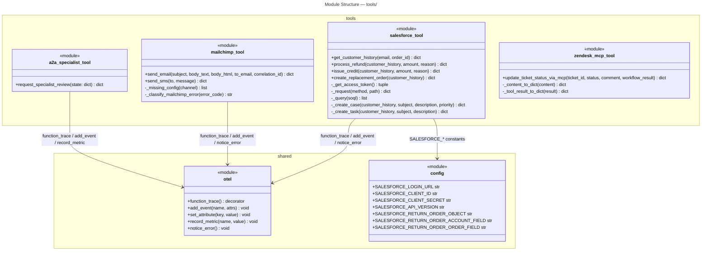
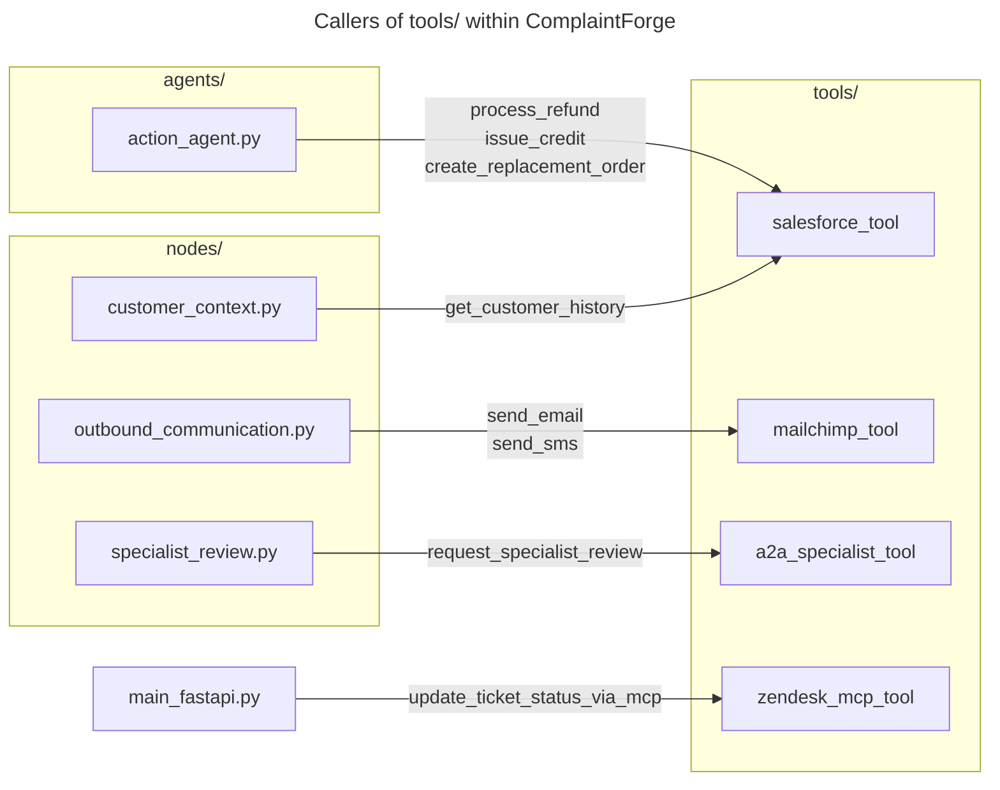

# C4 Code Level: Tools

## Overview

- **Name**: External Integration Tools
- **Description**: A collection of tool modules that wrap third-party service integrations — Salesforce CRM, Mailchimp Transactional messaging, Zendesk via MCP, and an external A2A specialist service. Each module exposes a narrow public API consumed by graph nodes and agents in the complaint-handling workflow.
- **Location**: `tools/`
- **Language**: Python 3.11+
- **Purpose**: Isolate every outbound I/O call behind purpose-built functions so that nodes, agents, and the FastAPI entry-point stay free of HTTP, SDK, and retry logic. All public functions are wrapped in OpenTelemetry spans via the `@function_trace()` decorator from `otel.py`.

---

## Code Elements

### `tools/a2a_specialist_tool.py`

Module-level constants loaded from environment variables:

| Constant | Source |
|---|---|
| `A2A_SPECIALIST_URL` | `os.getenv("A2A_SPECIALIST_URL")` |
| `A2A_SPECIALIST_AUTH_TOKEN` | `os.getenv("A2A_SPECIALIST_AUTH_TOKEN")` |

#### Public Functions

- `request_specialist_review(state: dict[str, Any]) -> dict[str, Any]`
  - Description: Calls the external A2A specialist REST endpoint (`POST /tasks/refund-specialist`) with a structured complaint payload extracted from the workflow state dict. Implements a 3-attempt retry loop with linear back-off (1 s, 2 s) for transient network and 5xx errors; returns a typed result dict with keys `status`, `message`, `retry_attempts`, and optionally `fallback`.
  - Location: `tools/a2a_specialist_tool.py` lines 18–109
  - OTel: decorated with `@function_trace()`; records `add_event("A2ASpecialistCall", ...)`, `set_attribute("a2a.attempt_count", ...)`, `set_attribute("a2a.status", ...)`, and `record_metric("a2a.retry_count", ...)`
  - Dependencies: `otel.add_event`, `otel.function_trace`, `otel.record_metric`, `otel.set_attribute`; `requests.post`; `requests.exceptions.ConnectionError`, `HTTPError`, `RequestException`, `Timeout`

---

### `tools/mailchimp_tool.py`

Module-level constants loaded from environment variables (and optionally from `config.py`):

| Constant | Source |
|---|---|
| `MAILCHIMP_API_KEY` | `os.getenv("MAILCHIMP_API_KEY")` |
| `MAILCHIMP_FROM_EMAIL` | `os.getenv("MAILCHIMP_FROM_EMAIL")` |
| `MAILCHIMP_TIMEOUT` | `os.getenv("MAILCHIMP_TIMEOUT", "30")` |

The `mailchimp_transactional` SDK is imported with a try/except guard; if not installed the module still loads and returns a descriptive error at call time.

#### Private Helpers

- `_missing_config(channel: str) -> list[str]`
  - Description: Returns the names of any required environment variables that are `None` for the given channel (`"email"` requires both `MAILCHIMP_API_KEY` and `MAILCHIMP_FROM_EMAIL`; `"sms"` only requires `MAILCHIMP_API_KEY`).
  - Location: `tools/mailchimp_tool.py` lines 19–24

- `_classify_mailchimp_error(error_code: int | str) -> str`
  - Description: Maps a numeric HTTP-style error code to one of `"permanent_failure"` (4xx except 429), `"transient_failure"` (5xx or 429 rate-limit), or `"success"` (2xx). Used to surface a normalised status string when the SDK raises an exception with an attached error code.
  - Location: `tools/mailchimp_tool.py` lines 27–40

#### Public Functions

- `send_email(*, subject: str, body_text: str, body_html: str | None, to_email: str, correlation_id: str | None = None) -> dict[str, Any]`
  - Description: Sends a transactional email through the Mailchimp Transactional SDK. Checks for missing config and SDK availability before making the API call. Maps the Mailchimp response status (`sent`, `queued`, `rejected`, or other) to a normalised result dict with keys `status`, `provider`, and `provider_response`.
  - Location: `tools/mailchimp_tool.py` lines 43–148
  - OTel: decorated with `@function_trace()`; emits `add_event("MailchimpDelivery", ...)` and `record_metric("mailchimp.email_sent" / "mailchimp.email_rejected", ...)`; calls `notice_error()` on exception

- `send_sms(*, to: str, message: str) -> dict[str, Any]`
  - Description: Sends a transactional SMS through the Mailchimp Transactional SMS API using the same SDK client. Maps the provider response state (`sent`, `queued`, `rejected`, `failed`) to the same normalised result shape as `send_email`.
  - Location: `tools/mailchimp_tool.py` lines 151–242
  - OTel: decorated with `@function_trace()`; emits `add_event("MailchimpDelivery", ...)` and `record_metric("mailchimp.sms_sent" / "mailchimp.sms_rejected", ...)`; calls `notice_error()` on exception

---

### `tools/salesforce_tool.py`

Configuration is imported directly from `config.py` (`SALESFORCE_API_VERSION`, `SALESFORCE_CLIENT_ID`, `SALESFORCE_CLIENT_SECRET`, `SALESFORCE_LOGIN_URL`, `SALESFORCE_RETURN_ORDER_ACCOUNT_FIELD`, `SALESFORCE_RETURN_ORDER_OBJECT`, `SALESFORCE_RETURN_ORDER_ORDER_FIELD`).

#### Private Helpers

- `_salesforce_error_message(response: requests.Response) -> str`
  - Description: Extracts a human-readable error string from a Salesforce HTTP response, handling both JSON payloads (`error`/`error_description` keys) and plain-text bodies.
  - Location: `tools/salesforce_tool.py` lines 22–38

- `_raise_for_status(response: requests.Response, *, context: str) -> None`
  - Description: Calls `response.raise_for_status()` and re-raises any `HTTPError` as a `RuntimeError` that includes the Salesforce error message and the originating context label.
  - Location: `tools/salesforce_tool.py` lines 41–48

- `_missing_config() -> list[str]`
  - Description: Returns the names of unset required Salesforce OAuth credentials (`SALESFORCE_CLIENT_ID`, `SALESFORCE_CLIENT_SECRET`, `SALESFORCE_LOGIN_URL`).
  - Location: `tools/salesforce_tool.py` lines 51–60

- `_get_access_token() -> tuple[str, str]`
  - Description: Performs an OAuth 2.0 client-credentials token request against the Salesforce login URL. Returns `(access_token, instance_url)`.
  - Location: `tools/salesforce_tool.py` lines 63–79

- `_headers() -> tuple[dict[str, str], str]`
  - Description: Obtains a fresh access token and returns a pre-built `Authorization: Bearer` headers dict alongside the Salesforce instance URL.
  - Location: `tools/salesforce_tool.py` lines 82–88

- `_request(method: str, path: str, **kwargs: Any) -> dict[str, Any]`
  - Description: Generic authenticated Salesforce REST request. Prepends the versioned base path (`/services/data/{API_VERSION}`) and calls `_raise_for_status`. Returns an empty dict for 204 responses.
  - Location: `tools/salesforce_tool.py` lines 91–103

- `_soql_string(value: str) -> str`
  - Description: Escapes a string value for safe embedding in a SOQL query (escapes backslashes and single quotes).
  - Location: `tools/salesforce_tool.py` lines 106–107

- `_query(soql: str) -> list[dict[str, Any]]`
  - Description: Executes a SOQL query via the Salesforce REST `/query` endpoint and returns the `records` list.
  - Location: `tools/salesforce_tool.py` lines 110–111

- `_first(records: list[dict[str, Any]]) -> dict[str, Any] | None`
  - Description: Returns the first element of a list or `None` if the list is empty.
  - Location: `tools/salesforce_tool.py` lines 114–115

- `_find_contact(email: str) -> dict[str, Any] | None`
  - Description: SOQL query that looks up a Salesforce `Contact` by email address (LIMIT 1), returning the record or `None`.
  - Location: `tools/salesforce_tool.py` lines 118–124

- `_recent_cases(contact_id: str) -> list[dict[str, Any]]`
  - Description: Returns up to 5 most-recent `Case` records associated with the given `ContactId`, ordered by `CreatedDate DESC`.
  - Location: `tools/salesforce_tool.py` lines 127–133

- `_recent_opportunities(account_id: str | None) -> list[dict[str, Any]]`
  - Description: Returns up to 5 most-recent `Opportunity` records for the account, or an empty list if `account_id` is `None`.
  - Location: `tools/salesforce_tool.py` lines 135–142

- `_find_order(order_id: str | None, account_id: str | None) -> dict[str, Any] | None`
  - Description: Finds a Salesforce `Order` first by `OrderNumber`, then falls back to the most recent order for the account. Returns `None` if neither lookup yields a result.
  - Location: `tools/salesforce_tool.py` lines 145–165

- `_salesforce_identifier(value: str) -> str`
  - Description: Validates that a string is a safe Salesforce field or object name (alphanumeric, underscores, dots only) to prevent SOQL injection via field names.
  - Location: `tools/salesforce_tool.py` lines 168–171

- `_recent_return_orders(account_id: str | None, matched_order: dict[str, Any] | None) -> list[dict[str, Any]]`
  - Description: Queries the configurable return-order object for up to 5 records matching the account or the matched order, using the configurable account and order field names.
  - Location: `tools/salesforce_tool.py` lines 174–197

- `_case_description(customer_history: dict[str, Any], amount: float | None, reason: str | None) -> str`
  - Description: Builds a multi-line plain-text description string for a Salesforce Case or Task from the customer history dict, optional amount, and optional reason; omits lines that resolve to `None`.
  - Location: `tools/salesforce_tool.py` lines 200–212

- `_create_case(customer_history: dict[str, Any], *, subject: str, description: str, priority: str = "Medium") -> dict[str, Any]`
  - Description: POSTs a new `Case` sObject to Salesforce, associating it with the contact and account from the customer history dict. Returns a result dict with `status`, `salesforce_action`, and `case_id`.
  - Location: `tools/salesforce_tool.py` lines 215–241

- `_create_task(customer_history: dict[str, Any], *, subject: str, description: str) -> dict[str, Any]`
  - Description: POSTs a new `Task` sObject to Salesforce, linking it via `WhoId` (contact) and `WhatId` (account). Returns a result dict with `status`, `salesforce_action`, and `task_id`.
  - Location: `tools/salesforce_tool.py` lines 244–266

#### Public Functions

- `get_customer_history(email: str, order_id: str | None = None) -> dict[str, Any]`
  - Description: Orchestrates a multi-step Salesforce lookup — contact, recent cases, recent opportunities, most recent order, and recent return orders — and assembles all data into a single context dict consumed downstream by nodes and agents. Returns an error dict if the contact is not found or any call raises.
  - Location: `tools/salesforce_tool.py` lines 269–309
  - OTel: decorated with `@function_trace()`; emits `add_event("SalesforceHistoryLookup", ...)`; calls `notice_error()` on exception

- `process_refund(customer_history: dict[str, Any], amount: float, reason: str | None = None) -> dict[str, Any]`
  - Description: Creates a high-priority Salesforce Case to initiate a refund workflow for the customer identified in `customer_history`.
  - Location: `tools/salesforce_tool.py` lines 312–331
  - OTel: decorated with `@function_trace()`; calls `notice_error()` on exception

- `issue_credit(customer_history: dict[str, Any], amount: float, reason: str | None = None) -> dict[str, Any]`
  - Description: Creates a medium-priority Salesforce Case to initiate a store-credit workflow.
  - Location: `tools/salesforce_tool.py` lines 334–350
  - OTel: decorated with `@function_trace()`; calls `notice_error()` on exception

- `create_replacement_order(customer_history: dict[str, Any]) -> dict[str, Any]`
  - Description: Creates a Salesforce Task (rather than a Case) to prompt a fulfilment team to ship a replacement order.
  - Location: `tools/salesforce_tool.py` lines 353–369
  - OTel: decorated with `@function_trace()`; calls `notice_error()` on exception

---

### `tools/zendesk_mcp_tool.py`

Module-level constants loaded from environment variables:

| Constant | Source | Default |
|---|---|---|
| `ZENDESK_MCP_URL` | `os.getenv("ZENDESK_MCP_URL")` | `None` |
| `ZENDESK_MCP_AUTH_TOKEN` | `os.getenv("ZENDESK_MCP_AUTH_TOKEN")` | `None` |
| `ZENDESK_TICKET_COMPLETION_STATUS` | `os.getenv("ZENDESK_TICKET_COMPLETION_STATUS", "solved")` | `"solved"` |
| `ZENDESK_MCP_UPDATE_TICKET_TOOL` | `os.getenv("ZENDESK_MCP_UPDATE_TICKET_TOOL", "update_ticket")` | `"update_ticket"` |

`httpx`, `mcp.ClientSession`, and `mcp.client.streamable_http.streamable_http_client` are imported lazily inside the public function body to allow the module to load without the MCP SDK installed.

#### Private Helpers

- `_content_to_dict(content) -> dict[str, Any]`
  - Description: Converts an MCP content object to a plain dict by calling `.model_dump()`, `.dict()`, or falling back to `str()`. Handles both Pydantic v1 and v2 response objects.
  - Location: `tools/zendesk_mcp_tool.py` lines 19–24

- `_tool_result_to_dict(result) -> dict[str, Any]`
  - Description: Normalises an MCP `CallToolResult` to a plain dict, preferring `structuredContent` when present, otherwise serialising the `content` list via `_content_to_dict`.
  - Location: `tools/zendesk_mcp_tool.py` lines 27–41

#### Public Functions

- `async update_ticket_status_via_mcp(*, ticket_id: int, status: str | None = None, comment: str | None = None, workflow_result: dict[str, Any] | None = None) -> dict[str, Any]`
  - Description: Connects to a remote MCP Streamable HTTP server and invokes the configured tool name (default `update_ticket`) to update a Zendesk ticket's status and add a comment. Accepts an optional `workflow_result` dict to include a workflow summary in the tool call payload. Returns a normalised result dict with `status`, `mcp_url`, `mcp_tool`, and `payload`; returns a `"skipped"` result if `ZENDESK_MCP_URL` is not set.
  - Location: `tools/zendesk_mcp_tool.py` lines 44–126
  - Dependencies (lazy imports): `httpx.AsyncClient`, `mcp.ClientSession`, `mcp.client.streamable_http.streamable_http_client`

---

## Dependencies

### Internal Dependencies

| Tool Module | Internal Import | Purpose |
|---|---|---|
| `a2a_specialist_tool.py` | `otel` | `add_event`, `function_trace`, `record_metric`, `set_attribute` |
| `mailchimp_tool.py` | `otel` | `add_event`, `function_trace`, `notice_error`, `record_metric` |
| `salesforce_tool.py` | `otel` | `add_event`, `function_trace`, `notice_error` |
| `salesforce_tool.py` | `config` | All `SALESFORCE_*` constants |
| `zendesk_mcp_tool.py` | _(none)_ | Uses only stdlib `logging` and `os` |

### External Dependencies

| Library | Used By | Purpose |
|---|---|---|
| `requests` | `a2a_specialist_tool`, `salesforce_tool` | HTTP calls to A2A endpoint and Salesforce REST/OAuth API |
| `mailchimp_transactional` | `mailchimp_tool` | Official Mailchimp Transactional SDK (optional, gracefully degraded) |
| `httpx` | `zendesk_mcp_tool` | Async HTTP client for MCP transport (lazy import) |
| `mcp` | `zendesk_mcp_tool` | MCP client SDK — `ClientSession`, `streamable_http_client` (lazy import) |
| `opentelemetry.*` | via `otel` | Tracing, metrics, and logging (indirect) |
| `python-dotenv` | via `config` | `.env` file loading (indirect) |

---

## Relationships

---

## Notes

- **No `__init__.py`**: The `tools/` directory has no package init file; each module is imported directly as `tools.<module_name>`.
- **Graceful degradation**: All four modules handle misconfiguration at call time rather than at import time, allowing the application to start even without all third-party credentials present. Each returns a typed error dict rather than raising, so callers can inspect `result["status"]` without a try/except.
- **OTel coverage**: Three of the four modules (`a2a_specialist_tool`, `mailchimp_tool`, `salesforce_tool`) wrap their public functions with `@function_trace()` from `otel.py`, creating child spans under the active workflow span. `zendesk_mcp_tool` uses only standard `logging` and does not yet use `function_trace`.
- **Async boundary**: `update_ticket_status_via_mcp` is the only `async` function in the tools layer, reflecting that Zendesk updates are driven from the async FastAPI request handler in `main_fastapi.py`.
- **SOQL injection protection**: `salesforce_tool.py` uses `_soql_string()` to escape user-supplied string values and `_salesforce_identifier()` to validate object/field names loaded from environment variables before they are interpolated into SOQL queries.
