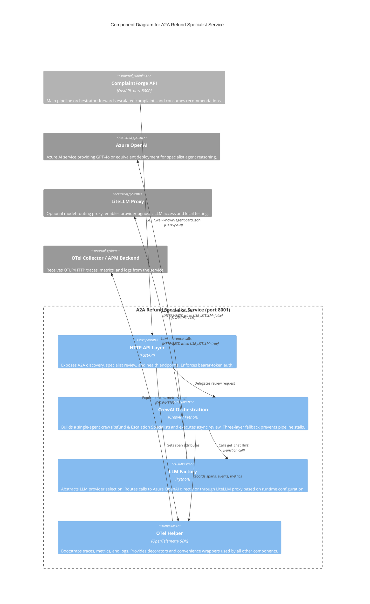

# C4 Component Level: A2A Refund Specialist Service

## Overview

- **Name**: A2A Refund Specialist Service
- **Description**: A standalone FastAPI microservice that accepts escalated complaint packages from the ComplaintForge pipeline, runs a CrewAI specialist agent to produce a policy-aware refund and credit recommendation, and returns a structured JSON advisory for human approval. Exposes an A2A (Agent-to-Agent) interface with standard discovery metadata.
- **Type**: Service
- **Technology**: Python 3.12, FastAPI, CrewAI, Azure OpenAI, LiteLLM (optional), OpenTelemetry

---

## Purpose

The A2A Refund Specialist Service fills the specialist-review gap in the ComplaintForge escalation path. When the main pipeline determines that a complaint exceeds automated resolution thresholds it forwards the complete complaint context — triage output, customer history, prior analysis, proposed resolution, policy checks, and evaluation results — to this service for a second-opinion review by a focused AI agent.

The service solves three problems:

1. **Separation of concerns**: The specialist review runs in its own process and container, so it can be scaled, deployed, or upgraded independently of the main ComplaintForge API without altering core pipeline logic.

2. **Resilience without blocking**: Three independent fallback layers (import failure, agent-setup failure, execution failure) ensure the pipeline always receives a well-formed response. All failure paths return an identically-shaped envelope with `source="fallback"` and `decision="human_review_required"`, so callers detect failure mode via a single field rather than exception handling.

3. **Provider flexibility**: An `llm_factory` abstraction lets operators route LLM calls to Azure OpenAI directly or through a LiteLLM proxy by toggling one environment variable, enabling model swaps and local testing without code changes.

The service is the concrete implementation of the Agent-to-Agent pattern within ComplaintForge: it advertises its capabilities via a standard `/.well-known/agent-card.json` discovery endpoint, accepts signed bearer-token requests, and returns structured recommendations that a human approver acts on.

---

## Software Features

- **A2A discovery endpoint**: Publishes agent metadata (name, description, version, URL, capabilities) at `GET /.well-known/agent-card.json` so orchestrators can discover the service dynamically without hardcoded configuration.
- **Escalated complaint review**: Accepts the full upstream pipeline payload and runs a single-crew CrewAI agent (one Agent, one Task) specialised in refund and escalation policy to produce a decision, risk level, refund amount, credit amount, and draft customer response.
- **Three-layer fallback guarantee**: Import failure, agent-setup failure, and execution failure are all caught independently; every failure path returns a structurally identical response with `source="fallback"` and `decision="human_review_required"`, preventing pipeline stalls.
- **Bearer token authentication**: Optional `A2A_SPECIALIST_AUTH_TOKEN` guard on the main endpoint; when the variable is unset the service accepts all requests, simplifying local development.
- **Dual LLM provider routing**: `llm_factory` builds a `crewai.LLM` instance targeting either Azure OpenAI (direct) or a LiteLLM proxy, selected at runtime via the `USE_LITELLM` environment variable.
- **OpenTelemetry observability**: All three OTel signals — distributed traces (OTLP/HTTP), metrics (histogram), and logs — are bootstrapped at startup and correlated across the service. Every HTTP request, CrewAI execution, and fallback event is captured with business-level attributes.
- **Automatic FastAPI span instrumentation**: `FastAPIInstrumentor` wraps every HTTP request automatically; individual async functions are traced with the `@function_trace()` decorator.
- **Liveness probe**: `GET /health` returns a fixed `{"status": "healthy"}` response for Docker `HEALTHCHECK` and container-orchestrator readiness checks.
- **Python version guard**: `_crewai_import_failure_reason` detects Python 3.14+ at runtime and surfaces a compatibility hint, protecting against silent failures on unsupported interpreter versions.

---

## Code Elements

This component is documented by the following code-level file:

- [c4-code-a2a-refund-specialist-service.md](./c4-code-a2a-refund-specialist-service.md) — Full code-level documentation covering `app.py` (FastAPI routes, CrewAI orchestration, helper utilities), `llm_factory.py` (LLM provider abstraction), and `otel.py` (OpenTelemetry bootstrap and instrumentation helpers).

---

## Interfaces

### A2A Agent Discovery

- **Protocol**: HTTP GET, JSON response
- **Endpoint**: `GET /.well-known/agent-card.json`
- **Description**: Returns static agent-card metadata following the A2A discovery convention. Allows the ComplaintForge orchestrator or any compatible A2A client to discover this service's identity, version, and capability list without prior configuration.
- **Operations**:
  - `agent_card() -> dict` — Returns `name`, `description`, `version`, `url`, `capabilities` fields.

### Specialist Review

- **Protocol**: HTTP POST, JSON request/response
- **Endpoint**: `POST /tasks/refund-specialist`
- **Description**: Primary A2A endpoint. Authenticates the caller, submits the complaint context to the CrewAI crew, and returns a structured recommendation envelope.
- **Authentication**: `Authorization: Bearer <token>` header; enforced when `A2A_SPECIALIST_AUTH_TOKEN` is configured.
- **Request schema** (`SpecialistRequest`):
  - `complaint: str` — Raw complaint text.
  - `triage: dict` — Upstream triage agent output.
  - `customer_email: str | None` — Customer contact address.
  - `order_id: str | None` — Associated order reference.
  - `customer_history: dict` — CRM / history lookup results.
  - `analysis: dict` — Sentiment and intent analysis output.
  - `resolution: dict` — Proposed resolution from the main pipeline.
  - `policy_result: dict` — Policy-check output.
  - `eval_results: dict` — Evaluator agent output.
  - `actions_taken: list[dict]` — Actions already executed.
- **Operations**:
  - `refund_specialist(request: SpecialistRequest, authorization: str | None) -> dict` — Returns `{"status": "success"|"fallback", "source": "crewai"|"fallback", "recommendation": {...}}`.

### Liveness Probe

- **Protocol**: HTTP GET, JSON response
- **Endpoint**: `GET /health`
- **Description**: Liveness check consumed by Docker `HEALTHCHECK` directives and container-orchestrator health polling.
- **Operations**:
  - `health() -> dict` — Returns `{"status": "healthy", "service": "refund-specialist-a2a"}`.

### LLM Provider Interface (consumed)

- **Protocol**: Internal function call → Azure OpenAI REST or LiteLLM proxy REST
- **Description**: `llm_factory.get_chat_llm()` is called by the CrewAI orchestration layer to obtain a configured `crewai.LLM` instance. The factory selects the backend at startup based on environment variables.
- **Operations**:
  - `get_chat_llm(*, temperature: float = 0) -> crewai.LLM` — Returns a ready-to-use LLM handle for CrewAI agent construction.

### OTel Export Interface (consumed)

- **Protocol**: OTLP/HTTP (traces, metrics, logs) to an OTel Collector or backend
- **Description**: `otel.setup_otel()` bootstraps OTLP exporters at startup. All traces, metric observations, and log records are shipped to the configured `OTEL_EXPORTER_OTLP_ENDPOINT`.
- **Operations**:
  - `setup_otel(service_name: str) -> None` — Initialises providers and exporters; must be called before the FastAPI app is created.
  - `instrument_fastapi(app) -> None` — Attaches `FastAPIInstrumentor` to the running app.

---

## Dependencies

### Components Used

- **ComplaintForge API** (caller): Sends escalated complaint packages to `POST /tasks/refund-specialist` and consumes the returned recommendation envelope. The A2A Specialist Service has no outbound dependency on the main API; the relationship is strictly inbound.

### External Systems

- **Azure OpenAI**: Direct LLM backend. Used when `USE_LITELLM` is not set to `true`. The `llm_factory` constructs a `crewai.LLM` with `azure/<deployment>` model string and authenticates via `AZURE_OPENAI_API_KEY`.
- **LiteLLM Proxy**: Alternative LLM backend. Used when `USE_LITELLM=true`. Accepts any model identifier via `LITELLM_MODEL` and routes to any underlying provider, enabling model-agnostic deployment and local testing.
- **OTel Collector / APM Backend**: Receives OTLP/HTTP exports for traces, metrics, and logs. Endpoint is configured via the standard `OTEL_EXPORTER_OTLP_ENDPOINT` environment variable.

---

## Component Diagram

---

## Notes

- **Port**: The service listens on port 8001, distinct from the main ComplaintForge API on port 8000.
- **Startup order**: `setup_otel("complaintforge-a2a-specialist")` must be called at module top-level before the FastAPI app is constructed so that all OTel providers are registered before `instrument_fastapi(app)` is invoked.
- **Fallback shape contract**: All three fallback paths (import, setup, execution) return an identically-shaped dict with `source="fallback"` and `decision="human_review_required"`. Callers detect the fallback path via `response["source"]` without inspecting error messages, making the contract stable across failure modes.
- **CrewAI Python compatibility**: CrewAI `>=1.14.0` requires Python `<3.14`. The Dockerfile pins Python 3.12-slim. The `_crewai_import_failure_reason` helper encodes a runtime version check to surface a meaningful error if an incompatible interpreter is used.
- **Auth model**: Bearer token authentication is optional. When `A2A_SPECIALIST_AUTH_TOKEN` is not set, the service accepts all requests, which simplifies local development and testing without secret management overhead.
