# C4 Component Level: Complaint Handler API

## Overview

- **Name**: Complaint Handler API
- **Description**: The main complaint-handling service that exposes HTTP endpoints for complaint intake and human-review management, orchestrates a stateful LangGraph multi-agent workflow, runs LLM-driven and deterministic processing nodes, and exports full OpenTelemetry and LangSmith observability.
- **Type**: Application Service
- **Technology**: Python 3.11+, FastAPI, LangGraph, LangChain, Azure OpenAI (or LiteLLM proxy), Pydantic, OpenTelemetry SDK, LangSmith

---

## Purpose

The Complaint Handler API is the central processing unit of ComplaintForge. It solves two related problems:

1. **Autonomous complaint resolution** — Incoming customer complaints arrive via a Zendesk webhook. The service classifies them, enriches them with CRM context, analyses sentiment and urgency, decides a policy-compliant resolution, drafts an empathetic email response, verifies response quality, executes real-world CRM actions (refunds, credits, replacements), and dispatches the final communication to the customer — all without human intervention on the happy path.

2. **Human-in-the-loop escalation** — When business policy rules, LLM confidence thresholds, or guardrail scores flag a complaint as too risky or too ambiguous for automation, the workflow pauses and exposes a review REST API. A human operator retrieves the pending review, supplies a decision, and the workflow resumes from the interruption point.

The component owns the complete lifecycle of a complaint from HTTP ingestion through CRM action to outbound communication, and provides a separate REST surface for review operators to inspect and resume paused workflows. All workflow steps emit structured OpenTelemetry spans, events, and metrics, and the LLM pipeline is traced end-to-end via LangSmith.

---

## Software Features

- **Zendesk webhook intake**: Accepts `POST /webhook/zendesk/complaint` payloads, validates required fields (description, email), and enqueues processing as a FastAPI `BackgroundTask`, returning HTTP 202 immediately.
- **Synchronous test endpoint**: `POST /test/complaint` directly awaits the full workflow for integration testing without requiring a Zendesk source.
- **LangGraph stateful workflow orchestration**: `graph.py` wires twelve nodes into a `StateGraph` with conditional routing. A `MemorySaver` checkpointer enables multi-step pause/resume across HTTP calls.
- **Complaint triage**: LLM agent classifies each ticket as a complaint or non-complaint, extracts customer e-mail and order ID, and gates the rest of the workflow on the result.
- **Customer context enrichment**: Deterministic node fetches Salesforce customer and order history before any LLM analysis occurs.
- **Complaint analysis**: LLM agent produces a structured `AnalysisResult` — issue type, sentiment, urgency, repeat-complaint flag — from the complaint text and Salesforce history.
- **Policy-compliant resolution**: LLM agent selects a resolution type (`full_refund`, `partial_refund`, `credit`, `replacement`, `apology`, `escalate`) with embedded business-rule constraints enforced in the prompt.
- **Deterministic policy enforcement**: A rule-engine node validates the LLM-proposed resolution against hard business rules (confidence threshold, refund ceiling, order-match requirement, excluded product categories) and escalates to human review when any rule fires.
- **Empathetic response drafting**: LLM agent generates a warm, professional customer-facing email body using the resolution and complaint context as input.
- **Response quality guardrails**: Async node scores the drafted response on empathy and resolution appropriateness using the LLM as an evaluator; fails below threshold 6/10 and overrides resolution to `escalate`.
- **CRM action execution**: Deterministic action agent translates the resolution into zero or more Salesforce API calls — `process_refund`, `issue_credit`, or `create_replacement_order`.
- **Specialist escalation**: Node delegates complex cases to a remote A2A specialist service, attaching full complaint state as context and storing the recommendation.
- **Human-in-the-loop review**: Node suspends the LangGraph workflow via `interrupt`, exposing a structured review payload through the REST API. Resumes on operator submission.
- **Outbound communication dispatch**: Node sends the final response via Mailchimp email, falling back to SMS on permanent email failure. Triggers a human-review interrupt if all delivery paths fail. Respects `OUTBOUND_COMMUNICATION_ENABLED` feature flag for non-production environments.
- **Zendesk ticket lifecycle management**: On workflow completion, calls the Zendesk MCP tool to close the source ticket.
- **Human review REST API**: `GET /review`, `GET /review/{thread_id}`, and `POST /review/{thread_id}/resume` allow operators to list, inspect, and resume paused workflows.
- **Health liveness probe**: `GET /health` for container orchestrator readiness checks.
- **OpenTelemetry observability**: Every node and agent emits OTel spans (via `@function_trace`), span attributes (`set_attribute`), named events (`add_event`), histogram metrics (`record_metric`), and error status (`notice_error`). FastAPI and `requests` are auto-instrumented. Telemetry is exported over OTLP/HTTP.
- **LangSmith tracing and evaluation**: The background processor is decorated with `@langsmith.traceable`. LLM quality evaluators (`evaluate_response_empathy`, `evaluate_resolution_appropriateness`) score completed runs against a rubric.
- **Dual LLM backend**: `llm_factory.get_chat_llm` switches transparently between Azure OpenAI (production) and a LiteLLM proxy (local development) via the `USE_LITELLM` feature flag.
- **Centralised prompt management**: All LLM system prompts and the embedded `POLICY_RULES` business-rule block live in a single versioned module, providing a single point of change for prompt engineering.
- **CLI entry point**: `main.py` allows direct invocation of the LangGraph workflow from the command line for local testing.

---

## Code Elements

This component is assembled from the following code-level documentation files:

- [c4-code-root.md](./c4-code-root.md) — Root module: FastAPI application (`main_fastapi.py`), LangGraph graph definition and `ComplaintState` schema (`graph.py`), OpenTelemetry helper (`otel.py`), LLM factory (`llm_factory.py`), environment configuration (`config.py`), LangSmith response evaluators (`response_evaluators.py`), and CLI entry point (`main.py`).
- [c4-code-agents.md](./c4-code-agents.md) — LLM-driven agent pipeline (`agents/`): `triage`, `analyzer`, `resolver`, `responder`, `action_agent`, and the Pydantic structured-output models (`TriageResult`, `AnalysisResult`, `ResolutionResult`) that form the state contracts between agents.
- [c4-code-nodes.md](./c4-code-nodes.md) — Deterministic workflow nodes (`nodes/`): `customer_context`, `policy`, `guardrails` (async), `specialist_review`, `human_review`, `communication_node`, `ignored`, and the communication data models (`CommunicationPayload`, `DeliveryAttempt`, `DeliveryRecord`).
- [c4-code-prompts.md](./c4-code-prompts.md) — Prompt templates module (`prompts/system_prompts.py`): `TRIAGE_PROMPT`, `ANALYZER_PROMPT`, `RESOLVER_PROMPT` (with inlined `POLICY_RULES`), and `RESPONDER_PROMPT`.

---

## Interfaces

### Complaint Intake API

- **Protocol**: HTTP / REST (ASGI via Uvicorn)
- **Description**: Receives inbound complaint events from Zendesk and test callers; accepts human-review decisions from operators.
- **Operations**:
  - `POST /webhook/zendesk/complaint` — Accepts a Zendesk webhook payload (`description`, `email`, `ticket_id`). Enqueues `process_complaint_async` as a background task. Returns `{"status": "accepted"}` immediately.
  - `POST /test/complaint` — Accepts `{"complaint": str, "email": str, "ticket_id": int}`. Runs the full workflow synchronously. Returns the completed graph result dict.

### Human Review API

- **Protocol**: HTTP / REST
- **Description**: Allows review operators to list, inspect, and resume paused complaint workflows.
- **Operations**:
  - `GET /review` — Returns all threads currently in `"pending_review"` status, including interrupt payloads. Records a `review.pending_count` OTel gauge metric.
  - `GET /review/{thread_id}` — Returns the live LangGraph checkpoint state for the given thread, including pending interrupt details and next-node queue.
  - `POST /review/{thread_id}/resume` — Accepts `HumanReviewResume { final_response?: str, approved?: bool, notes?: str, resolution?: dict }`. Resumes the paused workflow with a `Command(resume=payload)`. Handles chained interrupts (multiple human-review steps) within the same call.

### Health API

- **Protocol**: HTTP / REST
- **Description**: Liveness probe for container orchestration.
- **Operations**:
  - `GET /health` — Returns `{"status": "healthy", "service": "complaint-forge"}`.

### OpenTelemetry Export Interface (outbound)

- **Protocol**: OTLP/HTTP (gRPC-compatible binary protobuf)
- **Description**: Exports distributed traces, histogram metrics, and log records to a downstream OTel Collector or compatible backend (e.g., Azure Monitor via OTel Collector).
- **Operations**: Automatic — configured at startup by `setup_otel(service_name)`. Spans created by `@function_trace`, `@background_task`, `FastAPIInstrumentor`, and `requests` auto-instrumentation.

### LangSmith Trace Interface (outbound)

- **Protocol**: HTTPS / LangSmith API
- **Description**: Sends per-run LLM traces and evaluation scores to LangSmith for debugging and quality monitoring.
- **Operations**: Automatic — `@langsmith.traceable` on `process_complaint_async`; `RESPONSE_QUALITY_EVALUATORS` registry consumed by LangSmith evaluation runs.

---

## Dependencies

### External System Dependencies

| External System | Interface | Purpose |
|---|---|---|
| Azure OpenAI | HTTPS / OpenAI REST API | LLM inference for triage, analysis, resolution, response drafting, and guardrail evaluation |
| LiteLLM Proxy (optional) | HTTPS / OpenAI-compatible REST | Alternative LLM backend for local development; selected via `USE_LITELLM` flag |
| Salesforce CRM | HTTPS / Salesforce REST API v61 | Customer history lookup; refund, credit, and replacement-order creation |
| Mailchimp Transactional | HTTPS / Mailchimp API | Outbound customer email delivery |
| Mailchimp / SMS Provider | HTTPS | Fallback outbound SMS delivery |
| Zendesk | HTTPS / Zendesk API (MCP) | Ticket status update on workflow completion |
| A2A Specialist Service | HTTPS / A2A protocol | Remote specialist review for escalated complaints |
| OTel Collector | OTLP/HTTP | Telemetry ingestion (traces, metrics, logs) |
| LangSmith | HTTPS | LLM trace capture and quality evaluation |

### Internal Component Dependencies

This component depends on the following tool-layer components (separate C4 components not detailed in the four input files):

| Component | Module | Purpose |
|---|---|---|
| Salesforce Tool | `tools/salesforce_tool.py` | `get_customer_history`, `process_refund`, `issue_credit`, `create_replacement_order` |
| Mailchimp Tool | `tools/mailchimp_tool.py` | `send_email`, `send_sms` |
| Zendesk MCP Tool | `tools/zendesk_mcp_tool.py` | `update_ticket_status_via_mcp` |
| A2A Specialist Tool | `tools/a2a_specialist_tool.py` | `request_specialist_review` |

---

## Component Diagram

```mermaid
C4Component
    title Component Diagram for Complaint Handler API

    Container_Boundary(api, "Complaint Handler API") {
        Component(http_layer, "HTTP API Layer", "FastAPI", "Exposes REST endpoints for complaint intake, human review management, and health checks. Manages in-process review_runs state.")
        Component(workflow_orchestrator, "Workflow Orchestrator", "LangGraph StateGraph", "Defines ComplaintState schema and wires all nodes into a stateful graph with MemorySaver checkpointing and conditional routing.")
        Component(agent_pipeline, "Agent Pipeline", "Python / LangChain", "Five LLM-driven nodes: triage, analyzer, resolver, responder, action_agent. Produce structured state updates via Pydantic output models.")
        Component(deterministic_nodes, "Deterministic Nodes", "Python", "Seven rule-based nodes: customer_context, policy, guardrails, specialist_review, human_review, communication_node, ignored.")
        Component(prompt_templates, "Prompt Templates", "Python / LangChain", "Centralised LLM system prompts and embedded POLICY_RULES business-rule block.")
        Component(observability, "Observability Infrastructure", "OpenTelemetry SDK / LangSmith", "Configures TracerProvider, MeterProvider, LoggerProvider. Provides @function_trace, @background_task decorators and helpers. Instruments FastAPI and requests.")
        Component(llm_factory, "LLM Factory", "Python / langchain-openai", "Returns ChatOpenAI instance configured for Azure OpenAI or LiteLLM proxy based on USE_LITELLM flag.")
        Component(config, "Configuration", "python-dotenv", "Loads all environment variables at import time and exposes typed module-level constants.")
        Component(response_evaluators, "Response Evaluators", "Python / LangSmith", "LLM-scored evaluators for empathy and resolution appropriateness. Consumed by guardrails node and LangSmith evaluation runs.")
    }

    System_Ext(zendesk, "Zendesk", "Complaint ticketing system — source of webhook events and target of ticket status updates")
    System_Ext(azure_openai, "Azure OpenAI", "LLM inference backend for all agent and evaluator calls")
    System_Ext(litellm, "LiteLLM Proxy", "Optional OpenAI-compatible LLM proxy for local/staging environments")
    System_Ext(salesforce, "Salesforce CRM", "Customer history, refund cases, credit cases, replacement order tasks")
    System_Ext(mailchimp, "Mailchimp", "Transactional email and SMS delivery for outbound customer communication")
    System_Ext(a2a_specialist, "A2A Specialist Service", "Remote AI agent that provides expert review recommendations for escalated complaints")
    System_Ext(otel_collector, "OTel Collector", "Receives OTLP traces, metrics, and logs from the service")
    System_Ext(langsmith, "LangSmith", "LLM run tracing and offline quality evaluation")

    Rel(zendesk, http_layer, "Sends complaint webhooks", "HTTPS POST")
    Rel(http_layer, workflow_orchestrator, "Enqueues and resumes graph runs")
    Rel(workflow_orchestrator, agent_pipeline, "Invokes agent nodes in sequence")
    Rel(workflow_orchestrator, deterministic_nodes, "Invokes deterministic nodes in sequence")
    Rel(agent_pipeline, prompt_templates, "Reads system prompt constants")
    Rel(agent_pipeline, llm_factory, "Obtains ChatOpenAI instance")
    Rel(agent_pipeline, observability, "Emits spans, attributes, events, metrics")
    Rel(deterministic_nodes, observability, "Emits spans, attributes, events, metrics")
    Rel(response_evaluators, llm_factory, "Calls LLM for scoring")
    Rel(deterministic_nodes, response_evaluators, "Guardrails node runs quality evaluators")
    Rel(llm_factory, config, "Reads Azure / LiteLLM credentials")
    Rel(llm_factory, azure_openai, "Sends inference requests", "HTTPS")
    Rel(llm_factory, litellm, "Sends inference requests (USE_LITELLM=true)", "HTTPS")
    Rel(deterministic_nodes, salesforce, "Fetches customer history", "HTTPS / Salesforce REST")
    Rel(agent_pipeline, salesforce, "Creates refund, credit, replacement records", "HTTPS / Salesforce REST")
    Rel(deterministic_nodes, mailchimp, "Sends email and SMS", "HTTPS / Mailchimp API")
    Rel(deterministic_nodes, a2a_specialist, "Requests specialist review", "HTTPS / A2A")
    Rel(http_layer, zendesk, "Updates ticket status on completion", "HTTPS / Zendesk MCP")
    Rel(observability, otel_collector, "Exports traces, metrics, logs", "OTLP/HTTP")
    Rel(observability, langsmith, "Exports LLM run traces and evaluation scores", "HTTPS")
```

---

## Notes

- **Startup order**: `main_fastapi.py` calls `setup_otel()` before any other import so that module-level loggers created during subsequent imports are immediately correlated with OTel context.
- **In-memory state limitation**: Both `review_runs` (FastAPI dict) and `MemorySaver` (LangGraph checkpointer) are in-process. A container restart loses all in-flight threads and pending human-review state. Production hardening requires replacing `MemorySaver` with a persistent checkpointer such as `langgraph-checkpoint-postgres`.
- **Chained human-review interrupts**: `resume_review` re-checks the resumed graph for a second `__interrupt__` to support multi-step review chains (specialist review followed by human review) within a single HTTP call.
- **Graceful triage failure**: `triage` is the only agent with a `try/except` safety net. On LLM unavailability it returns `is_complaint=False`, routing the ticket to the `ignored` terminal node rather than crashing the workflow.
- **`action_agent` is LLM-free**: Despite being part of the `agents/` package, `action_agent` contains no LLM call. It translates the `ResolutionResult` into direct Salesforce API calls, acting as a Salesforce orchestration adapter.
- **Guardrails are async**: `guardrails` is the only async node in the pipeline. The `@function_trace()` decorator in `otel.py` handles both sync and async functions transparently.
- **Feature flags**: `USE_LITELLM` switches the LLM backend; `OUTBOUND_COMMUNICATION_ENABLED` bypasses all outbound delivery (useful in staging). Both are read from environment variables via `config.py`.
