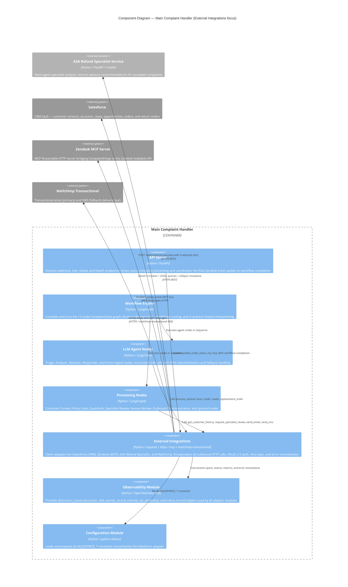

# C4 Component Level: External Integrations

## Overview

- **Name**: External Integrations
- **Description**: Client adapters that encapsulate every outbound HTTP call made by ComplaintForge. Provides a stable internal Python API for the Workflow Engine and AI Agents to reach Salesforce (CRM), Zendesk (via MCP), the A2A Refund Specialist service, and Mailchimp (transactional email/SMS). Authentication, retry logic, error normalisation, and graceful degradation are all handled inside this boundary so no other component deals with raw HTTP concerns.
- **Type**: Library (importable Python modules; no own server process)
- **Technology**: Python 3.11+, `requests`, `httpx`, `mcp` SDK (MCP Streamable HTTP client), `mailchimp-transactional` SDK, OpenTelemetry

---

## Purpose

ComplaintForge's workflow touches four separate external systems at runtime. Without a dedicated boundary, authentication boilerplate, HTTP error handling, retry policies, and protocol specifics (REST vs MCP Streamable HTTP) would leak into graph nodes and agent code. The External Integrations component acts as an anti-corruption layer: each adapter module translates a simple Python function call into the network protocol its target expects, normalises all success and error responses into a consistent `{"status": ...}` shape, and emits OpenTelemetry spans so every outbound call appears as a named child span in distributed traces.

Specifically, the component:

- Handles OAuth 2.0 client-credentials token acquisition for Salesforce on every call, keeping credentials out of business logic.
- Wraps the full MCP Streamable HTTP session lifecycle for Zendesk so callers issue a single `await update_ticket_status_via_mcp(...)` call without managing protocol state.
- Implements a 3-attempt linear-backoff retry loop around the A2A Specialist HTTP endpoint, differentiating transient (5xx, timeout, connection error) from permanent failures.
- Classifies Mailchimp delivery outcomes into `success`, `permanent_failure` (4xx except 429), and `transient_failure` (5xx, 429) so the communication node can make channel-fallback routing decisions without parsing raw provider responses.
- Allows the application to start without all third-party credentials present: each module validates its configuration at call time and returns a typed error dict rather than crashing at import.

---

## Software Features

- **Salesforce OAuth Authentication**: Acquires Bearer tokens via the OAuth 2.0 client-credentials flow against the configured `SALESFORCE_LOGIN_URL`. Returns `(access_token, instance_url)` to all downstream Salesforce calls.
- **Salesforce Customer History Lookup**: Orchestrates a multi-step lookup — Contact by email, linked Account, up to 5 recent Cases, up to 5 recent Opportunities, matched Order (by order number or most-recent fallback), and up to 5 recent return orders — and assembles all data into a single context dict consumed by downstream nodes and agents.
- **Salesforce CRM Action Creation**: Creates a high-priority Case for refund requests, a medium-priority Case for credit requests, or a Task for replacement-order coordination — each linked to the correct `ContactId` and `AccountId` from the customer history.
- **SOQL Injection Prevention**: Escapes single-quote and backslash characters in all user-supplied string values embedded in SOQL queries (`_soql_string`). Validates object and field names loaded from environment variables against an alphanumeric allowlist (`_salesforce_identifier`) before query interpolation.
- **Zendesk MCP Ticket Update**: Opens a `mcp.ClientSession` over `streamable_http_client`, initialises the MCP protocol handshake, invokes the configured tool (default `update_ticket`) with ticket ID, target status, public comment, and optional workflow summary, and normalises the `CallToolResult` — preferring `structuredContent` when present — into a plain dict.
- **Zendesk Graceful Degradation**: Returns a structured `{"status": "skipped"}` result when `ZENDESK_MCP_URL` is not set. Lazy-imports `httpx` and `mcp` so the module loads and runs without those packages installed.
- **A2A Specialist Advisory Request**: POSTs the full escalation packet (complaint text, triage result, customer history, analysis, resolution, policy result, guardrail results, actions taken) to `POST /tasks/refund-specialist` and returns the advisory recommendation dict.
- **A2A Retry with Linear Backoff**: Retries transient failures (network timeout, connection error, HTTP 5xx) up to 3 times with 1 s and 2 s backoff intervals. Records `a2a.attempt_count` and `a2a.status` as OTel span attributes and emits a `a2a.retry_count` metric on each retry. Returns a structured `error` result with `retry_attempts` count on exhaustion.
- **Mailchimp Email Delivery**: Sends a transactional email through the `mailchimp_transactional` SDK with subject, plain-text body, optional HTML body, recipient address, and optional `correlation_id` metadata for end-to-end tracing.
- **Mailchimp SMS Delivery**: Sends a transactional SMS through the Mailchimp Transactional SMS API as a secondary delivery channel when email delivery fails permanently.
- **Mailchimp Error Classification**: Maps raw Mailchimp error codes to `permanent_failure` (4xx except 429), `transient_failure` (5xx, 429), or `success` (2xx) using the `_classify_mailchimp_error` helper, enabling the caller to make channel-fallback routing decisions without parsing SDK exceptions.
- **OpenTelemetry Instrumentation**: Every public function in `salesforce_tool`, `mailchimp_tool`, and `a2a_specialist_tool` is wrapped with `@function_trace()` from `otel.py`, creating a named child OTel span. Structured events (`SalesforceHistoryLookup`, `A2ASpecialistCall`, `MailchimpDelivery`) and typed span attributes are recorded; `notice_error()` is called on exceptions to annotate the span with error details.

---

## Code Elements

This component is synthesised from a single C4-Code-level documentation file:

- [c4-code-tools.md](./c4-code-tools.md) — Detailed documentation for all four adapter modules in the `tools/` package: public function signatures, private helper inventory, OTel instrumentation details, environment variable configuration, and module-level dependency tables.

The source modules covered by that file are:

| Source File | Role |
|---|---|
| `tools/salesforce_tool.py` | Salesforce REST API adapter — OAuth 2.0 authentication, SOQL query helpers, and CRM record creation (Case, Task) |
| `tools/zendesk_mcp_tool.py` | Zendesk MCP Streamable HTTP adapter — ticket status and public comment updates via MCP tool invocation |
| `tools/a2a_specialist_tool.py` | A2A Refund Specialist HTTP adapter — escalation packet submission with 3-attempt linear-backoff retry |
| `tools/mailchimp_tool.py` | Mailchimp Transactional adapter — email and SMS delivery with error classification and channel-fallback support |

---

## Interfaces

### Internal Python API (exposed to callers)

The component exposes importable Python functions. These are the contracts consumed by the Processing Nodes and LLM Agent Nodes components within the Complaint Handler API container.

**salesforce_tool**

- **Protocol**: Direct Python import (`from tools.salesforce_tool import ...`)
- **Description**: Provides read-only customer context lookups and write-path CRM action creation against the Salesforce REST API.
- **Operations**:
  - `get_customer_history(email: str, order_id: str | None = None) -> dict` — Assembles full customer context (contact, account, cases, opportunities, order, return orders) or returns `{"error": "..."}` on failure
  - `process_refund(customer_history: dict, amount: float, reason: str | None = None) -> dict` — Creates a high-priority Salesforce Case for a refund; returns `{"status": "success", "salesforce_action": "case_created", "case_id": "..."}`
  - `issue_credit(customer_history: dict, amount: float, reason: str | None = None) -> dict` — Creates a medium-priority Salesforce Case for a store credit; same return shape as `process_refund`
  - `create_replacement_order(customer_history: dict) -> dict` — Creates a Salesforce Task for fulfilment; returns `{"status": "success", "salesforce_action": "task_created", "task_id": "..."}`

**zendesk_mcp_tool**

- **Protocol**: Direct Python import; caller must `await` the function (async)
- **Description**: Wraps the full MCP Streamable HTTP session lifecycle for updating Zendesk tickets.
- **Operations**:
  - `async update_ticket_status_via_mcp(*, ticket_id: int, status: str | None = None, comment: str | None = None, workflow_result: dict | None = None) -> dict` — Updates ticket status and posts a comment via MCP; returns `{"status": "success"|"skipped"|"error", "mcp_url": ..., "mcp_tool": ..., "payload": ...}`

**a2a_specialist_tool**

- **Protocol**: Direct Python import (synchronous)
- **Description**: Submits a full escalation packet to the A2A Refund Specialist Service with automatic retry.
- **Operations**:
  - `request_specialist_review(state: dict) -> dict` — Posts escalation packet; returns advisory recommendation dict or `{"status": "error", "retry_attempts": N, ...}` on exhaustion

**mailchimp_tool**

- **Protocol**: Direct Python import (synchronous)
- **Description**: Delivers transactional messages to customers via email (primary) and SMS (fallback).
- **Operations**:
  - `send_email(*, subject: str, body_text: str, body_html: str | None, to_email: str, correlation_id: str | None = None) -> dict` — Delivers transactional email; `status` in `{"success", "permanent_failure", "transient_failure", "error"}`
  - `send_sms(*, to: str, message: str) -> dict` — Delivers transactional SMS; same `status` vocabulary

---

### Salesforce REST API (consumed)

- **Protocol**: HTTPS REST — JSON bodies, OAuth 2.0 Bearer token in `Authorization` header
- **Description**: Salesforce standard versioned REST API used for SOQL queries and sObject mutations.
- **Operations consumed**:
  - `POST /services/oauth2/token` — Exchange client credentials for `access_token` and `instance_url`
  - `GET /services/data/{version}/query?q={SOQL}` — Execute a SOQL query; returns `{"records": [...]}`
  - `POST /services/data/{version}/sobjects/Case` — Create a Case record; returns `{"id": "..."}`
  - `POST /services/data/{version}/sobjects/Task` — Create a Task record; returns `{"id": "..."}`
- **Configuration**: `SALESFORCE_LOGIN_URL`, `SALESFORCE_CLIENT_ID`, `SALESFORCE_CLIENT_SECRET`, `SALESFORCE_API_VERSION`, `SALESFORCE_RETURN_ORDER_OBJECT`, `SALESFORCE_RETURN_ORDER_ACCOUNT_FIELD`, `SALESFORCE_RETURN_ORDER_ORDER_FIELD`

---

### Zendesk MCP Server (consumed)

- **Protocol**: MCP Streamable HTTP — bidirectional JSON-RPC over HTTP, Bearer token authentication
- **Description**: Remote MCP server that exposes Zendesk ticket management as callable tools. The adapter opens a session, completes the protocol initialisation handshake, and calls one tool per invocation.
- **Operations consumed**:
  - `update_ticket(ticket_id, status, comment, workflow_summary)` — Set ticket status, post a public agent comment, and attach a workflow summary string
- **Configuration**: `ZENDESK_MCP_URL`, `ZENDESK_MCP_AUTH_TOKEN`, `ZENDESK_TICKET_COMPLETION_STATUS` (default `"solved"`), `ZENDESK_MCP_UPDATE_TICKET_TOOL` (default `"update_ticket"`)

---

### A2A Refund Specialist HTTP API (consumed)

- **Protocol**: HTTPS REST — JSON request/response, optional Bearer token
- **Description**: Internal microservice that runs a multi-agent workflow and returns an advisory recommendation for escalated complaints.
- **Operations consumed**:
  - `POST /tasks/refund-specialist` — Submit a full escalation packet; returns `{"status": "...", "recommendation": {...}}`
- **Configuration**: `A2A_SPECIALIST_URL`, `A2A_SPECIALIST_AUTH_TOKEN`

---

### Mailchimp Transactional API (consumed)

- **Protocol**: HTTPS — via the official `mailchimp_transactional` Python SDK
- **Description**: Transactional messaging SaaS for customer-facing email and SMS delivery.
- **Operations consumed**:
  - `messages.send(message)` — Deliver a transactional email; message body contains `from_email`, `subject`, `text`, `html`, `to`, and optional metadata
  - `messages_sms.send(message)` — Deliver a transactional SMS; message body contains `from_name`, `to`, `text`
- **Configuration**: `MAILCHIMP_API_KEY`, `MAILCHIMP_FROM_EMAIL`, `MAILCHIMP_TIMEOUT` (default `"30"`)

---

## Dependencies

### Components Used

- **Observability Module** (`otel.py`): Three of the four adapter modules (`salesforce_tool`, `mailchimp_tool`, `a2a_specialist_tool`) import `function_trace`, `add_event`, `record_metric`, `set_attribute`, and `notice_error` from the shared OTel utility. Every public function is traced as a named child span.
- **Configuration Module** (`config.py`): `salesforce_tool` imports all `SALESFORCE_*` constants (API version, OAuth credentials, return-order object/field names) from the shared configuration module.

### External Systems

- **Salesforce** — CRM SaaS. OAuth 2.0 client-credentials REST API. Read: contacts, accounts, cases, opportunities, orders, return orders. Write: Cases (refund, credit) and Tasks (replacement order).
- **Zendesk** (via MCP server) — Helpdesk SaaS reached through an MCP Streamable HTTP intermediary. Receives ticket status updates and public agent comments.
- **A2A Refund Specialist Service** — Internal second microservice (separate container). Receives full escalation packets via HTTP POST and returns advisory recommendations.
- **Mailchimp Transactional** — Messaging SaaS. Delivers transactional emails (primary channel) and SMS messages (fallback channel) to complaint-originating customers.

---

## Component Diagram

---

## Design Notes

**No shared session or token cache.** Each Salesforce call re-acquires an OAuth token via `_get_access_token()`. This avoids token expiry bugs at the cost of one extra round-trip per public function call. A token cache with expiry tracking would be a natural future improvement.

**Graceful degradation over hard failure.** All four adapters validate their configuration at call time and return a structured error dict (`{"status": "error"|"skipped", ...}`) rather than raising when the downstream system is unavailable or unconfigured. This allows the workflow graph to route to a human escalation path instead of crashing.

**Synchronous vs asynchronous boundary.** `salesforce_tool`, `a2a_specialist_tool`, and `mailchimp_tool` are synchronous (`requests` / SDK). `zendesk_mcp_tool.update_ticket_status_via_mcp` is `async` because the MCP session lifecycle requires `async with`. Callers in async contexts (FastAPI request handlers, LangGraph async nodes) must `await` the Zendesk adapter and run the synchronous adapters in a thread executor when needed.

**OTel coverage gap.** Three of the four modules are instrumented with `@function_trace()`. `zendesk_mcp_tool` uses only standard `logging` and does not yet apply `function_trace`; adding the decorator and `httpx` auto-instrumentation (`HttpxInstrumentor`) would provide full tracing coverage across all outbound calls.

**Lazy imports for optional dependencies.** `zendesk_mcp_tool` lazy-imports `httpx`, `mcp.ClientSession`, and `mcp.client.streamable_http.streamable_http_client` inside the function body. `mailchimp_tool` imports the SDK inside a `try/except` guard. Both allow the application container to start without these packages installed and fail descriptively only at call time.

**SOQL injection protection.** `salesforce_tool` uses `_soql_string()` to escape single-quote and backslash characters in all user-supplied string values, and `_salesforce_identifier()` to validate object and field names loaded from environment variables against an alphanumeric allowlist before they are interpolated into SOQL query strings.
