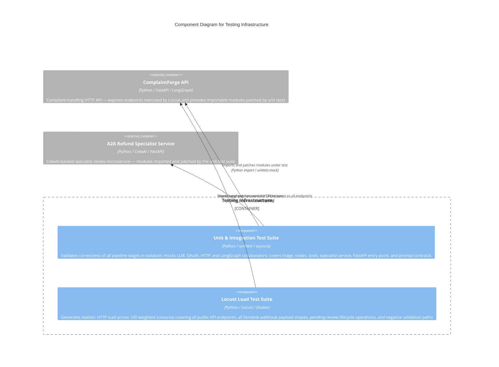

# C4 Component Level: Testing Infrastructure

## Overview

- **Name**: Testing Infrastructure
- **Description**: Standard-library unittest test suite and Locust load-testing scripts covering all major ComplaintForge components, providing correctness validation under isolated conditions and HTTP load simulation against the live API.
- **Type**: Test Suite
- **Technology**: Python 3.11+, unittest, asyncio, unittest.mock, Locust, Docker

## Purpose

The Testing Infrastructure validates the ComplaintForge complaint-handling pipeline at two complementary levels.

The unit and async integration test suite (`tests/`) exercises every major node, tool, agent, and API handler in complete isolation — using `unittest.mock.patch` to stub LLM endpoints, Salesforce OAuth flows, HTTP tools, and LangGraph primitives so that no live cloud services or LLM endpoints are required during CI. This suite covers the triage agent, all LangGraph graph nodes (customer context, specialist review, human review, outbound communication), both HTTP tools (Salesforce and A2A specialist), the CrewAI-backed specialist service, the FastAPI entry point, and prompt template contracts.

The Locust load-test suite (`locust/`) generates realistic synthetic HTTP load against the running FastAPI application to validate throughput, latency, and correctness under concurrent usage. It defines 100 named, weighted task scenarios across five groups: infrastructure health reads, pending-review CRUD operations, Zendesk webhook ingestion across all four accepted payload shapes, direct LangGraph workflow invocations, and negative validation paths. A module-level bounded deque shares discovered pending-review thread IDs across task invocations so that resume scenarios operate on real thread IDs, mimicking the natural read-after-write access pattern of a human reviewer.

Together they address three distinct concerns: (1) correctness of individual pipeline stages under controlled inputs, (2) prompt-template and graph interrupt/resume contract verification, and (3) performance and stability of the HTTP API under realistic concurrent load.

## Software Features

- **Node correctness testing**: Validates customer context Salesforce phone propagation, specialist review result recording, human review interrupt payload construction (including `specialist_review`, `customer_phone`, and `reason` fields), and outbound communication fallback chains (email to SMS, SMS to human review interrupt).
- **LLM prompt contract validation**: Asserts that `TRIAGE_PROMPT` exposes exactly `{"input"}` and `ANALYZER_PROMPT` exposes exactly `{"complaint", "history"}` as input variables.
- **Triage LLM failure safety**: Verifies the triage agent returns a safe `is_complaint=False`, `confidence=0.0` fallback with a reason containing "LLM triage unavailable" when the LLM raises a runtime error.
- **HTTP retry validation**: Confirms the A2A specialist tool retries on `requests.exceptions.Timeout`, makes exactly two POST calls on transient failure, and surfaces `{status: "error", retry_attempts: 3, fallback: "retry_exhausted"}` after exhausting all attempts.
- **Salesforce OAuth error handling**: Asserts `_get_access_token` raises `RuntimeError` with the OAuth error body (code and description) while not leaking the client secret, and that the successful path strips trailing slashes from `instance_url`.
- **LangGraph interrupt/resume semantics**: Validates `process_complaint_async` records `pending_review` state with the interrupt payload without calling finalization, and that a completed result triggers `_finalize_completed_workflow` and returns the Zendesk update payload.
- **Async CrewAI integration**: Verifies `run_crewai_review` calls `kickoff_async` (not synchronous `kickoff`), passes the correct Azure LLM to the agent, and maps the raw JSON result to `{status, source, recommendation}`.
- **FastAPI endpoint load simulation**: Exercises all eight public API endpoints under weighted concurrent traffic across 100 named Locust task scenarios.
- **Zendesk webhook payload shape coverage**: Exercises all four accepted `POST /webhook/zendesk/complaint` payload shapes — nested `ticket.description`, flat top-level `description`, `ticket.comment.body`, and `ticket.via.source.from.address` — ensuring the FastAPI parser handles each variant.
- **Pending review state sharing**: Shares discovered thread IDs across Locust task invocations via a bounded `deque(maxlen=500)` so review-resume scenarios operate on real thread IDs rather than synthetic UUIDs.
- **Negative path validation**: Confirms HTTP 400 responses for missing description fields, missing requester email, empty payloads, blank description strings, empty `comment.body`, and structurally invalid nested objects.
- **Realistic traffic weighting**: Models production-realistic load distribution — health checks at weight 15 and lightweight reads at weight 4–8, with expensive LLM-backed workflow tasks at weight 1–2.
- **Containerised load execution**: Dockerfile based on `locustio/locust:latest`, exposing port 8089, enables cloud-scale load tests from Azure Container Instances or Docker Compose pointed at the Azure Container Apps endpoint.

## Code Elements

This component contains the following code-level elements:

- [c4-code-tests.md](./c4-code-tests.md) - Unit and async integration tests (`tests/`) covering eight test modules: triage agent, four graph nodes, two HTTP tools, the CrewAI specialist service, the FastAPI entry point, and LLM prompt templates. All external collaborators are mocked; no live network or LLM calls are exercised.
- [c4-code-locust.md](./c4-code-locust.md) - Locust HTTP load-test suite (`locust/`) defining the `ComplaintForgeUser` class with 100 weighted task scenarios, seven private HTTP helper methods, five module-level payload-generator functions, and a bounded shared-state deque for pending-review thread IDs.

## Interfaces

### Consumed: FastAPI HTTP API (Locust Load Tests)

- **Protocol**: HTTP/JSON
- **Direction**: Locust Load Test Suite → ComplaintForge API Container
- **Description**: The Locust suite sends HTTP requests to all public endpoints of the ComplaintForge FastAPI application. Response status codes and JSON fields are asserted per scenario; failures are reported to the Locust event loop.
- **Operations**:
  - `GET /health` — Asserts HTTP 200 and `status == "healthy"`; weight 15 and 3 (burst)
  - `GET /openapi.json` — Asserts HTTP 200; validates the FastAPI schema endpoint
  - `GET /docs` — Asserts HTTP 200; validates the Swagger UI endpoint
  - `GET /review` — Lists pending reviews; calls `_remember_review_list` to harvest thread IDs into shared state
  - `GET /review/{thread_id}` — Reads a specific pending review; accepts 200 or 404
  - `GET /review/{uuid}` — Uses a fresh UUID4; always expects 404
  - `POST /review/{thread_id}/resume` — Resumes a pending review with approved/adjusted/rejected payloads; accepts 200 or 404
  - `POST /webhook/zendesk/complaint` — Ingests Zendesk webhook payloads across all four shapes; happy path expects 200, validation paths expect 400
  - `POST /test/complaint` — Runs the full LangGraph pipeline inline; expects HTTP 200 with `status` in `{"completed", "pending_review"}`

### Consumed: Application Module Imports (Unit Tests)

- **Protocol**: Python module import
- **Direction**: Unit Test Suite → Application components
- **Description**: Test classes import application modules directly via Python's module system and apply `unittest.mock.patch` / `patch.object` to isolate collaborators. Environment variables (`AZURE_OPENAI_*`) are injected via `os.environ.setdefault` at import time where required.
- **Modules under test**:
  - `agents.triage` — LLM-backed triage agent (structured output, fallback path)
  - `nodes.customer_context` — Customer context graph node (Salesforce phone mapping)
  - `nodes.specialist_review` — Specialist review graph node (A2A tool invocation, retry end-to-end)
  - `nodes.human_review` — Human review graph node (LangGraph interrupt payload)
  - `nodes.outbound_communication` — Outbound communication node (email/SMS fallback, interrupt escalation)
  - `tools.a2a_specialist_tool` — A2A specialist HTTP tool (skip, payload, retry, exhaustion)
  - `tools.salesforce_tool` — Salesforce OAuth and SOQL query tool
  - `a2a_refund_specialist_service.app` — CrewAI specialist service endpoint
  - `a2a_refund_specialist_service.llm_factory` — CrewAI Azure LLM factory
  - `main_fastapi` — FastAPI application entry point (interrupt recording, finalization)
  - `prompts.system_prompts` — LLM prompt template constants

## Dependencies

### Components Used

- **Triage Agent** (`agents/triage`): Tested for structured LLM output mapping, safe fallback on LLM failure, and prompt pipe (`prompt | llm.with_structured_output(Model)`) invocation contract.
- **Graph Nodes** (`nodes/`): Customer Context tested for Salesforce phone propagation into state; Specialist Review tested for result recording, retry invocation, and outage fallback; Human Review tested for interrupt payload shape including `specialist_review`; Outbound Communication tested for email delivery, SMS fallback on permanent email failure, and human review escalation when no phone number is available.
- **A2A Specialist Tool** (`tools/a2a_specialist_tool`): Tested for skip-without-URL early return, POST request payload and header correctness, retry on `Timeout`, and `retry_exhausted` fallback after three attempts.
- **Salesforce Tool** (`tools/salesforce_tool`): Tested for OAuth client-credentials flow, 400 error body surfacing without secret leakage, instance URL normalisation, and optional `Phone` field surfacing in customer history.
- **A2A Refund Specialist Service** (`a2a_refund_specialist_service/`): Tested for Python version constraint message content, LLM factory keyword argument correctness (model, endpoint, api_key, api_version, temperature), and async CrewAI kickoff result mapping.
- **FastAPI API Layer** (`main_fastapi`): Tested for `pending_review` state recording on LangGraph interrupt, `completed` status recording and Zendesk update return on completed graph result, and `_finalize_completed_workflow` delegation.
- **Prompt Templates** (`prompts/system_prompts`): Tested for `TRIAGE_PROMPT` and `ANALYZER_PROMPT` input variable contracts via real `ChatPromptTemplate` instantiation.

### External Systems

- **ComplaintForge Azure Container Apps endpoint**: Runtime target of Locust load tests when the Locust Docker container is deployed to Azure Container Instances or Docker Compose.
- **Locust Web UI** (port 8089): Exposes the Locust real-time monitoring and control dashboard when the load-test Docker container is running.

### External Libraries

| Library | Purpose |
|---------|---------|
| `unittest` (stdlib) | `TestCase` and `IsolatedAsyncioTestCase` base classes for synchronous and async test suites |
| `unittest.mock` (stdlib) | `patch` and `patch.object` for complete collaborator isolation without live calls |
| `asyncio` (stdlib) | `asyncio.run()` to drive coroutines from synchronous test cases |
| `os` (stdlib) | `os.environ.setdefault` to inject `AZURE_OPENAI_*` environment variables before module import |
| `types.SimpleNamespace` (stdlib) | Lightweight fakes for CrewAI and LangGraph stub objects |
| `requests` (third-party) | Imported in tests to access `requests.exceptions` types for error injection |
| `langchain_core.prompts` | `ChatPromptTemplate` instantiated to assert `input_variables` contracts |
| `locust` | `HttpUser`, `between`, `task` — load-test framework providing user simulation, task scheduling, and the HTTP session client |
| `collections.deque` (stdlib) | Bounded ring-buffer for shared `PENDING_REVIEW_IDS` state across Locust tasks |
| `uuid` (stdlib) | Generates unique synthetic email addresses and unknown thread IDs in Locust scenarios |

## Component Diagram

