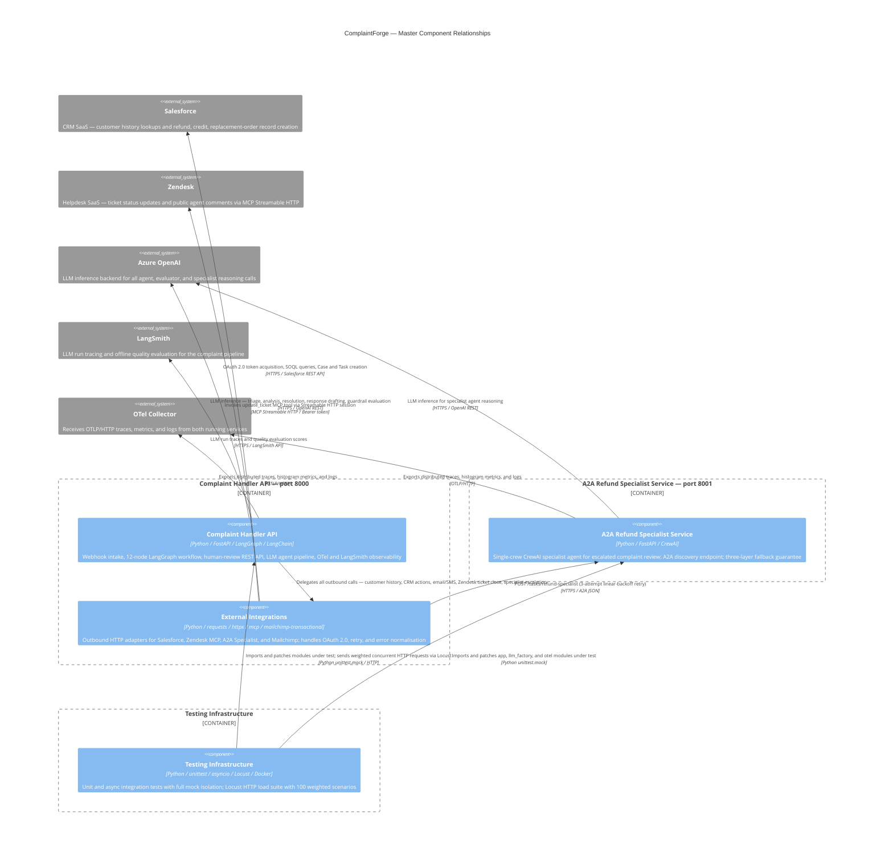

# C4 Component Level: ComplaintForge Master Index

## System Components

| Component | Short Description | Documentation |
|---|---|---|
| Complaint Handler API | Central complaint-processing service: FastAPI webhook intake, LangGraph multi-agent workflow, human-review REST API, and full OpenTelemetry + LangSmith observability. | [c4-component-complaint-handler-api.md](./c4-component-complaint-handler-api.md) |
| External Integrations | Client adapters encapsulating every outbound HTTP call — Salesforce (CRM), Zendesk (via MCP), A2A Refund Specialist, and Mailchimp (email/SMS) — with OAuth 2.0 auth, retry logic, and error normalisation. | [c4-component-external-integrations.md](./c4-component-external-integrations.md) |
| A2A Refund Specialist Service | Standalone FastAPI microservice that accepts escalated complaint packages, runs a CrewAI specialist agent, and returns a policy-aware refund/credit recommendation via the A2A protocol. | [c4-component-a2a-specialist-service.md](./c4-component-a2a-specialist-service.md) |
| Testing Infrastructure | unittest + asyncio unit/integration test suite (eight modules, all collaborators mocked) and a Locust load-test suite (100 weighted HTTP task scenarios) covering all pipeline stages and API endpoints. | [c4-component-testing-infrastructure.md](./c4-component-testing-infrastructure.md) |

---

## Component Relationships Diagram

