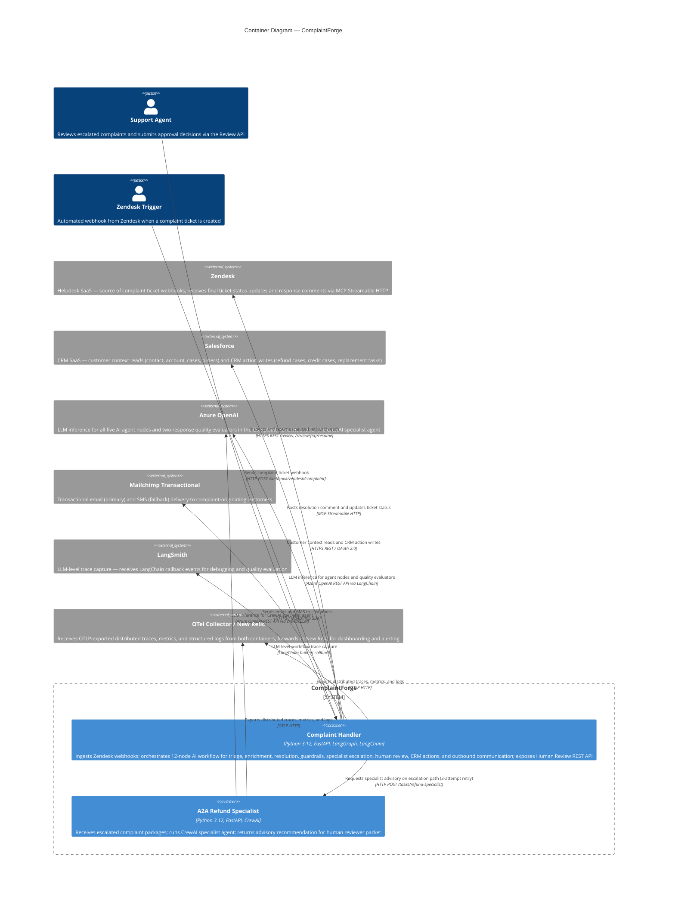

# C4 Container Level: ComplaintForge System Deployment

## Containers

| Container | Type | Technology | Port | Documentation |
|---|---|---|---|---|
| Complaint Handler | Web Application / API | Python 3.12, FastAPI, LangGraph, LangChain, Azure OpenAI | 8000 | [This section](#complaint-handler) |
| A2A Refund Specialist | API Microservice | Python 3.12, FastAPI, CrewAI, Azure OpenAI | 8001 | [This section](#a2a-refund-specialist) |

---

## Complaint Handler

### Container Metadata

- **Name**: Complaint Handler
- **Description**: Primary FastAPI service that ingests Zendesk complaint webhooks, orchestrates a 12-node LangGraph agentic workflow for autonomous triage, enrichment, resolution, and communication, and exposes a REST API for human review management.
- **Type**: Web Application / API
- **Technology**: Python 3.12, FastAPI, Uvicorn (2 workers), LangGraph, LangChain, Azure OpenAI (or LiteLLM proxy), Pydantic v2, OpenTelemetry SDK, LangSmith
- **Deployment**: Docker container (multi-stage Python 3.12-slim image); production on Azure Container Apps, northeurope region. Runs as non-root `appuser` (UID 1000).

---

### Purpose

The Complaint Handler is the core orchestration container of ComplaintForge. It receives inbound customer complaint tickets from Zendesk via webhook, assigns each complaint a UUID thread ID, and immediately queues it for asynchronous processing. The LangGraph state machine (12 nodes, 3 conditional routing edges) drives the complaint through triage, Salesforce CRM enrichment, AI analysis and resolution proposal, deterministic policy enforcement, response quality guardrails, optional specialist advisory escalation, human review suspend/resume, CRM action execution, multi-channel outbound communication, and final Zendesk ticket closure via MCP.

The container owns all workflow state in an in-process `MemorySaver` checkpoint store. Threads that exceed policy thresholds or fail quality checks are escalated to the A2A Refund Specialist container before being suspended for human review. A human reviewer uses the REST review API to inspect the full complaint packet and resume the workflow with a decision.

---

### Components

The following C4 components are deployed inside this container:

- **Complaint Handler API** — FastAPI application, LangGraph graph definition, all workflow node implementations, and the HTTP API layer.
  Documentation: [c4-component-complaint-handler-api.md](./c4-component-complaint-handler-api.md)

- **External Integrations** — Python adapter library (no separate process) providing client functions for Salesforce, Zendesk MCP, the A2A Refund Specialist container, and Mailchimp. Deployed as part of the `tools/` package inside this container.
  Documentation: [c4-component-external-integrations.md](./c4-component-external-integrations.md)

---

### Interfaces

**API Specification**: [apis/complaint-handler-api.yaml](./apis/complaint-handler-api.yaml)

#### POST /webhook/zendesk/complaint — Zendesk Webhook Receiver

- **Protocol**: HTTP POST, JSON
- **Description**: Primary inbound interface. Validates that the ticket payload contains a description and requester email, assigns a UUID thread ID, and queues the complaint for asynchronous background processing. Returns `202 Accepted` immediately.
- **Request**: Zendesk ticket webhook JSON (`{ "ticket": { "id", "subject", "description", "requester": { "email" } } }`)
- **Response 202**: `{ status: "accepted", ticket_id, thread_id, message }`
- **Response 400**: Missing description or email
- **Response 500**: Unexpected payload parsing error

#### POST /test/complaint — Developer Test Endpoint

- **Protocol**: HTTP POST, JSON
- **Description**: Accepts a raw `{ complaint, email }` payload and runs the full LangGraph workflow synchronously using a fixed ticket ID of 9999. Returns the completed workflow result or a pending review state. Intended for integration testing without a live Zendesk trigger.
- **Request**: `{ "complaint": str, "email": str }`
- **Response 200**: `{ status: "completed" | "pending_review", thread_id, result?, interrupts? }`
- **Response 400**: Complaint text is required

#### GET /review — List Pending Reviews

- **Protocol**: HTTP GET
- **Description**: Returns all workflow threads currently paused at a LangGraph human review interrupt.
- **Response 200**: `{ "reviews": [ { thread_id, status, ticket_id, requester_email, interrupts } ] }`

#### GET /review/{thread_id} — Get Review Detail

- **Protocol**: HTTP GET
- **Description**: Returns the full LangGraph state snapshot and interrupt payload for a paused thread, including the complaint, customer CRM history, AI analysis, resolution proposal, guardrail scores, and specialist recommendation.
- **Response 200**: `{ thread_id, status, interrupts, state, next }`
- **Response 404**: Unknown thread_id

#### POST /review/{thread_id}/resume — Resume Human Review

- **Protocol**: HTTP POST, JSON
- **Description**: Resumes a paused workflow by injecting the reviewer's decision. Supports incremental resumption: if the workflow hits a second interrupt (e.g. delivery failure), the thread re-enters pending state. At least one field in the body must be non-null.
- **Request**: `HumanReviewResume { final_response?, approved?, notes?, resolution? }`
- **Response 200**: `{ status: "completed" | "pending_review", thread_id, result?, interrupts? }`
- **Response 400**: Empty resume payload
- **Response 404**: Unknown thread_id
- **Response 500**: Workflow resumption error

#### GET /health — Health Check

- **Protocol**: HTTP GET
- **Description**: Liveness probe for Azure Container Apps health checks and the Dockerfile `HEALTHCHECK` instruction.
- **Response 200**: `{ status: "healthy", service: "ComplaintForge Complaint Handler" }`

---

### Dependencies

#### Containers Used

| Container | Usage | Protocol |
|---|---|---|
| A2A Refund Specialist | Called by the `specialist_review` workflow node during the escalation path, before the human review interrupt fires. Uses a 3-attempt linear-backoff retry. | HTTP POST `/tasks/refund-specialist` |

#### External Systems

| External System | Usage | Protocol |
|---|---|---|
| Zendesk | Source of inbound complaint ticket webhooks; final outbound step posts public comment and updates ticket status via MCP | Inbound: HTTP webhook; Outbound: MCP Streamable HTTP |
| Salesforce | Customer context enrichment (contact, account, cases, orders) during workflow; CRM action writes (refund cases, credit cases, replacement tasks) on approved resolution | HTTPS REST / OAuth 2.0 client credentials |
| Azure OpenAI | LLM inference for all five agent nodes (triage, analyzer, resolver, responder, action agent) and two response quality evaluators | Azure OpenAI REST API via LangChain `ChatOpenAI` |
| LiteLLM Proxy | Alternative LLM backend, enabled via `USE_LITELLM=true`; provides the same `ChatOpenAI`-compatible interface | HTTP (LiteLLM proxy endpoint) |
| Mailchimp Transactional | Transactional email delivery to customers (primary channel); SMS delivery as fallback when email fails permanently | HTTPS / Mailchimp Transactional SDK |
| OTel Collector / New Relic | Receives OTLP-exported distributed traces, metrics, and structured logs; forwards to New Relic for dashboarding and alerting | OTLP HTTP (`/v1/traces`, `/v1/metrics`, `/v1/logs`) |
| LangSmith | LLM-level trace capture for debugging and quality evaluation (LangChain built-in callback, no explicit SDK calls) | HTTPS (LangChain callback) |

---

### Infrastructure

- **Dockerfile**: [Dockerfile](../Dockerfile) — Multi-stage Python 3.12-slim build; installs gcc/curl in builder stage; runtime stage runs as non-root `appuser`; exposes port 8000; starts Uvicorn with 2 workers.
- **Docker Compose service**: `complaint-handler` in [docker-compose.yml](../docker-compose.yml) — maps host port 8000 to container port 8000; loads `.env`; sets `OTEL_SERVICE_NAME=complaintforge-complaint-handler`.
- **Production deployment**: Azure Container Apps, northeurope region. Publicly accessible via ACA ingress.
- **Scaling**: Horizontal scaling via ACA replicas. Note: `MemorySaver` is in-process only — all pending review state is lost on container restart or scale-in. For production durability, replace with a persistent checkpointer (e.g. `AsyncPostgresSaver`).
- **Key environment variables**:
  - `AZURE_OPENAI_API_KEY`, `AZURE_OPENAI_ENDPOINT`, `AZURE_OPENAI_DEPLOYMENT_NAME` — LLM backend (default)
  - `USE_LITELLM`, `LITELLM_BASE_URL`, `LITELLM_API_KEY`, `LITELLM_MODEL` — LiteLLM backend (optional)
  - `A2A_SPECIALIST_URL`, `A2A_SPECIALIST_AUTH_TOKEN` — A2A container address and auth token
  - `SALESFORCE_LOGIN_URL`, `SALESFORCE_CLIENT_ID`, `SALESFORCE_CLIENT_SECRET` — CRM integration
  - `ZENDESK_MCP_URL`, `ZENDESK_MCP_AUTH_TOKEN` — Zendesk MCP integration
  - `MAILCHIMP_API_KEY`, `MAILCHIMP_FROM_EMAIL` — Outbound email/SMS
  - `OUTBOUND_COMMUNICATION_ENABLED` — Set to `false` in non-production to disable Mailchimp delivery
  - `LANGSMITH_TRACING`, `LANGSMITH_API_KEY`, `LANGCHAIN_PROJECT` — LangSmith tracing
  - `OTEL_EXPORTER_OTLP_ENDPOINT`, `OTEL_EXPORTER_OTLP_HEADERS` — OTel export target

---

## A2A Refund Specialist

### Container Metadata

- **Name**: A2A Refund Specialist
- **Description**: Standalone FastAPI microservice that receives escalated complaint cases from the Complaint Handler, runs a single-agent CrewAI crew to produce an advisory recommendation, and returns structured JSON guidance for inclusion in the human review packet.
- **Type**: API Microservice
- **Technology**: Python 3.12, FastAPI, Uvicorn (single worker), CrewAI, Pydantic v2, OpenTelemetry SDK
- **Deployment**: Docker container (multi-stage Python 3.12-slim image); production on Azure Container Apps, northeurope region. Runs as non-root `appuser` (UID 1000).

---

### Purpose

The A2A Refund Specialist is a purpose-built advisory microservice. When the Complaint Handler's deterministic policy gate or response quality guardrails flag a complaint for escalation, the main workflow calls this service before suspending execution for human review. The service instantiates a CrewAI `Refund and Escalation Specialist` agent with a focused goal and backstory, executes the crew asynchronously, and returns a structured recommendation covering decision, risk level, recommended refund/credit amounts, reasoning, reviewer notes, and a draft customer response.

The recommendation is explicitly advisory: the agent's system prompt instructs it not to approve actions autonomously, and `approved` is always returned as `false`. The service exposes an A2A-compatible agent card for service discovery. If CrewAI is unavailable at any stage (import failure, setup failure, or runtime exception), a well-formed fallback recommendation is returned so that the escalation packet remains complete and the main workflow can continue to the human review interrupt without blocking.

---

### Components

The following C4 component is deployed inside this container:

- **A2A Refund Specialist Service** — FastAPI application, CrewAI agent/task/crew construction, fallback logic, JSON extraction, LLM factory, and OpenTelemetry helper.
  Documentation: [c4-component-a2a-specialist-service.md](./c4-component-a2a-specialist-service.md)

---

### Interfaces

**API Specification**: [apis/a2a-specialist-api.yaml](./apis/a2a-specialist-api.yaml)

#### POST /tasks/refund-specialist — Specialist Review Task

- **Protocol**: HTTP POST, JSON
- **Authentication**: `Authorization: Bearer <token>` — required when `A2A_SPECIALIST_AUTH_TOKEN` is set in the container environment; bypassed when the variable is unset.
- **Description**: Accepts the full escalation packet and returns a structured advisory recommendation. Always returns HTTP 200: if the CrewAI agent fails, a fallback recommendation with `source: "fallback"` is returned.
- **Request**: `SpecialistRequest { complaint, triage, customer_email?, order_id?, customer_history, analysis, resolution, policy_result, eval_results, actions_taken }`
- **Response 200**: `{ status: "success", source: "crewai" | "fallback", recommendation: { decision, risk_level, approved, refund_amount, credit_amount, reasoning, human_reviewer_notes, draft_response } }`
- **Response 401**: Invalid Bearer token (only when auth token is configured)

#### GET /.well-known/agent-card.json — A2A Agent Discovery Card

- **Protocol**: HTTP GET
- **Authentication**: None required
- **Description**: A2A service discovery endpoint. Returns a machine-readable description of the agent's name, version, capabilities, and task endpoint URL.
- **Response 200**: `{ name, description, version, url, capabilities: ["refund_review", "credit_review", "replacement_review", "human_reviewer_packet"] }`

#### GET /health — Health Check

- **Protocol**: HTTP GET
- **Authentication**: None required
- **Description**: Liveness probe for Azure Container Apps health checks and the Dockerfile `HEALTHCHECK` instruction (`curl -f http://localhost:8001/health`).
- **Response 200**: `{ status: "healthy", service: "refund-specialist-a2a" }`

---

### Dependencies

#### Containers Used

This container has no runtime dependency on other ComplaintForge containers. It is a leaf service — it only receives calls.

#### External Systems

| External System | Usage | Protocol |
|---|---|---|
| Azure OpenAI | LLM inference for the CrewAI specialist agent (via `crewai.LLM` with `azure/<deployment>` model string) | Azure OpenAI REST API |
| LiteLLM Proxy | Alternative LLM backend, enabled via `USE_LITELLM=true` | HTTP (LiteLLM proxy endpoint) |
| OTel Collector / New Relic | Receives OTLP-exported distributed traces (`specialist_review.requested`, `a2a.crewai_success` metrics), metrics, and logs | OTLP HTTP (`/v1/traces`, `/v1/metrics`, `/v1/logs`) |

---

### Infrastructure

- **Dockerfile**: [a2a_refund_specialist_service/Dockerfile](../a2a_refund_specialist_service/Dockerfile) — Multi-stage Python 3.12-slim build; runtime stage runs as non-root `appuser`; exposes port 8001; Docker health check via `curl -f http://localhost:8001/health` every 30 seconds; starts Uvicorn on port 8001.
- **Docker Compose service**: `a2a-specialist` in [docker-compose.yml](../docker-compose.yml) — maps host port 8001 to container port 8001; loads `./a2a_refund_specialist_service/.env`; sets `OTEL_SERVICE_NAME=complaintforge-a2a-specialist`.
- **Production deployment**: Azure Container Apps, northeurope region. Internal service — not exposed publicly; accessible only from within the ACA environment by the Complaint Handler container.
- **Scaling**: Horizontal scaling via ACA replicas. Service is stateless — no in-process state between requests.
- **Python version constraint**: Requires Python `>=3.10,<3.14` for CrewAI compatibility. Docker image uses Python 3.12-slim.
- **Key environment variables**:
  - `AZURE_OPENAI_API_KEY`, `AZURE_OPENAI_ENDPOINT`, `AZURE_OPENAI_DEPLOYMENT_NAME` — LLM backend (default)
  - `USE_LITELLM`, `LITELLM_BASE_URL`, `LITELLM_API_KEY`, `LITELLM_MODEL` — LiteLLM backend (optional)
  - `A2A_SPECIALIST_AUTH_TOKEN` — Optional shared-secret Bearer token for endpoint protection
  - `OTEL_EXPORTER_OTLP_ENDPOINT`, `OTEL_EXPORTER_OTLP_HEADERS` — OTel export target

---

## Container Diagram

---

## Inter-Container Communication

The only runtime call between ComplaintForge containers is from the Complaint Handler to the A2A Refund Specialist, issued by the `specialist_review` processing node during the escalation path.

| Caller | Callee | Endpoint | Auth | Retry |
|---|---|---|---|---|
| Complaint Handler (`tools/a2a_specialist_tool.py`) | A2A Refund Specialist | `POST /tasks/refund-specialist` | Optional Bearer token (`A2A_SPECIALIST_AUTH_TOKEN`) | 3 attempts, linear backoff; returns structured error dict on exhaustion |

The A2A Refund Specialist URL is configured via the `A2A_SPECIALIST_URL` environment variable in the Complaint Handler container. If the variable is unset, the specialist review step is skipped gracefully and the workflow proceeds to the human review interrupt without a specialist recommendation.

---

## Deployment Summary

| Attribute | Complaint Handler | A2A Refund Specialist |
|---|---|---|
| Docker image base | `python:3.12-slim` (multi-stage) | `python:3.12-slim` (multi-stage) |
| Internal port | 8000 | 8001 |
| Local dev port | 8000 | 8010 |
| Uvicorn workers | 2 | 1 |
| Run as user | `appuser` (UID 1000) | `appuser` (UID 1000) |
| Health check path | `GET /health` | `GET /health` |
| ACA exposure | Public ingress | Internal only |
| State | In-process `MemorySaver` (non-durable) | Stateless |
| OTel service name | `complaintforge-complaint-handler` | `complaintforge-a2a-specialist` |
| Dockerfile | [Dockerfile](../Dockerfile) | [a2a_refund_specialist_service/Dockerfile](../a2a_refund_specialist_service/Dockerfile) |
| Docker Compose service | `complaint-handler` | `a2a-specialist` |
