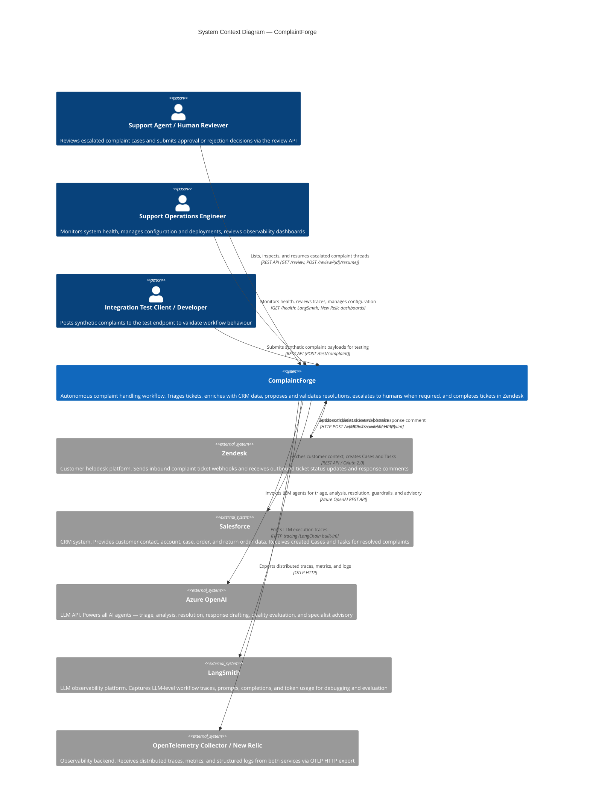

# C4 Context Level: System Context

## System Overview

### Short Description

ComplaintForge is an autonomous complaint handling workflow that receives customer support tickets from Zendesk, enriches them with Salesforce CRM data, applies AI-driven triage and resolution, enforces policy and quality guardrails, and — when human judgement is required — pauses for a human reviewer before completing the ticket lifecycle.

### Long Description

ComplaintForge is a two-service system built on FastAPI and LangGraph. The primary service (Main Complaint Handler) orchestrates a multi-step agentic workflow: it accepts inbound complaint tickets from Zendesk via webhook, classifies them, enriches them with full customer history from Salesforce, proposes a resolution using an LLM, validates that proposal against deterministic business rules and an LLM-based quality guardrail, performs CRM actions in Salesforce, and finalises the Zendesk ticket via a Model Context Protocol (MCP) connection.

When a case is too risky to automate — either because business policy flags it or because the response quality check raises concerns — the workflow pauses at a LangGraph interrupt and suspends until a human reviewer submits a decision through the `/review` REST API. Before that interrupt fires, a second service (A2A Refund Specialist) is called over HTTP: it runs a CrewAI multi-agent analysis and returns an advisory recommendation that is included in the human review packet, giving the reviewer AI-assisted context before they decide.

Both services are deployed as Docker containers (Azure Container Apps in northeurope) and emit distributed traces, metrics, and logs through an OpenTelemetry Collector to New Relic. LangSmith captures LLM-level execution traces for debugging and evaluation.

---

## Personas

### Support Agent / Human Reviewer

- **Type**: Human User
- **Description**: A customer support team member who handles escalated complaint cases that the automated workflow cannot safely resolve on its own. They interact with the system exclusively through the human review REST API, receiving a structured packet containing the original complaint, Salesforce customer history, and a CrewAI specialist recommendation before making a final decision.
- **Goals**:
  - Review escalated complaint cases with full context (customer history, AI recommendation)
  - Approve or reject proposed resolutions and provide the final customer-facing response text
  - Ensure high-risk or edge-case complaints are resolved appropriately and compliantly
- **Key Features Used**:
  - Human-in-the-Loop Escalation (list, inspect, and resume paused workflow threads)
  - Salesforce Customer Enrichment (surfaced in the review packet)
  - Response Quality Guardrails (guardrail failure is one of the escalation triggers)

### Support Operations Engineer

- **Type**: Human User
- **Description**: An engineer or DevOps team member responsible for keeping both services healthy and observable. They do not interact with complaint workflows directly but monitor system behaviour, manage configuration, maintain deployments, and investigate failures using observability tooling.
- **Goals**:
  - Maintain service availability and correctness for both containers
  - Monitor workflow execution via LangSmith traces and OpenTelemetry dashboards
  - Configure environment variables (LLM endpoints, Salesforce credentials, Zendesk tokens)
  - Investigate failures and restart services when necessary
- **Key Features Used**:
  - Full Observability (OpenTelemetry traces, metrics, logs; LangSmith LLM tracing)
  - Health check endpoints (`/health` on both services)

### Zendesk

- **Type**: Programmatic User / External System
- **Description**: The customer helpdesk platform that is the primary source of complaint tickets. Zendesk sends inbound webhooks to ComplaintForge when tickets are created or updated, and receives outbound ticket updates (status changes, public comments) from ComplaintForge at the end of the workflow via the MCP streamable HTTP interface.
- **Goals**:
  - Deliver complaint ticket events to ComplaintForge for autonomous processing
  - Receive ticket closure or status updates when processing is complete
- **Key Features Used**:
  - Autonomous Complaint Triage (entry point)
  - Zendesk Ticket Completion (outbound MCP update)

### Integration Test Client / Developer

- **Type**: Programmatic User / Human User
- **Description**: A developer or QA engineer who exercises the complaint workflow without needing a live Zendesk webhook. They post synthetic complaint payloads directly to the test endpoint and inspect the resulting workflow state, making it possible to validate end-to-end behaviour in development or staging environments.
- **Goals**:
  - Verify workflow correctness for specific complaint scenarios
  - Test escalation paths and human review flows in isolation
  - Develop and debug new workflow steps without Zendesk involvement
- **Key Features Used**:
  - Autonomous Complaint Triage (via `/test/complaint`)
  - All downstream workflow features (Customer Enrichment, Resolution, Policy Gate, Guardrails, Escalation)

---

## System Features

### 1. Autonomous Complaint Triage

- **Description**: The LLM-based triage agent classifies each inbound ticket as a complaint or a non-complaint. Non-complaints exit the workflow immediately. Complaints proceed to enrichment and resolution. This gate prevents the system from processing irrelevant tickets.
- **Users**: Zendesk (inbound webhook), Integration Test Client / Developer
- **User Journey**: [Autonomous Triage Journey](#1-autonomous-complaint-triage---zendesk-journey)

### 2. Salesforce Customer Enrichment

- **Description**: Before resolution is attempted, the workflow fetches the full customer context from Salesforce: contact record, linked account, open and historical cases, recent orders, and return orders. This data is available to all downstream agents and is included in the human review packet for escalated cases.
- **Users**: Zendesk (indirectly, as ticket originator), Support Agent / Human Reviewer (receives this data in escalation packet)
- **User Journey**: [Salesforce Enrichment Journey](#2-salesforce-customer-enrichment---automated-workflow-journey)

### 3. AI-Driven Resolution Proposal

- **Description**: The resolver LLM agent analyses the enriched complaint and proposes a resolution action: full refund, partial credit, product replacement, or escalation to a human. The proposal is passed to the deterministic policy gate before any action is taken.
- **Users**: Zendesk (indirectly), Integration Test Client / Developer
- **User Journey**: [Resolution Proposal Journey](#3-ai-driven-resolution-proposal---automated-workflow-journey)

### 4. Deterministic Policy Gate

- **Description**: A non-LLM node applies hard-coded business rules to the proposed resolution. If the proposal breaches policy thresholds (e.g., refund amount above limit), the workflow routes to the escalation path rather than proceeding automatically. This is the first trigger for human review.
- **Users**: Zendesk (indirectly), Support Agent / Human Reviewer (receives policy-flagged cases)
- **User Journey**: [Policy Escalation Journey](#policy-escalation---support-agent--human-reviewer-journey)

### 5. Response Quality Guardrails

- **Description**: An LLM evaluator reviews the drafted customer-facing response for quality and appropriateness before it is sent. If the response fails the quality check, the workflow routes to the escalation path. This is the second trigger for human review.
- **Users**: Zendesk (indirectly), Support Agent / Human Reviewer (receives guardrail-flagged cases)
- **User Journey**: [Guardrails Escalation Journey](#guardrails-escalation---support-agent--human-reviewer-journey)

### 6. Salesforce Action Automation

- **Description**: Once the resolution is approved (either automatically or by a human reviewer), the action agent creates the corresponding record in Salesforce — a Case for complaint tracking or a Task for follow-up actions.
- **Users**: Zendesk (indirectly, as originating system), Support Agent / Human Reviewer (their decision triggers this)
- **User Journey**: [Action Automation Journey](#6-salesforce-action-automation---automated-workflow-journey)

### 7. Zendesk Ticket Completion

- **Description**: The final step of every successful workflow run updates the originating Zendesk ticket via MCP streamable HTTP: the ticket receives a public comment with the resolution or response text and its status is updated to reflect the outcome.
- **Users**: Zendesk (receives the update), Support Agent / Human Reviewer (their approval leads here)
- **User Journey**: [Ticket Completion Journey](#7-zendesk-ticket-completion---automated-workflow-journey)

### 8. Human-in-the-Loop Escalation

- **Description**: When policy or guardrails flag a case, the LangGraph workflow pauses at an interrupt node and remains suspended until a human decision arrives. Before the interrupt fires, the A2A Refund Specialist Service is called to produce a CrewAI advisory recommendation. The human reviewer sees the full packet (complaint, customer history, specialist recommendation) via the `/review` API and submits an approve/reject decision with a final response text to resume the workflow.
- **Users**: Support Agent / Human Reviewer, A2A Refund Specialist Service (programmatic)
- **User Journey**: [Human-in-the-Loop Escalation Journey](#8-human-in-the-loop-escalation---support-agent--human-reviewer-journey)

### 9. Full Observability

- **Description**: Both services emit OpenTelemetry traces, metrics, and structured logs through an OTLP exporter to an OpenTelemetry Collector (forwarded to New Relic). LangSmith captures LLM-level workflow traces for debugging agent behaviour and evaluating response quality.
- **Users**: Support Operations Engineer
- **User Journey**: [Observability Monitoring Journey](#9-full-observability---support-operations-engineer-journey)

---

## User Journeys

### 1. Autonomous Complaint Triage - Zendesk Journey

1. **Ticket created**: A customer submits a support ticket in Zendesk (e.g., "My order never arrived").
2. **Webhook fires**: Zendesk sends a `POST /webhook/zendesk/complaint` request to ComplaintForge with the ticket payload.
3. **Background processing starts**: The main service accepts the webhook and begins processing the workflow asynchronously.
4. **Triage agent runs**: An LLM agent reads the ticket subject and body and classifies it as a complaint or a non-complaint.
5. **Non-complaint path**: If classified as a non-complaint, the workflow routes to the ignored node and terminates. No further action is taken.
6. **Complaint path**: If classified as a complaint, the workflow continues to customer enrichment.

### 2. Salesforce Customer Enrichment - Automated Workflow Journey

1. **Complaint confirmed**: Triage has classified the ticket as a complaint.
2. **Contact lookup**: The customer context node calls the Salesforce REST API (OAuth 2.0) to look up the contact record matching the ticket's requester email.
3. **Account and history fetch**: Additional API calls retrieve the linked account, open cases, order history, and return orders.
4. **Context assembled**: All Salesforce data is assembled into a structured context object and attached to the LangGraph workflow state.
5. **Workflow continues**: The enriched state is passed to the analyzer agent for complaint extraction.

### 3. AI-Driven Resolution Proposal - Automated Workflow Journey

1. **Analyzer agent runs**: An LLM agent reads the ticket text and Salesforce context and extracts structured complaint details (product, issue type, severity, customer sentiment).
2. **Resolver agent runs**: An LLM agent receives the extracted complaint details and proposes a resolution: full refund, partial credit, product replacement, or escalation.
3. **Proposal recorded**: The proposed resolution and rationale are stored in the workflow state.
4. **Policy gate runs**: The deterministic policy node evaluates the proposal against business rules.

### Policy Escalation - Support Agent / Human Reviewer Journey

1. **Policy gate triggers**: The proposal breaches a business rule (e.g., refund exceeds threshold, customer tier requires manual approval).
2. **Specialist advisory requested**: The workflow calls the A2A Refund Specialist Service (`POST /tasks/refund-specialist`) with the escalation packet.
3. **CrewAI recommendation received**: The specialist service returns an advisory recommendation (or a fallback if unavailable).
4. **Human review interrupt fires**: LangGraph suspends the workflow thread. The thread ID and full packet (complaint, Salesforce context, specialist recommendation) are stored in the checkpoint state.
5. **Reviewer lists pending cases**: A support agent calls `GET /review` to see all suspended threads.
6. **Reviewer inspects case**: The agent calls `GET /review/{thread_id}` to read the full review packet.
7. **Reviewer decides**: The agent calls `POST /review/{thread_id}/resume` with an `approve` or `reject` decision and a final response text.
8. **Workflow resumes**: LangGraph unpauses the thread and routes to the communication node.
9. **Ticket completed**: The Zendesk ticket is updated via MCP with the final outcome.

### Guardrails Escalation - Support Agent / Human Reviewer Journey

1. **Responder agent runs**: An LLM agent drafts the customer-facing response text based on the resolved complaint and Salesforce context.
2. **Guardrails node runs**: An LLM evaluator scores the draft for quality and appropriateness.
3. **Guardrails escalate**: The evaluator flags the response as inappropriate or insufficient.
4. **Specialist advisory requested**: The workflow calls the A2A Refund Specialist Service for an advisory recommendation.
5. **Human review interrupt fires**: LangGraph suspends the workflow thread with the draft response and guardrail failure reason included in the packet.
6. **Reviewer lists pending cases**: A support agent calls `GET /review` and identifies the guardrail-flagged thread.
7. **Reviewer inspects case**: The agent calls `GET /review/{thread_id}` to read the draft response, failure reason, and specialist recommendation.
8. **Reviewer decides**: The agent calls `POST /review/{thread_id}/resume` with a corrected or approved response text.
9. **Workflow resumes**: LangGraph routes to the action agent, then the communication node.
10. **Ticket completed**: The Zendesk ticket is updated via MCP.

### 6. Salesforce Action Automation - Automated Workflow Journey

1. **Resolution approved**: Either the guardrails node passed automatically or a human reviewer submitted an approval.
2. **Action agent runs**: An LLM agent determines the appropriate Salesforce record type based on the resolution (Case for complaint tracking, Task for follow-up).
3. **Salesforce API called**: The action agent creates the record via the Salesforce REST API.
4. **Record ID stored**: The created record ID is stored in the workflow state for audit purposes.
5. **Workflow continues**: The communication node runs next to finalise the Zendesk ticket.

### 7. Zendesk Ticket Completion - Automated Workflow Journey

1. **Salesforce action complete**: The workflow state contains an approved resolution and a Salesforce record ID.
2. **Communication node runs**: The node prepares the final customer response text and the target ticket status.
3. **MCP call made**: The communication node calls the Zendesk MCP streamable HTTP interface with the ticket ID, response comment, and new status.
4. **Zendesk ticket updated**: The Zendesk ticket receives a public comment and its status changes to reflect the resolution (e.g., solved, pending).
5. **Workflow ends**: The LangGraph workflow thread completes successfully.

### 8. Human-in-the-Loop Escalation - Support Agent / Human Reviewer Journey

This is the consolidated end-to-end escalation journey covering both policy and guardrail triggers.

1. **Escalation triggered**: Either the policy gate or the guardrails node determines the case cannot be resolved automatically.
2. **Specialist advisory**: ComplaintForge calls `POST /tasks/refund-specialist` on the A2A Refund Specialist Service. CrewAI agents analyse the case and return an advisory recommendation.
3. **Interrupt fires**: LangGraph suspends the thread. The full review packet (ticket, Salesforce context, draft response if applicable, specialist recommendation, escalation reason) is persisted in the checkpoint store.
4. **Reviewer discovers case**: The support agent calls `GET /review` and sees the thread in the pending list with its escalation reason.
5. **Reviewer reads packet**: The agent calls `GET /review/{thread_id}` to read the full packet.
6. **Reviewer submits decision**: The agent calls `POST /review/{thread_id}/resume` with:
   - `decision`: `approve` or `reject`
   - `response_text`: the final customer-facing message
7. **Workflow resumes**: LangGraph routes to the action agent (Salesforce) then the communication node (Zendesk MCP).
8. **Ticket finalised**: The Zendesk ticket is updated. The workflow thread closes.

### Developer Test Flow - Integration Test Client / Developer Journey

1. **Developer prepares payload**: The developer constructs a synthetic complaint payload matching the expected schema (customer email, ticket subject, ticket body).
2. **Test request sent**: The developer calls `POST /test/complaint` with the payload. No Zendesk webhook is required.
3. **Workflow executes**: ComplaintForge runs the full workflow (triage, enrichment, resolution, policy, guardrails, action, communication) against the test payload.
4. **Escalation scenario**: If testing escalation, the developer calls `GET /review` to find the paused thread.
5. **Review packet inspected**: The developer calls `GET /review/{thread_id}` to inspect the escalation packet including the specialist recommendation.
6. **Decision submitted**: The developer calls `POST /review/{thread_id}/resume` to resume the paused workflow.
7. **Outcome verified**: The developer confirms the Salesforce records and Zendesk ticket were updated correctly (or inspects traces in LangSmith/OTLP dashboards).

### 9. Full Observability - Support Operations Engineer Journey

1. **Service starts**: Both containers initialise the OpenTelemetry SDK on startup, configuring OTLP HTTP exporters pointing at the collector endpoint.
2. **Traces emitted**: Every workflow execution emits distributed traces — span-per-node for the LangGraph graph and span-per-LLM-call for each agent.
3. **LangSmith captures LLM traces**: LangChain's built-in LangSmith integration records each LLM invocation (prompt, completion, latency, token counts) for debugging and evaluation.
4. **Metrics and logs shipped**: The OTLP exporter sends metrics and structured logs alongside traces to the collector, which forwards to New Relic.
5. **Engineer monitors dashboards**: The operations engineer reviews New Relic dashboards for error rates, workflow latency, and escalation frequency.
6. **Engineer investigates failures**: On alert, the engineer inspects the LangSmith trace for the failing thread ID to identify which agent produced an unexpected result.
7. **Health checked**: The engineer calls `GET /health` on both services to confirm liveness before and after deployments.

---

## External Systems and Dependencies

### Zendesk

- **Type**: Helpdesk SaaS
- **Description**: The customer-facing support ticketing platform used by ComplaintForge's organisation. Zendesk is both the source of complaint events and the destination for resolved ticket updates.
- **Integration Type**: Inbound — webhook HTTP POST to ComplaintForge. Outbound — MCP streamable HTTP calls from ComplaintForge to Zendesk.
- **Purpose**: Delivers complaint ticket payloads to the system; receives ticket status updates and customer-facing response comments at workflow completion.

### Salesforce

- **Type**: CRM (Customer Relationship Management) SaaS
- **Description**: The organisation's system of record for customer contacts, accounts, order history, case history, and return orders. ComplaintForge reads from Salesforce to enrich complaint context and writes to Salesforce to create Cases and Tasks representing complaint resolutions.
- **Integration Type**: REST API with OAuth 2.0 client credentials flow.
- **Purpose**: Customer context enrichment (contacts, accounts, cases, orders, return orders); CRM action creation (Cases and Tasks for approved resolutions).

### Azure OpenAI

- **Type**: LLM API (Azure-hosted)
- **Description**: Microsoft Azure's hosted OpenAI service. All LLM agents in both the main workflow (triage, analyzer, resolver, responder, guardrails, action agent) and the A2A Refund Specialist Service (CrewAI agents) use this as their model backend via LangChain's `ChatOpenAI` integration.
- **Integration Type**: Azure OpenAI REST API via LangChain.
- **Purpose**: Powers all large language model inference — classification, extraction, resolution proposal, response drafting, quality evaluation, and specialist advisory generation.

### LangSmith

- **Type**: LLM Observability SaaS
- **Description**: Anthropic-independent LLM observability platform provided by LangChain. Captures detailed execution traces at the LLM call level, including prompts, completions, latency, and token usage, enabling debugging and quality evaluation of agent behaviour.
- **Integration Type**: HTTP tracing via LangChain's built-in LangSmith callback integration (no explicit SDK calls required in application code).
- **Purpose**: Workflow execution trace capture and LLM-level debugging; evaluation of agent response quality over time.

### OpenTelemetry Collector / New Relic

- **Type**: Observability Infrastructure (self-managed collector + SaaS backend)
- **Description**: Both ComplaintForge services emit OpenTelemetry signals (distributed traces, metrics, structured logs) via an OTLP HTTP exporter to an OpenTelemetry Collector. The collector forwards signals to New Relic for storage, dashboarding, and alerting. This gives the operations team end-to-end visibility across both Docker containers.
- **Integration Type**: OTLP HTTP export from application to collector; collector-to-New Relic via New Relic's OTLP ingest endpoint.
- **Purpose**: Distributed tracing, metrics collection, and structured log aggregation for both services; operational monitoring, alerting, and performance analysis.

### A2A Refund Specialist Service (Internal Second Service)

- **Type**: Internal microservice (CrewAI-based)
- **Description**: A separate FastAPI service within the same deployment that runs a CrewAI multi-agent workflow to produce advisory recommendations for escalated complaint cases. It exposes an A2A-compatible agent card and a task endpoint. From the perspective of the Main Complaint Handler, this service behaves as an external HTTP dependency.
- **Integration Type**: HTTP POST (`/tasks/refund-specialist`) called synchronously by the main service during the escalation path.
- **Purpose**: Provides AI-assisted specialist recommendations for policy- or guardrail-escalated cases; the recommendation is included in the human review packet to improve reviewer decision quality.

---

## System Context Diagram

---

## Related Documentation

- [Container Documentation](./c4-container.md)
- [Component Documentation](./c4-component.md)
