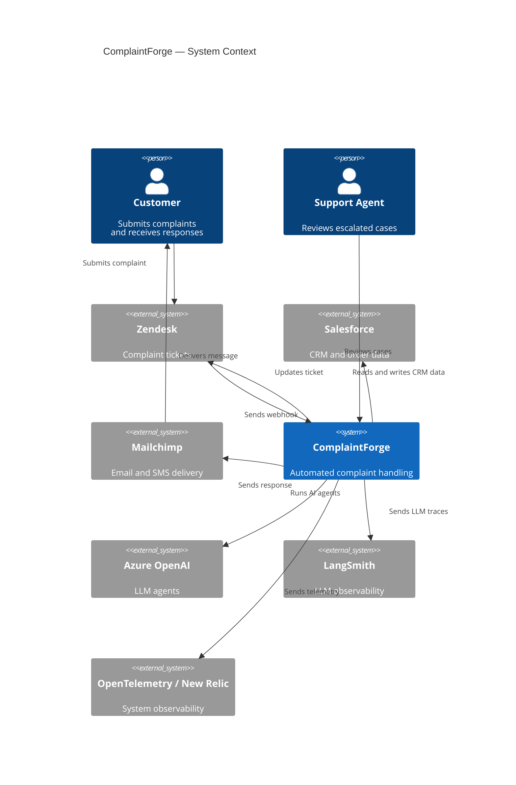

# C4 Context Level: System Context

## System Overview

### Short Description

ComplaintForge is an autonomous complaint handling workflow that receives customer support tickets from Zendesk, enriches them with Salesforce CRM data, applies AI-driven triage and resolution, enforces policy and quality guardrails, and — when human judgement is required — pauses for a human reviewer before completing the ticket lifecycle.

### Long Description

ComplaintForge is a two-service system built on FastAPI and LangGraph. The primary service (Main Complaint Handler) orchestrates a multi-step agentic workflow: it accepts inbound complaint tickets from Zendesk via webhook, classifies them, enriches them with full customer history from Salesforce, proposes a resolution using an LLM, validates that proposal against deterministic business rules and an LLM-based quality guardrail, performs CRM actions in Salesforce, and finalises the Zendesk ticket via a Model Context Protocol (MCP) connection.

When a case is too risky to automate — either because business policy flags it or because the response quality check raises concerns — the workflow pauses at a LangGraph interrupt and suspends until a human reviewer submits a decision through the `/review` REST API. Before that interrupt fires, a second service (A2A Refund Specialist) is called over HTTP: it runs a CrewAI multi-agent analysis and returns an advisory recommendation that is included in the human review packet, giving the reviewer AI-assisted context before they decide.

Both services are deployed as Docker containers (Azure Container Apps in northeurope) and emit distributed traces, metrics, and logs through an OpenTelemetry Collector to New Relic. LangSmith captures LLM-level execution traces for debugging and evaluation.

---

## Personas

### Customer

- **Type**: Human User
- **Description**: The end customer who raised the original complaint. They interact with the business through Zendesk (submitting the ticket) and receive the resolution response via email or SMS delivered by Mailchimp Transactional. They are never aware of ComplaintForge directly — from their perspective, they submitted a support ticket and received a reply.
- **Goals**:
  - Get their complaint resolved quickly and fairly
  - Receive clear communication about the outcome (refund, credit, replacement, or explanation)
- **Key Features Used**:
  - Autonomous Complaint Triage (their ticket triggers the workflow)
  - AI-Driven Resolution Proposal (determines what they receive)
  - Outbound Communication (email/SMS delivery of the final response)

### Support Agent / Human Reviewer

- **Type**: Human User
- **Description**: A customer support team member who handles escalated complaint cases that the automated workflow cannot safely resolve on its own. They interact with the system exclusively through the human review REST API, receiving a structured packet containing the original complaint, Salesforce customer history, and a CrewAI specialist recommendation before making a final decision.
- **Goals**:
  - Review escalated complaint cases with full context (customer history, AI recommendation)
  - Approve or reject proposed resolutions and provide the final customer-facing response text
  - Ensure high-risk or edge-case complaints are resolved appropriately and compliantly
- **Key Features Used**:
  - Human-in-the-Loop Escalation (list, inspect, and resume paused workflow threads)
  - Salesforce Customer Enrichment (surfaced in the review packet)
  - Response Quality Guardrails (guardrail failure is one of the escalation triggers)

---

## System Features

### 1. Autonomous Complaint Triage

- **Description**: The LLM-based triage agent classifies each inbound ticket as a complaint or a non-complaint. Non-complaints exit the workflow immediately. Complaints proceed to enrichment and resolution. This gate prevents the system from processing irrelevant tickets.
- **Users**: Customer (originator via Zendesk)
- **User Journey**: [Autonomous Triage Journey](#1-autonomous-complaint-triage-journey)

### 2. Salesforce Customer Enrichment

- **Description**: Before resolution is attempted, the workflow fetches the full customer context from Salesforce: contact record, linked account, open and historical cases, recent orders, and return orders. This data is available to all downstream agents and is included in the human review packet for escalated cases.
- **Users**: Customer (their data), Support Agent / Human Reviewer (receives this data in escalation packet)
- **User Journey**: [Salesforce Enrichment Journey](#2-salesforce-customer-enrichment-journey)

### 3. AI-Driven Resolution Proposal

- **Description**: The resolver LLM agent analyses the enriched complaint and proposes a resolution action: full refund, partial credit, product replacement, or escalation to a human. The proposal is passed to the deterministic policy gate before any action is taken.
- **Users**: Customer (outcome affects them directly)
- **User Journey**: [Resolution Proposal Journey](#3-ai-driven-resolution-proposal-journey)

### 4. Deterministic Policy Gate

- **Description**: A non-LLM node applies hard-coded business rules to the proposed resolution. If the proposal breaches policy thresholds (e.g., refund amount above limit), the workflow routes to the escalation path rather than proceeding automatically. This is the first trigger for human review.
- **Users**: Customer (outcome affects them), Support Agent / Human Reviewer (receives policy-flagged cases)
- **User Journey**: [Policy Escalation Journey](#policy-escalation-journey)

### 5. Response Quality Guardrails

- **Description**: An LLM evaluator reviews the drafted customer-facing response for quality and appropriateness before it is sent. If the response fails the quality check, the workflow routes to the escalation path. This is the second trigger for human review.
- **Users**: Customer (receives the response), Support Agent / Human Reviewer (receives guardrail-flagged cases)
- **User Journey**: [Guardrails Escalation Journey](#guardrails-escalation-journey)

### 6. Salesforce Action Automation

- **Description**: Once the resolution is approved (either automatically or by a human reviewer), the action agent creates the corresponding record in Salesforce — a Case for complaint tracking or a Task for follow-up actions.
- **Users**: Customer (resolution executed on their behalf), Support Agent / Human Reviewer (their decision triggers this on escalated cases)
- **User Journey**: [Action Automation Journey](#6-salesforce-action-automation-journey)

### 7. Outbound Customer Communication

- **Description**: The final step of every successful workflow run delivers the resolution response to the customer via Mailchimp Transactional email, with SMS as an automatic fallback on permanent email failure. The originating Zendesk ticket is also updated via MCP streamable HTTP with the outcome and status change.
- **Users**: Customer (receives the email or SMS), Support Agent / Human Reviewer (their approval leads here on escalated cases)
- **User Journey**: [Outbound Communication Journey](#7-outbound-customer-communication-journey)

### 8. Human-in-the-Loop Escalation

- **Description**: When policy or guardrails flag a case, the LangGraph workflow pauses at an interrupt node and remains suspended until a human decision arrives. Before the interrupt fires, the A2A Refund Specialist Service is called to produce a CrewAI advisory recommendation. The human reviewer sees the full packet (complaint, customer history, specialist recommendation) via the `/review` API and submits an approve/reject decision with a final response text to resume the workflow.
- **Users**: Support Agent / Human Reviewer, Customer (receives the outcome)
- **User Journey**: [Human-in-the-Loop Escalation Journey](#8-human-in-the-loop-escalation-journey)

---

## User Journeys

### 1. Autonomous Complaint Triage Journey

1. **Customer submits ticket**: A customer contacts support in Zendesk (e.g., "My order never arrived").
2. **Webhook fires**: Zendesk sends a `POST /webhook/zendesk/complaint` request to ComplaintForge with the ticket payload.
3. **Triage agent runs**: An LLM agent reads the ticket and classifies it as a complaint or a non-complaint.
4. **Non-complaint path**: If not a complaint, the workflow routes to the ignored node and terminates. No action is taken.
5. **Complaint path**: If a complaint, the workflow continues to customer enrichment.

### 2. Salesforce Customer Enrichment Journey

1. **Complaint confirmed**: Triage has classified the ticket as a complaint.
2. **Contact lookup**: The customer context node calls the Salesforce REST API (OAuth 2.0) to find the contact record matching the customer's email.
3. **History fetch**: Additional queries retrieve the linked account, open and historical cases, order history, and return orders.
4. **Context assembled**: All Salesforce data is attached to the LangGraph workflow state and flows into every downstream agent.
5. **Workflow continues**: The enriched state is passed to the analyzer agent.

### 3. AI-Driven Resolution Proposal Journey

1. **Analyzer agent runs**: An LLM agent extracts structured complaint details — issue type, severity, sentiment, repeat-customer flag.
2. **Resolver agent runs**: An LLM agent proposes a resolution: full refund, partial credit, product replacement, or escalation.
3. **Proposal recorded**: The resolution and rationale are stored in the workflow state.
4. **Policy gate runs**: The deterministic policy node evaluates the proposal against business rules.

### Policy Escalation Journey

1. **Policy gate triggers**: The proposal breaches a business rule (e.g., refund exceeds $500, no matched Salesforce order).
2. **Specialist advisory requested**: The workflow calls the A2A Refund Specialist Service (`POST /tasks/refund-specialist`) with the full escalation packet.
3. **CrewAI recommendation received**: The specialist service returns an advisory recommendation (or a safe fallback if unavailable).
4. **Human review interrupt fires**: LangGraph suspends the workflow thread. The full packet (complaint, Salesforce context, specialist recommendation) is persisted in the checkpoint store.
5. **Reviewer lists pending cases**: A support agent calls `GET /review` to see all suspended threads.
6. **Reviewer inspects case**: The agent calls `GET /review/{thread_id}` to read the full review packet.
7. **Reviewer decides**: The agent calls `POST /review/{thread_id}/resume` with an approve/reject decision and final response text.
8. **Workflow resumes**: LangGraph unpauses the thread and routes to the communication node.
9. **Customer notified**: The resolution response is delivered to the customer via Mailchimp and the Zendesk ticket is updated via MCP.

### Guardrails Escalation Journey

1. **Responder agent runs**: An LLM agent drafts the customer-facing response based on the resolved complaint and Salesforce context.
2. **Guardrails node runs**: LLM evaluators score the draft for empathy and resolution appropriateness.
3. **Guardrails escalate**: One or both scores fall below the threshold (< 6/10).
4. **Specialist advisory requested**: The workflow calls the A2A Refund Specialist Service for an advisory recommendation.
5. **Human review interrupt fires**: LangGraph suspends the thread with the draft response and guardrail failure reason in the packet.
6. **Reviewer inspects and decides**: The support agent reviews the draft, failure reason, and specialist recommendation via `GET /review/{thread_id}`, then resumes via `POST /review/{thread_id}/resume` with a corrected response.
7. **Customer notified**: The approved response is delivered to the customer via Mailchimp and the Zendesk ticket is updated via MCP.

### 6. Salesforce Action Automation Journey

1. **Resolution approved**: Either guardrails passed automatically or a human reviewer submitted an approval.
2. **Action agent runs**: Determines the appropriate Salesforce record type based on the resolution (Case for refund/credit, Task for replacement).
3. **Salesforce API called**: The record is created via the Salesforce REST API and the ID stored in workflow state.
4. **Workflow continues**: The communication node runs next.

### 7. Outbound Customer Communication Journey

1. **Action complete**: The workflow holds an approved resolution and Salesforce record.
2. **Communication node runs**: Prepares the final customer response text and delivery targets.
3. **Email sent**: Mailchimp Transactional sends the response email to the customer's address.
4. **SMS fallback**: If email delivery fails permanently (bounced address, rejected), Mailchimp SMS is used automatically.
5. **Zendesk ticket updated**: The MCP streamable HTTP call updates the originating ticket with a public comment and sets status to `solved`.
6. **Workflow ends**: The LangGraph thread completes successfully. The customer has their answer.

### 8. Human-in-the-Loop Escalation Journey

End-to-end escalation covering both policy and guardrail triggers.

1. **Escalation triggered**: Policy gate or guardrails node determines the case cannot be resolved automatically.
2. **Specialist advisory**: ComplaintForge calls the A2A Refund Specialist Service. The CrewAI agent analyses the full case and returns an advisory recommendation.
3. **Interrupt fires**: LangGraph suspends the thread. The review packet (complaint, Salesforce context, draft response if applicable, specialist recommendation, escalation reason) is persisted.
4. **Reviewer discovers case**: The support agent calls `GET /review` and finds the thread in the pending list.
5. **Reviewer reads packet**: Calls `GET /review/{thread_id}` for the full context including the specialist recommendation.
6. **Reviewer submits decision**: Calls `POST /review/{thread_id}/resume` with `decision` (approve/reject) and `response_text` (final customer-facing message).
7. **Workflow resumes**: Routes to the action agent (Salesforce), then the communication node (Mailchimp + Zendesk MCP).
8. **Customer notified**: The human-approved response reaches the customer. The ticket closes.

---

## External Systems and Dependencies

### Zendesk

- **Type**: Helpdesk SaaS
- **Description**: The customer-facing support ticketing platform used by ComplaintForge's organisation. Zendesk is both the source of complaint events and the destination for resolved ticket updates.
- **Integration Type**: Inbound — webhook HTTP POST to ComplaintForge. Outbound — MCP streamable HTTP calls from ComplaintForge to Zendesk.
- **Purpose**: Delivers complaint ticket payloads to the system; receives ticket status updates and customer-facing response comments at workflow completion.

### Salesforce

- **Type**: CRM (Customer Relationship Management) SaaS
- **Description**: The organisation's system of record for customer contacts, accounts, order history, case history, and return orders. ComplaintForge reads from Salesforce to enrich complaint context and writes to Salesforce to create Cases and Tasks representing complaint resolutions.
- **Integration Type**: REST API with OAuth 2.0 client credentials flow.
- **Purpose**: Customer context enrichment (contacts, accounts, cases, orders, return orders); CRM action creation (Cases and Tasks for approved resolutions).

### Azure OpenAI

- **Type**: LLM API (Azure-hosted)
- **Description**: Microsoft Azure's hosted OpenAI service. All LLM agents in both the main workflow (triage, analyzer, resolver, responder, guardrails, action agent) and the A2A Refund Specialist Service (CrewAI agents) use this as their model backend via LangChain's `ChatOpenAI` integration.
- **Integration Type**: Azure OpenAI REST API via LangChain.
- **Purpose**: Powers all large language model inference — classification, extraction, resolution proposal, response drafting, quality evaluation, and specialist advisory generation.

### LangSmith

- **Type**: LLM Observability SaaS
- **Description**: LLM observability platform provided by LangChain. Captures detailed execution traces at the LLM call level — prompts, completions, latency, and token usage — enabling debugging and quality evaluation of agent behaviour.
- **Integration Type**: HTTP tracing via LangChain's built-in LangSmith callback integration (no explicit SDK calls required in application code).
- **Purpose**: Workflow execution trace capture and LLM-level debugging; evaluation of agent response quality over time.

### OpenTelemetry Collector / New Relic

- **Type**: Observability Infrastructure (self-managed collector + SaaS backend)
- **Description**: Both ComplaintForge services emit OpenTelemetry signals (distributed traces, metrics, structured logs) via OTLP HTTP to an OpenTelemetry Collector, which forwards to New Relic for dashboarding and alerting.
- **Integration Type**: OTLP HTTP export from application to collector; collector-to-New Relic via New Relic's OTLP ingest endpoint.
- **Purpose**: Distributed tracing, metrics collection, and structured log aggregation for both services.

### A2A Refund Specialist Service (Internal Second Service)

- **Type**: Internal microservice (CrewAI-based)
- **Description**: A separate FastAPI service within the same deployment that runs a CrewAI multi-agent workflow to produce advisory recommendations for escalated complaint cases. It exposes an A2A-compatible agent card and a task endpoint. From the perspective of the Main Complaint Handler, this service behaves as an external HTTP dependency.
- **Integration Type**: HTTP POST (`/tasks/refund-specialist`) called synchronously by the main service during the escalation path.
- **Purpose**: Provides AI-assisted specialist recommendations for policy- or guardrail-escalated cases; the recommendation is included in the human review packet to improve reviewer decision quality.

---

## System Context Diagram

---

## Related Documentation

- [Container Documentation](./c4-container.md)
- [Component Documentation](./c4-component.md)
